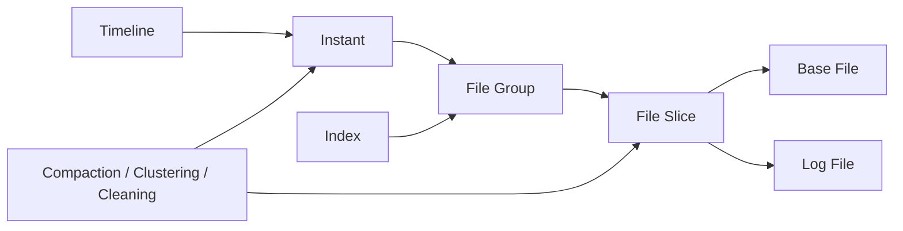

---
kb_id: bigdata/hudi/core-objects-state
title: Hudi 核心对象与状态所有权
description: 解释 Hudi 中 timeline、instant、file group、file slice、base file、log file、index 和表服务分别拥有什么状态，以及这些状态如何一起构成表的可见性和恢复边界。
domain: bigdata
component: hudi
topic: core-objects-state
difficulty: intermediate
status: reviewed
sidebar_position: 2
version_scope: Apache Hudi docs as verified on 2026-04-28
last_verified_at: '2026-04-28'
source_ids:
  - hudi-docs-overview
  - hudi-timeline-docs
  - hudi-file-layout-docs
  - hudi-writing-data-docs
  - hudi-table-types-docs
claim_ids:
  - bigdata-hudi-claim-0001
  - bigdata-hudi-claim-0003
  - bigdata-hudi-claim-0002
  - bigdata-hudi-claim-0004
  - bigdata-hudi-claim-0005
  - bigdata-hudi-claim-0006
  - bigdata-hudi-claim-0007
  - bigdata-hudi-claim-0008
  - bigdata-hudi-claim-0009
  - bigdata-hudi-claim-0010
tags:
  - bigdata
  - hudi
  - core-objects-state
  - knowledge-base
  - production
---
## 讲 Hudi 的对象，重点不是背名词，而是判断“谁拥有哪一层状态”

Hudi 难的地方不在术语数量，而在这些术语分属不同层级。很多人把 timeline、commit、file group、base file、log file 混成一个平面，于是既讲不清可见性，也讲不清恢复边界。更稳的理解方式是按状态所有权拆层。

## 第一层：表级状态由 timeline 和 instant 持有

表级状态回答的是“当前有哪些版本、哪些动作已经完成、哪些动作只是计划中或执行中”。这层的核心对象是 `timeline` 和 `instant`。

### Timeline 是整张表的时间轴

timeline 记录的不只是普通写入，还包括 compaction、clean、rollback、replacecommit 等动作。它是表的控制面真相来源。判断一次动作是否对读者可见，首先看它在 timeline 上的状态，而不是先看数据目录是否出现了新文件。

### Instant 是时间轴上的动作单元

instant 可以理解成一次具体动作在 timeline 上的状态实体。不同类型的 instant 表示不同的表级操作，例如：

- `commit`
- `deltacommit`
- `replacecommit`
- `compaction`
- `clean`
- `rollback`

对于多数核心动作，至少要理解三种常见状态：

- `requested`：动作已经声明，但还没有真正完成执行。
- `inflight`：动作正在执行中。
- `completed`：动作已经完成，可以作为稳定版本被后续链路消费。

这就是 Hudi 的第一条硬边界：目录里出现新文件，不等于 instant 已经 completed；只有 completed 才意味着版本真正成立。

## 第二层：记录级和文件级状态由 file group 与 file slice 持有

如果 timeline 负责“版本时间”，那么 file group 和 file slice 负责“物理位置”。

### File Group 决定一批记录长期属于哪一组文件

一个 file group 是 Hudi 组织物理文件的基本归属单元。对 upsert 来说，重要的不是“这条记录落到哪个分区”就结束了，而是“它最终归属哪个 file group”。因为后续更新通常会继续作用于同一组演进链条。

### File Slice 是某个时刻 file group 的可读切片

file slice 体现的是“在某个提交边界上，这个 file group 对外暴露哪一组 base/log 组合”。

- 对 COW，file slice 往往更接近某个新 base file 版本。
- 对 MOR，file slice 可能由一个 base file 加若干 log file 共同组成。

所以 file slice 才是读路径真正关心的对象。Reader 不会抽象地读“一个 file group”，而是读某个时间点上可见的 slice。

## 第三层：字节级状态由 base file 和 log file 承载

### Base File 承载列式稳定视图

base file 通常是列式文件，是多数扫描型读取最希望直接命中的对象。COW 每次更新倾向于生成新的 base file，因此读路径更直接，但写放大更明显。

### Log File 承载 MOR 的增量变更

log file 是 MOR 写优化的关键。更新先追加到日志，而不是马上重写整个 base file。这样写入成本更低，但读 snapshot 时就必须额外做日志合并，直到 compaction 把这些日志折叠回新的 base file。

因此，log file 本身不是异常现象；异常的是 log 文件长期累积、迟迟不 compaction，最终把读放大推高到不可接受。

## 第四层：定位状态由 index 持有

index 回答的是“某条 key 对应的记录应该去哪里找、去哪里写”。Hudi 官方文档提供多种索引思路，但无论具体类型如何变化，实践和生产里都要抓住共同点：索引不是为了数据库式点查，而是为了在分布式表里控制 upsert 路由成本。

如果索引选型不当，常见后果有三类：

- 写入前定位成本过高。
- 更新路由不稳定，放大 file group 数量。
- 小文件和读写放大进一步恶化。

## 第五层：长期治理状态由表服务持有

表服务包括 compaction、clustering、cleaning 等后台动作。它们不是“写完之后顺手优化一下”，而是 Hudi 长期稳定运行的必要部分。

- `compaction`：把 MOR 的 log 变更折叠回新 base file。
- `clustering`：重组文件布局，改善文件大小或排序组织。
- `cleaning`：清理不再保留的旧文件版本，控制存储膨胀。

这些动作也会体现在 timeline 上，所以它们既属于维护面，又会反过来改变表级状态。

## 把这些对象串起来，才是真正的 Hudi 状态图

这张图里每个对象都不是孤立的：

- timeline 决定版本是否成立。
- index 决定写入路由到哪个 file group。
- file slice 决定某次查询看到哪套 base/log 组合。
- table services 决定长期文件布局是否还能维持健康。

## 生产里如何用“状态所有权”排障

### 场景 1：目录里已经有新文件，但查询结果没有更新

先看 timeline 上对应 instant 是否 completed。如果还停在 inflight，说明文件只是写到了一半或提交还没完成，问题优先属于控制面，而不是读引擎本身。

### 场景 2：MOR 表 snapshot 查询越来越慢

优先看 file slice 上是否挂了过多 log file，再看 compaction backlog 是否长期积压。这里真正出问题的是文件级状态和治理状态，而不只是 SQL 变慢。

### 场景 3：upsert 吞吐突然下降

除了执行引擎资源外，要看索引定位成本、file group 分布是否失控，以及小文件是否让每次更新都需要处理过多切片。

## 学习和排障时最值得反复强调的结论

1. timeline 管版本，file group 管归属，file slice 管可读切面。
2. COW 和 MOR 的差异最终都会落到 base file 与 log file 的组织方式上。
3. 目录观察只能辅助判断，不能替代 timeline 作为语义真相来源。
4. compaction、clustering、cleaning 不是附属知识点，而是表长期稳定的核心机制。

## 来源与事实边界

### 来源

`hudi-docs-overview`、`hudi-timeline-docs`、`hudi-file-layout-docs`、`hudi-writing-data-docs`、`hudi-table-types-docs`

### 事实声明

`bigdata-hudi-claim-0001`、`bigdata-hudi-claim-0003`、`bigdata-hudi-claim-0002`、`bigdata-hudi-claim-0004`、`bigdata-hudi-claim-0005`、`bigdata-hudi-claim-0006`、`bigdata-hudi-claim-0007`、`bigdata-hudi-claim-0008`、`bigdata-hudi-claim-0009`、`bigdata-hudi-claim-0010`

