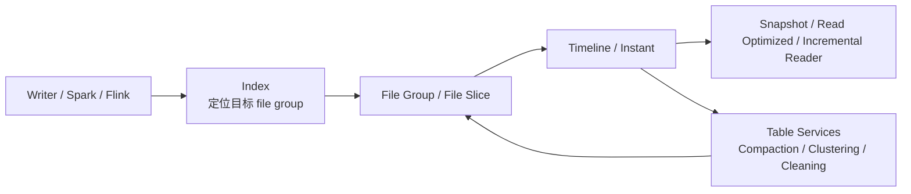

---
kb_id: bigdata/hudi/overview
title: Hudi 整体定位与技术边界
description: 解释 Hudi 作为湖仓表格式与数据管理层的真实定位，说明它解决什么问题、核心状态如何组织，以及它与 Spark、Flink、对象存储和其他湖仓表格式的边界。
domain: bigdata
component: hudi
topic: overview
difficulty: intermediate
status: reviewed
sidebar_position: 1
version_scope: Apache Hudi docs as verified on 2026-04-28
last_verified_at: '2026-04-28'
source_ids:
  - hudi-docs-overview
  - hudi-timeline-docs
  - hudi-file-layout-docs
  - hudi-writing-data-docs
  - hudi-table-types-docs
claim_ids:
  - bigdata-hudi-claim-0001
  - bigdata-hudi-claim-0002
  - bigdata-hudi-claim-0003
  - bigdata-hudi-claim-0004
  - bigdata-hudi-claim-0005
  - bigdata-hudi-claim-0006
  - bigdata-hudi-claim-0007
  - bigdata-hudi-claim-0008
  - bigdata-hudi-claim-0009
  - bigdata-hudi-claim-0010
tags:
  - bigdata
  - hudi
  - overview
  - knowledge-base
  - production
---
## Hudi 真正要解决的，不是“把 Parquet 管起来”，而是让数据湖具备持续写入、增量消费和表级治理能力

如果只把 Hudi 理解成一种文件格式，后面几乎所有原理都会讲偏。Hudi 的核心定位是湖仓表格式与数据管理层：它建立在对象存储或 HDFS 之上，通过 timeline、commit、索引、file group 和表服务，把原本分散的文件写入组织成一个带版本演进、增量语义和后台维护能力的表。

这也是为什么 Hudi 经常出现在“实时入湖、明细 upsert、流批一体增量处理”场景里。它不只是保存数据文件，而是持续回答四个问题：

- 一批写入是否已经成为表的可见版本。
- 一条记录应该落到哪个 file group。
- 当前读者应该看到 base file、log file 的哪一组组合。
- 历史版本、失败写入和后台维护任务如何与当前读写共存。

## 不要把 Hudi 和相邻系统混成一类

| 系统 | 核心职责 | 不能混淆成什么 |
| --- | --- | --- |
| Hudi | 表级版本管理、upsert、增量处理、索引和表服务 | 单纯文件目录或只读表格式 |
| Spark / Flink | 计算和执行引擎，负责把写读请求真正跑起来 | Hudi 本体 |
| HDFS / 对象存储 | 持久化承载层，保存 base file、log file 和元数据文件 | Hudi 的事务语义来源 |
| Hive Metastore / Catalog | 表注册、库表发现和外部元数据集成 | Hudi timeline 本身 |
| Iceberg / Delta Lake | 同类湖仓表格式 | Hudi 的内部组件 |

最容易出现的误判是把“底层已经有 Parquet 文件”直接等同于“表已经可读”。Hudi 的语义边界不在目录里，而在 timeline 上。只有对应 instant 进入完成态，读者才应该把这次写入视为表的稳定版本。

## 先记住这条主线：timeline 决定版本，file group 决定物理组织，query type 决定读到什么

这条链路里最关键的是三组对象：

- `timeline / instant`：定义表状态如何推进，决定什么版本可见。
- `file group / file slice / base file / log file`：定义数据怎样物理落盘，决定读写放大和后续维护成本。
- `snapshot / read optimized / incremental query`：定义读者到底读取完整视图、优化视图还是增量边界。

## Hudi 的组件边界，决定了它擅长什么

### Hudi 擅长的场景

- 主键或准主键驱动的持续 upsert。
- 需要按提交边界做增量消费的数仓链路。
- 需要后台 compaction、clustering、cleaning 管理文件布局的湖仓表。
- 既要保留数据湖开放存储，又要引入表级版本治理的架构。

### Hudi 不擅长的场景

- 极端低延迟点查，且依赖数据库级索引与事务隔离。
- 没有稳定主键，却强行做高频去重 upsert。
- 小批量高并发多写者同时打到同一张表，但没有清晰并发控制边界。
- 只需要一次写入、多次只读分析，且根本不需要增量和表服务的纯静态数据集。

## 一个 Hudi 表最少要能讲清楚的对象

| 对象 | 它解决什么问题 | 为什么重要 |
| --- | --- | --- |
| Timeline | 记录表的版本演进和后台服务动作 | 可见性、恢复、排障都以它为准 |
| Instant | 一次 commit、deltacommit、compaction、clean 等动作的状态单元 | requested、inflight、completed 是状态边界核心 |
| File Group | 一组记录长期归属的物理组织单元 | 决定更新会写到哪里 |
| File Slice | 某一时刻 file group 的可读切片 | 决定读视图如何拼装 base 和 log |
| Base File | 列式主文件，通常是 Parquet | 读性能和扫描成本核心 |
| Log File | MOR 增量日志文件 | 写吞吐和读合并成本核心 |
| Index | 记录定位机制 | 决定 upsert 如何找到旧记录 |
| Table Services | compaction、clustering、cleaning 等后台维护服务 | 决定长期性能是否失控 |

## 为什么说 Hudi 的原理核心是“状态组织”，不是“文件写入”

很多系统也会写 Parquet，但 Hudi 的特别之处在于：它把文件操作提升成了表状态机。一次 upsert 不是“生成几个文件”这么简单，而是要同时推进以下几件事：

1. 通过索引决定记录属于哪个 file group。
2. 生成新的 base file，或者往 log file 追加变更。
3. 在 timeline 上登记这次动作的 instant 和状态变化。
4. 让后续查询根据 query type 选择正确视图。
5. 在必要时安排 compaction、clustering 和 cleaning 修正长期布局。

所以，生产里遇到“目录里有文件，但查询看不到”“MOR 表越跑越慢”“增量消费漏数据”时，真正要查的不是文件本身，而是 timeline、file slice、query type 和后台服务之间是否发生了错位。

## Hudi 和 COW / MOR 的关系，不是二选一口号，而是两套成本模型

Hudi 官方文档把表类型区分为 Copy On Write 和 Merge On Read。它们不是营销概念，而是两套不同的读写取舍。

- `COW`：更新时直接改写新的 base file，读路径相对简单，写放大更高。
- `MOR`：更新时优先追加到 log file，写入更轻，但 snapshot 查询通常需要把 base file 和 log file 合并，后台还要通过 compaction 把日志折叠回新的 base file。

这意味着如果对 COW 和 MOR 的理解只停留在“COW 读快、MOR 写快”，深度还不够。更完整的理解应当落到：

- 查询主力是 snapshot、read optimized 还是 incremental。
- 数据更新频率高不高。
- 是否能接受后台 compaction 带来的资源占用和调度复杂度。
- 小文件、log 膨胀、读放大是否可控。

## 生产里最先要看的，不是参数，而是证据链

理解 Hudi 以后，排障入口会非常明确：

1. 先看 `timeline`，确认最近的 instant 是什么类型、停在哪个状态。
2. 再看 `file group / file slice`，确认物理布局是否和预期一致。
3. 再看查询类型，判断读的是 snapshot、read optimized 还是 incremental。
4. 最后才去看索引、compaction backlog、cleaning 策略、并发写控制和底层存储异常。

如果没有这条证据链，就很容易把问题粗暴归因成“Spark 写坏了”“对象存储不稳定”或者“Hudi 有 bug”。

## 学 Hudi 时最容易犯的四个错误

1. 把 Hudi 说成“Parquet + 元数据”。
2. 只背 COW/MOR，不理解 timeline 和 file slice。
3. 只看目录文件，不看 instant 状态就判断提交是否成功。
4. 把 compaction、clustering、cleaning 当成可有可无的附加功能，而不是长期治理主线。

## 来源与事实边界

### 来源

`hudi-docs-overview`、`hudi-timeline-docs`、`hudi-file-layout-docs`、`hudi-writing-data-docs`、`hudi-table-types-docs`

### 事实声明

`bigdata-hudi-claim-0001`、`bigdata-hudi-claim-0002`、`bigdata-hudi-claim-0003`、`bigdata-hudi-claim-0004`、`bigdata-hudi-claim-0005`、`bigdata-hudi-claim-0006`、`bigdata-hudi-claim-0007`、`bigdata-hudi-claim-0008`、`bigdata-hudi-claim-0009`、`bigdata-hudi-claim-0010`

