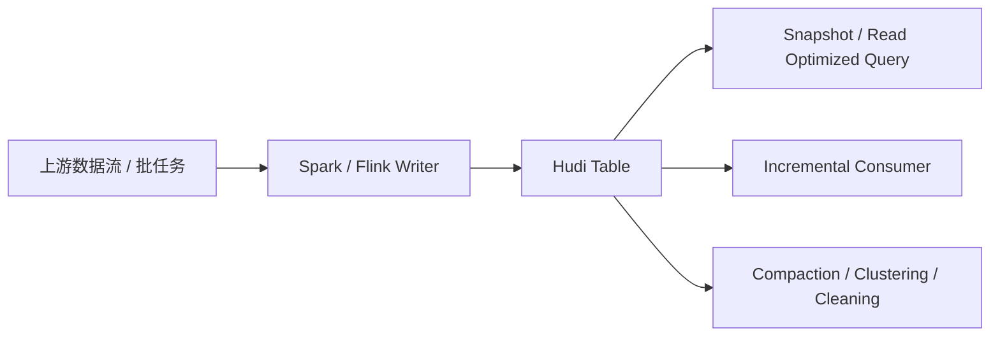

---
kb_id: bigdata/hudi/system-design
title: Hudi 系统设计取舍
description: 解释在真实湖仓架构里怎样设计 Hudi 表，重点说明表类型、主键、分区、增量链路、表服务调度、治理边界与相邻组件协作的取舍。
domain: bigdata
component: hudi
topic: system-design
difficulty: advanced
status: reviewed
sidebar_position: 19
version_scope: Apache Hudi docs as verified on 2026-04-28
last_verified_at: '2026-04-28'
source_ids:
  - hudi-docs-overview
  - hudi-timeline-docs
  - hudi-file-layout-docs
  - hudi-writing-data-docs
  - hudi-table-types-docs
claim_ids:
  - bigdata-hudi-claim-0001
  - bigdata-hudi-claim-0019
  - bigdata-hudi-claim-0020
  - bigdata-hudi-claim-0002
  - bigdata-hudi-claim-0005
  - bigdata-hudi-claim-0007
  - bigdata-hudi-claim-0009
  - bigdata-hudi-claim-0011
  - bigdata-hudi-claim-0014
  - bigdata-hudi-claim-0015
tags:
  - bigdata
  - hudi
  - system-design
  - knowledge-base
  - production
---
## 设计 Hudi 系统时，最重要的不是先选参数，而是先定义“这张表想成为什么”

Hudi 设计题最容易答偏的地方，是一上来就讲 Spark 参数、对象存储路径或者 compaction 频率。真正高质量的系统设计，第一步不是配置，而是明确这张表的角色：

- 它是高频 upsert 明细表，还是相对静态的分析表。
- 下游主要用 snapshot、read optimized 还是 incremental。
- 它是单写者主导，还是存在多写并发。
- 它更看重写吞吐、读稳定，还是恢复窗口。

这些前提不清楚，后面任何设计取舍都会摇摆。

## 设计 Hudi 表时必须先做的五个决定

### 1. 表类型：COW 还是 MOR

这是系统设计里最先要定的方向。它决定的是整张表的成本曲线，而不是一个局部开关。

- 如果查询更看重简单稳定的读取路径，COW 通常更自然。
- 如果更新频率高、希望降低即时写放大，MOR 更有吸引力，但必须接受 compaction 和读时日志合并的治理复杂度。

### 2. 主键与去重语义

Hudi 的 upsert 依赖 `record key`。因此，设计时必须回答：

- 哪个字段组合代表稳定记录身份。
- 上游乱序和重放时，最终以什么顺序准则决定覆盖关系。
- `preCombine` 是按事件时间、更新时间还是其他业务顺序字段生效。

如果主键和顺序语义没定清楚，后面所有“增量一致性”都会不稳。

### 3. 分区与布局模型

分区不是只为了好看，而是直接影响扫描范围、热点分布、小文件风险和 file group 增长方式。设计时要同时考虑：

- 分区维度是否符合主要查询路径。
- 单分区是否会形成热点。
- file group 会不会快速失控。
- clustering 是否需要成为长期治理动作。

### 4. 下游消费模式

如果下游主要用增量链路，就必须反过来约束上游和治理策略：

- incremental 最长消费滞后多久。
- cleaning 是否会提前清掉下游仍依赖的边界。
- snapshot 与 incremental 是否需要同时稳定服务。

### 5. 后台表服务节奏

设计一张 Hudi 表，不可能只设计主写链路。必须连同 compaction、clustering、cleaning 一起设计，因为它们决定长期健康状况。

## 一个更靠谱的设计视角：把 Hudi 放在整条数据链路里看

Hudi 不是孤立组件，它通常位于“上游流或批数据 -> 写入引擎 -> Hudi 表 -> 下游查询或增量消费 -> 治理与恢复”这条链路中。

这张图说明一个关键事实：Hudi 设计不能只看写入成功率，而要同时看写入、查询、增量消费和治理链路是否能一起成立。

## Hudi 设计中最常见的四类错误

1. 明明主要是静态分析表，却硬上 MOR，结果平白引入 compaction 复杂度。
2. 主键不稳定，却又要求严格 upsert 语义。
3. 只设计主写链路，不设计表服务和恢复窗口。
4. 增量消费依赖很重，却没有把保留窗口和 cleaning 策略纳入设计。

这些错误很多在上线初期不明显，但运行几周后就会逐步放大。

## 一个实用的设计检查框架

设计一张 Hudi 表时，可以用下面这组问题做快速审查：

1. 这张表的主服务对象是谁，读多还是写多。
2. `record key` 和 `preCombine` 是否足以支撑真实业务更新语义。
3. 分区策略是否兼顾查询裁剪与热点控制。
4. COW / MOR 选择是否和查询模式匹配。
5. compaction、clustering、cleaning 的调度和资源边界是否已经定义。
6. incremental 消费和恢复窗口是否与保留策略一致。
7. 权限、资源、catalog 和存储边界是否已经与相邻系统协同好。

## 怎样把 Hudi 设计问题讲得更高级

比起背一串最佳实践，更稳的理解框架是：

- 先问业务更重写、读还是增量消费。
- 再围绕表类型、主键、分区、布局、表服务、恢复窗口依次做取舍。
- 最后再补治理边界、资源隔离和相邻组件协作。

这样回答，才能体现你理解的是完整系统，而不是零散特性。

## 来源与事实边界

### 来源

`hudi-docs-overview`、`hudi-timeline-docs`、`hudi-file-layout-docs`、`hudi-writing-data-docs`、`hudi-table-types-docs`

### 事实声明

`bigdata-hudi-claim-0001`、`bigdata-hudi-claim-0019`、`bigdata-hudi-claim-0020`、`bigdata-hudi-claim-0002`、`bigdata-hudi-claim-0005`、`bigdata-hudi-claim-0007`、`bigdata-hudi-claim-0009`、`bigdata-hudi-claim-0011`、`bigdata-hudi-claim-0014`、`bigdata-hudi-claim-0015`

