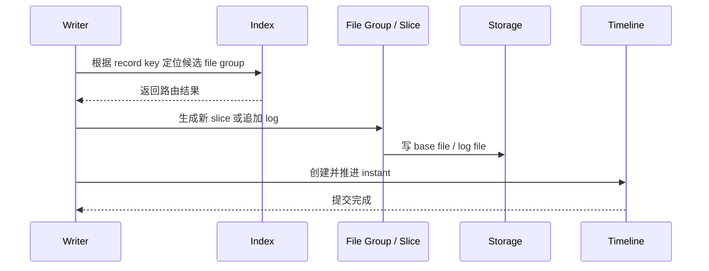

---
kb_id: bigdata/hudi/write-path
title: Hudi 写入路径与提交边界
description: 解释 Hudi 从 record key 路由、文件写入、instant 状态推进到提交完成的完整写链路，并说明 COW、MOR、索引、并发控制和失败恢复如何共同决定写语义。
domain: bigdata
component: hudi
topic: write-path
difficulty: advanced
status: reviewed
sidebar_position: 5
version_scope: Apache Hudi docs as verified on 2026-04-28
last_verified_at: '2026-04-28'
source_ids:
  - hudi-docs-overview
  - hudi-timeline-docs
  - hudi-file-layout-docs
  - hudi-writing-data-docs
  - hudi-table-types-docs
claim_ids:
  - bigdata-hudi-claim-0001
  - bigdata-hudi-claim-0006
  - bigdata-hudi-claim-0002
  - bigdata-hudi-claim-0003
  - bigdata-hudi-claim-0004
  - bigdata-hudi-claim-0005
  - bigdata-hudi-claim-0007
  - bigdata-hudi-claim-0008
  - bigdata-hudi-claim-0009
  - bigdata-hudi-claim-0010
tags:
  - bigdata
  - hudi
  - write-path
  - knowledge-base
  - production
---
## Hudi 写路径的关键，不是“把数据写进表”，而是如何把一批变更变成一个稳定版本

一条 Hudi 写链路至少同时处理三件事：

- 记录应该路由到哪个 file group。
- 这次变更在 COW 或 MOR 下怎样生成新的物理文件。
- 这次动作何时能在 timeline 上成为对读者可见的稳定 instant。

只看其中一部分，都会把问题讲浅。比如只讲“upsert 先找 key 再写文件”，还不够解释为什么目录里有文件但结果不可见；只讲 timeline，也解释不了为什么写放大、小文件和 compaction backlog 会一起出现。



## 第一步：写入先决定记录归属，而不是直接落文件

Hudi 的 upsert 不是看到一条记录就随便找个文件写进去。它首先依赖 `record key` 和索引来判断：这条记录是不是已经存在，如果存在，应该归到哪个 file group；如果不存在，是否需要新建 file group 或追加到当前布局中的某个目标文件。

这一步非常重要，因为它直接决定后续：

- 更新会不会打散到过多 file group。
- 小文件问题会不会被进一步放大。
- 同一个 key 的演进链条是否还可控。

所以，`record key` 设计不稳定、`preCombine` 语义含混、索引选型不合适，都会先在写路径上爆出来。

## 第二步：COW 与 MOR 在真正写文件时分叉

### COW 写路径

COW 的核心思路是：变更最终体现为新的 base file 版本。对于读者来说，好处是读取路径更直接，因为不需要额外合并日志；代价是更新时通常要重写更多数据。

### MOR 写路径

MOR 的核心思路是：变更优先追加到 log file，先把写入成本降下来，再通过 compaction 在后续时机把日志折叠回新 base file。它更适合高频更新或持续写入，但读 snapshot 时往往要承担更多合并开销。

因此，写路径一开始就已经决定了后续读路径和维护路径的成本结构。

## 第三步：写入成功不等于表已经可见

Hudi 最容易讲错的地方就在这里。很多人看到 base file 或 log file 已经写到对象存储，就以为提交完成。实际上，文件写入只是数据面动作；表级语义是否成立，要看对应 instant 是否完成状态推进。

也就是说：

- 文件存在，说明字节可能已经落盘。
- instant completed，才说明这批字节成为了表的稳定版本。

这就是为什么 Hudi 的语义不能被简化成“Parquet 覆盖目录”。真正的提交边界在 timeline 上。

## 第四步：失败恢复围绕 instant 状态和 rollback 展开

写入失败时，系统要回答两个问题：

- 哪些文件已经生成但还不应计入稳定版本。
- 哪些表级动作需要 rollback 或在后续清理中被处理掉。

这里的判断依据仍然是 timeline，而不是“目录里有没有新文件”。如果只看文件系统，很难区分稳定版本和失败半成品。

## 第五步：后台表服务会反过来影响写路径长期成本

很多团队在早期只关注写入能不能成功，忽视 compaction、clustering 和 cleaning，结果几周后表开始变得越来越难维护。原因是写路径并不是一次性动作，它会持续制造新的 file slice、log file 和历史版本。如果没有后台服务消化这些产物，后续写读成本都会失控。

- `compaction` 影响 MOR 的日志堆积。
- `clustering` 影响文件大小和布局均衡。
- `cleaning` 影响历史版本保留与存储膨胀。

## 写路径中的几个真实生产边界

### 边界 1：preCombine 不是万能去重开关

`preCombine` 用于在同一批或同一 key 的多条候选记录之间做顺序判断，但它不是跨所有历史版本的业务最终真相来源。业务如果需要更强的一致性语义，仍然要明确上游事件顺序和重放边界。

### 边界 2：并发写不是天然免费

多写者同时更新同一张 Hudi 表时，必须明确采用什么并发控制与锁策略。否则即使底层存储能接收多个任务写文件，也不等于表层面的提交一定安全。

### 边界 3：bulk_insert 和 upsert 不是同一条成本曲线

初始化灌库、分区重导入和持续增量更新，在写路径上的成本结构不同。把高吞吐导入场景和高频 upsert 场景混用同一套写策略，通常会带来文件布局失衡或资源浪费。

## 一个最小写入示例

```python
hudi_options = {
    "hoodie.table.name": "orders_hudi",
    "hoodie.datasource.write.recordkey.field": "order_id",
    "hoodie.datasource.write.precombine.field": "updated_at",
    "hoodie.datasource.write.partitionpath.field": "dt",
    "hoodie.datasource.write.operation": "upsert",
}

(df.write
   .format("hudi")
   .options(**hudi_options)
   .mode("append")
   .save("s3://warehouse/orders_hudi"))
```

这个例子真正值得看的不是 API 形式，而是它背后的语义：`recordkey` 决定记录身份，`precombine` 决定批内候选顺序，`operation` 决定走哪类写路径。

## 写路径排障顺序

1. 先看最近写入对应的 instant 是否完成。
2. 再看写入操作类型和表类型是否匹配。
3. 再看索引定位、file group 分布和小文件情况。
4. 最后看 compaction backlog、cleaning、并发冲突和底层存储异常。

## 真正能体现原理深度的理解方式

理解 Hudi upsert 原理时，不应只背流程图，而应顺着这条线展开：

1. 记录先通过 key 和索引定位 file group。
2. 写入再按 COW 或 MOR 生成新的 base 或 log。
3. 只有 timeline instant 完成，版本才真正可见。
4. 后台 compaction、clustering、cleaning 决定这条写路径能否长期稳定运行。

## 来源与事实边界

### 来源

`hudi-docs-overview`、`hudi-timeline-docs`、`hudi-file-layout-docs`、`hudi-writing-data-docs`、`hudi-table-types-docs`

### 事实声明

`bigdata-hudi-claim-0001`、`bigdata-hudi-claim-0006`、`bigdata-hudi-claim-0002`、`bigdata-hudi-claim-0003`、`bigdata-hudi-claim-0004`、`bigdata-hudi-claim-0005`、`bigdata-hudi-claim-0007`、`bigdata-hudi-claim-0008`、`bigdata-hudi-claim-0009`、`bigdata-hudi-claim-0010`

