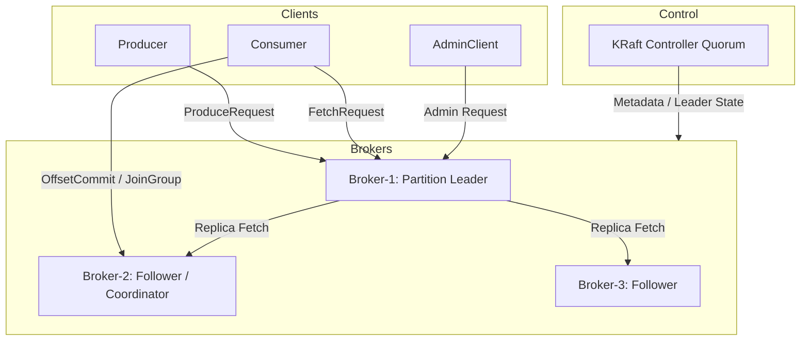

## 架构分层与角色协作

Kafka 架构可以分成四层：客户端层负责生产和消费，Broker 数据面负责日志读写和副本复制，协调层负责消费组和 offset，控制面负责 topic、partition、leader、ACL 等元数据。新版本 Kafka 的控制面通常由 KRaft controller quorum 承担，不再把 ZooKeeper 当成新集群的核心依赖。

架构理解最容易混淆的是“所有请求都经过 controller”这个错误想象。Producer 和 Consumer 的数据请求直接找目标 partition leader；controller 维护元数据和 leader 变更，不承载普通消息转发。Group coordinator 也不是全局单点，而是根据 group 绑定到某个 coordinator broker。

## 关键对象和状态归属

| 对象 | 作用 | 关键边界 |
| --- | --- | --- |
| Client | Producer、Consumer、AdminClient 等客户端，先拿 metadata 再访问目标 broker | 客户端缓存 metadata，遇到 leader 变化或错误后刷新 |
| Broker 数据面 | 处理 Produce、Fetch、ListOffsets 等请求，维护本地日志和副本状态 | 网络线程、请求队列、IO 线程、磁盘和 page cache 是主要观察点 |
| Controller 控制面 | 管理集群元数据、leader 选举和分区状态变化 | KRaft 下 controller quorum 需要多数派可用 |
| Group Coordinator | 管理消费组成员、generation、offset commit 和 rebalance | coordinator 迁移会导致客户端重新发现 |
| 内部 Topic | 如 __consumer_offsets、Connect 内部 topic、事务相关 topic | 内部 topic 的复制、压缩和可用性会影响上层语义 |

## 客户端请求如何绕过中心路由直接进入目标分区

1. Client 通过 bootstrap broker 获取集群 metadata。
2. Producer 根据 metadata 找到目标 partition leader，直接发送 ProduceRequest。
3. Consumer 根据分配关系找 partition leader，直接发送 FetchRequest。
4. Group coordinator 只处理组成员、rebalance 和 offset commit，不转发普通消息数据。
5. Controller 处理 leader 变化和元数据变更，客户端通过 metadata refresh 感知变化。

## 图解：客户端请求如何绕过中心路由直接进入目标分区



## 核心机制拆解

- Kafka 的数据面强调“客户端直连分区 leader”，减少中心转发层。
- 控制面强调元数据一致性和 leader 状态变更，KRaft controller quorum 的多数派可用性决定控制面可用性。
- 协调面把 consumer group 状态和 offset 状态绑定到 coordinator broker，并通过内部 compacted topic 形成可恢复状态。

## 性能和容量观察

- 数据请求热点通常表现为某些 broker 或 partition leader 压力高，而不是 controller 压力高。
- metadata 抖动会放大客户端刷新、请求失败和重试成本。
- coordinator 压力会影响 join、heartbeat、commit、offset fetch，而不一定影响 produce/fetch 吞吐。

## 生产排障入口

- leader 不均衡时先查 `kafka-topics.sh --describe` 和 broker 端 leader 数。
- 消费组异常时先查 coordinator 变化、rebalance 日志和 `__consumer_offsets` 健康。
- 控制面问题要查 KRaft quorum、controller 日志和 metadata shell/metadata quorum 工具。

## 可执行观察示例

```bash
kafka-metadata-quorum.sh --bootstrap-server broker:9092 describe --status
kafka-topics.sh --bootstrap-server broker:9092 --describe --topic orders
kafka-consumer-groups.sh --bootstrap-server broker:9092 --describe --group order-service
```

## 设计取舍和边界

- 客户端直连 leader 能提升吞吐，但要求客户端正确处理 metadata 过期和 leader 切换。
- coordinator 分散在 broker 上能避免单点，但 group 迁移和 offset cache 加载会带来瞬时异常。
- KRaft 去掉外部 ZooKeeper 简化部署链路，但 controller quorum 自身需要严格容量、磁盘和变更治理。

## 依据与版本边界

本页依据 Kafka 4.2 官方文档、Javadoc、Implementation、Operations、Configuration 或对应组件文档整理。涉及默认值、协议行为和版本差异时，应以当前集群 Kafka 版本、客户端版本和实际配置为准；本页不把具体业务集群经验写成跨版本绝对结论。

### 来源

`kafka-docs-home`、`kafka-design-doc`、`kafka-implementation-distribution`、`kafka-implementation-network`、`kafka-kraft-operations`

### 事实声明

`kafka-claim-0001`、`kafka-claim-0016`、`kafka-claim-0019`、`kafka-claim-0022`、`kafka-claim-0027`、`kafka-claim-0048`、`kafka-claim-0049`、`kafka-claim-0070`、`kafka-claim-0071`
