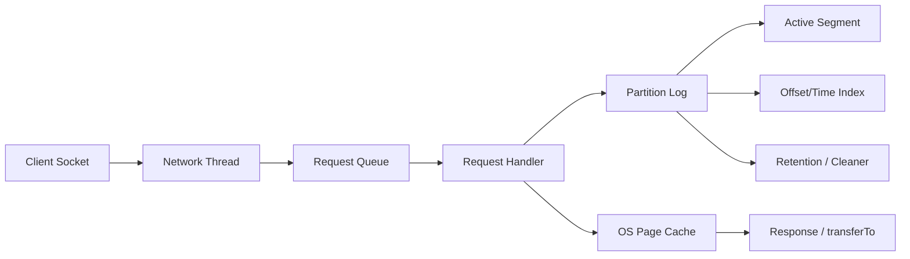

## Broker 存储、网络线程与零拷贝边界

Broker 是 Kafka 数据面的核心，但它不是“把消息放进内存队列”。一个 broker 要同时做网络接入、请求排队、权限和配额检查、日志追加、索引维护、副本复制、segment 清理和 fetch 返回。Kafka 的高吞吐来自顺序追加、批量、page cache 和高效网络传输的组合。

Broker 的优化边界不能被理解成“磁盘越快越好”或“内存越大越好”。写入主要落到 active segment 的顺序追加；读取要先通过 offset index 定位 segment 和相对位置；热点分区、慢磁盘、网络队列、page cache 命中率、replica fetch 和 log cleaner 都会影响表现。

## 关键对象和状态归属

| 对象 | 作用 | 关键边界 |
| --- | --- | --- |
| Socket Server | 接收客户端连接和网络请求 | 观察连接数、请求队列、网络线程繁忙度 |
| Request Handler | 处理 produce/fetch/metadata 等请求 | 请求队列时间和处理时间能区分网络排队和业务处理 |
| Log Segment | 分区日志物理文件单位，以起始 offset 命名 | segment 大小影响索引、清理、恢复和文件数量 |
| Offset Index / Time Index | 帮助从逻辑 offset 或时间定位文件位置 | 索引是稀疏结构，定位后仍可能顺序扫描一小段 |
| Page Cache | 操作系统文件缓存 | Kafka 依赖 OS 缓存加速读写，不应简单等同于 JVM 堆缓存 |
| Replica Fetcher | follower 从 leader 拉取日志的复制线程 | 复制落后会影响 ISR、HW 和 produce 成功率 |

## Broker 处理 Produce 和 Fetch 的共同路径

1. 网络线程接收请求并放入请求队列。
2. 请求处理线程解析目标 topic-partition 和权限、quota、配置。
3. Produce 请求追加到 partition active segment，同时更新必要索引。
4. Fetch 请求根据 offset 找到 segment 和文件位置，读取一段日志返回。
5. 副本复制本质上也是 follower 向 leader 发起 fetch。
6. 后台清理根据 retention 或 compaction 处理旧 segment。

## 图解：Broker 处理 Produce 和 Fetch 的共同路径



## 核心机制拆解

- 写入是追加到 active segment，segment roll 后变成只读候选，后续才能被删除或压缩。
- 读取先按 offset 找 segment，再利用 index 近似定位，最后从文件位置读出 batch。
- 网络层是 NIO 模型，文件 backed records 可以通过 transferTo 走更高效的数据传输路径，但这不等于所有场景都没有拷贝成本。

## 性能和容量观察

- RequestQueueTime 高通常表明请求正在排队，LocalTime 高可能是磁盘、锁、日志追加或索引相关压力。
- Fetch 延迟高可能来自页缓存未命中、磁盘抖动、远端副本落后或消费者 fetch 配置。
- 小 batch 会增加请求数和系统调用压力，大 batch 能提升吞吐但可能增加排队和端到端延迟。

## 生产排障入口

- 查看 broker 请求时间分解，区分队列、处理、本地磁盘和远端等待。
- 结合磁盘使用率、log dir 分布、segment 数和 page cache 压力判断是否是存储瓶颈。
- 如果只有部分分区慢，优先查 leader 分布和热点 key，不要直接全局扩 broker。

## 可执行观察示例

```bash
kafka-log-dirs.sh --bootstrap-server broker:9092 --describe
kafka-topics.sh --bootstrap-server broker:9092 --describe --topic orders
# JMX 中重点观察 RequestMetrics、LogFlushRateAndTimeMs、UnderReplicatedPartitions
```

## 设计取舍和边界

- 较大的 segment 减少文件数量和清理频率，但故障恢复和删除粒度更粗。
- 更密的索引提升定位精度，但增加索引文件大小。
- 依赖 page cache 能减少 JVM 堆压力，但也要求机器内存和其他进程隔离良好。

## 依据与版本边界

本页依据 Kafka 4.2 官方文档、Javadoc、Implementation、Operations、Configuration 或对应组件文档整理。涉及默认值、协议行为和版本差异时，应以当前集群 Kafka 版本、客户端版本和实际配置为准；本页不把具体业务集群经验写成跨版本绝对结论。

### 来源

`kafka-implementation-log`、`kafka-implementation-network`、`kafka-design-doc`、`kafka-topic-configs`

### 事实声明

`kafka-claim-0023`、`kafka-claim-0024`、`kafka-claim-0025`、`kafka-claim-0026`、`kafka-claim-0027`、`kafka-claim-0046`
