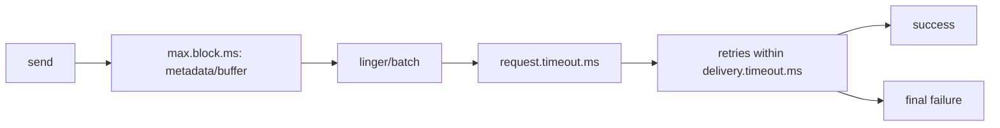

## 客户端超时、重试、Delivery Timeout 与错误边界

Kafka 客户端超时要按生命周期理解。Producer 可能在获取 metadata、等待 buffer、发送请求、等待 broker ack、重试和最终 delivery timeout 中失败；Consumer 可能在 poll 周期、group heartbeat、offset commit 和业务处理超时中失败。

request.timeout.ms 不是发送总超时，delivery.timeout.ms 才是 producer 报告成功或失败的总边界。max.block.ms 控制 send 或 metadata 等待 buffer/metadata 的阻塞上限。盲目加大 timeout 可能掩盖故障，盲目缩小 timeout 可能误杀可恢复抖动。

## 关键对象和状态归属

| 对象 | 作用 | 关键边界 |
| --- | --- | --- |
| max.block.ms | send 或 metadata 请求等待 buffer/metadata 的阻塞上限 | buffer.memory 耗尽时尤其关键 |
| request.timeout.ms | 一次请求等待响应的时间边界 | 不是完整发送生命周期 |
| delivery.timeout.ms | producer send 最终成功或失败的总时间边界 | 应覆盖 linger 和 request timeout |
| retries | 可恢复错误的重试次数 | 幂等配置影响重试安全性 |
| max.poll.interval.ms | consumer 两次 poll 间最大间隔 | 业务处理超时会触发 rebalance |

## Producer 发送失败如何被超时边界裁剪

1. 应用调用 send，可能等待 metadata 或 buffer。
2. record 进入 batch，可能等待 linger。
3. Sender 发出 ProduceRequest，等待 request timeout。
4. 可恢复错误在 delivery timeout 内重试。
5. 超过 delivery timeout 后回调失败。
6. 不可恢复事务或 fencing 类异常需要关闭 producer。

## 图解：Producer 发送失败如何被超时边界裁剪



## 核心机制拆解

- delivery.timeout.ms 应大于等于 request.timeout.ms 加 linger.ms，这保证总边界覆盖请求和批量等待。
- 关闭幂等且 in-flight 大于 1 时，重试可能造成同分区批次乱序。
- 事务异常要按 recoverable 和 fatal 分类，不能所有异常都无限重试。

## 性能和容量观察

- timeout 太短会导致瞬时 broker 抖动被放大成业务失败。
- timeout 太长会让调用方长时间感知不到错误，堆积更多内存和请求。
- 重试能提升成功率，但会增加尾延迟和重复处理风险。

## 生产排障入口

- send 阻塞先看 max.block.ms、buffer.memory 和 metadata。
- request timeout 先看 broker request latency、ISR 等待和网络。
- 事务生产者失败时按异常类型判断 abortTransaction 还是 close。

## 可执行观察示例

```properties
request.timeout.ms=30000
linger.ms=5
delivery.timeout.ms=120000
retries=2147483647
enable.idempotence=true
```

## 设计取舍和边界

- 更长 delivery timeout 提高容错，但拉长故障反馈。
- 开启幂等让 retry 更安全，但有配置约束。
- 消费者扩大 max.poll.interval.ms 能容忍慢处理，但故障接管更慢。

## 依据与版本边界

本页依据 Kafka 4.2 官方文档、Javadoc、Implementation、Operations、Configuration 或对应组件文档整理。涉及默认值、协议行为和版本差异时，应以当前集群 Kafka 版本、客户端版本和实际配置为准；本页不把具体业务集群经验写成跨版本绝对结论。

### 来源

`kafka-producer-configs`、`kafka-producer-javadoc`、`kafka-consumer-configs`

### 事实声明

`kafka-claim-0094`、`kafka-claim-0098`、`kafka-claim-0100`、`kafka-claim-0101`、`kafka-claim-0063`、`kafka-claim-0107`
