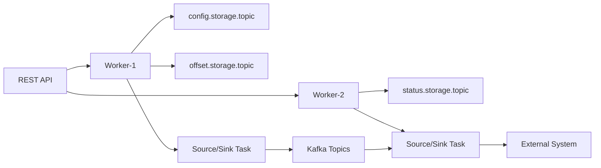

## Connect 分布式运行时与内部 Topic

Kafka Connect 是 Kafka 生态里的数据集成运行时，用来把外部系统与 Kafka 连接起来。分布式模式下，多个 worker 组成一个 Connect 集群，connector 描述连接任务，task 执行实际数据搬运，配置、offset 和状态存入 Kafka 内部 topic。

Connect 不是万能 ETL 引擎，也不是每个 connector 都天然 exactly-once。它提供运行时、任务分配、REST 管理、内部状态存储和故障恢复框架；具体 source/sink 语义取决于 connector 实现、外部系统能力和配置。

## 关键对象和状态归属

| 对象 | 作用 | 关键边界 |
| --- | --- | --- |
| Worker | Connect 进程实例，分布式模式下组成 worker group | 负责运行 connector/task 并参与 rebalance |
| Connector | 定义连接器实例和配置 | source connector 从外部读入 Kafka，sink connector 从 Kafka 写出外部 |
| Task | 实际执行数据搬运的并行单元 | task 数量和外部系统分片共同决定并行度 |
| Config Topic | 保存 connector 配置 | 官方建议单分区并启用 compaction |
| Offset Topic | 保存 source offset | 通常多分区并 compact，影响恢复和吞吐 |
| Status Topic | 保存 connector/task 状态 | 用于 REST 和运维观察 |

## Distributed Connect 提交和运行一个 Connector 的链路

1. 用户通过 REST API 提交 connector 配置。
2. worker 将配置写入 config.storage.topic。
3. worker group 进行任务分配，生成 connector tasks。
4. source task 读取外部系统并写入 Kafka；sink task 从 Kafka 读取并写入外部系统。
5. offset 和 status 分别写入内部 topic，支持恢复和观察。
6. worker 加入或离开时，Connect 根据协议进行 rebalance。

## 图解：Distributed Connect 提交和运行一个 Connector 的链路



## 核心机制拆解

- 分布式模式自动平衡 work，并通过 Kafka 内部 topic 存储配置、offset 和状态。
- Connect 自 Kafka 2.3 起在兼容协议下默认使用 incremental cooperative rebalancing，以降低全量重平衡影响。
- worker 离开后可等待 scheduled.rebalance.max.delay.ms，以便短暂离线 worker 返回并拿回原任务。

## 性能和容量观察

- tasks.max 不是越大越好，外部系统连接数、分区数、事务能力和限流都会形成边界。
- 内部 topic 分区和压缩策略配置错误会影响恢复和状态一致性。
- sink 端吞吐通常受外部系统写入能力限制，而不是 Kafka fetch 能力。

## 生产排障入口

- 优先通过 REST API 查看 connector 和 task 状态，而不是只看 worker 进程。
- 任务频繁重启时检查 connector 配置、外部系统错误、内部 topic 和 worker rebalance。
- source offset 回退或重复时检查 offset.storage.topic 和 connector 自身 offset 语义。

## 可执行观察示例

```bash
curl -s http://connect:8083/connectors
curl -s http://connect:8083/connectors/jdbc-source/status
curl -X PUT http://connect:8083/connectors/jdbc-source/config -H 'Content-Type: application/json' -d @connector.json
```

## 设计取舍和边界

- standalone 模式简单，适合单进程或开发环境，但容错能力弱。
- distributed 模式运维复杂一些，但支持任务分配、故障恢复和 REST 管理。
- source/sink exactly-once 依赖 connector 和外部系统，不应把运行时能力误认为所有连接器保证。

## 依据与版本边界

本页依据 Kafka 4.2 官方文档、Javadoc、Implementation、Operations、Configuration 或对应组件文档整理。涉及默认值、协议行为和版本差异时，应以当前集群 Kafka 版本、客户端版本和实际配置为准；本页不把具体业务集群经验写成跨版本绝对结论。

### 来源

`kafka-connect-user-guide`、`kafka-connect-administration`、`kafka-geo-replication`

### 事实声明

`kafka-claim-0082`、`kafka-claim-0083`、`kafka-claim-0084`、`kafka-claim-0085`、`kafka-claim-0086`、`kafka-claim-0092`
