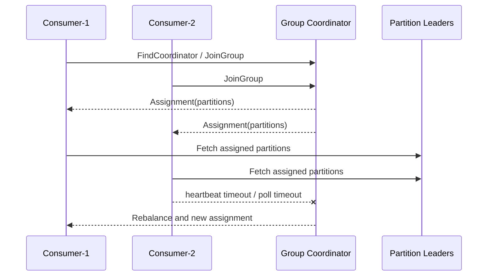

## Consumer Group、Coordinator 与 Rebalance 原理

Consumer Group 解决什么问题：把同一批 topic partition 分摊给多个 consumer，同时在成员变化时重新接管分区。它不是简单的“多个线程一起读”，而是一套由 group coordinator、member、generation、assignment、heartbeat、poll 和 offset commit 共同组成的协调协议。

同一个 consumer group 内，一个 partition 同一时刻最多分配给一个 consumer，因此并行度上限首先受 partition 数限制。Rebalance 解决成员和分配变化问题，但会带来停顿、重复处理窗口和状态迁移成本。手动 assign 不走组协调，也就没有自动故障接管。

## 关键对象和状态归属

| 对象 | 作用 | 关键边界 |
| --- | --- | --- |
| Group Coordinator | 负责消费组成员、generation、分配和 offset 相关请求 | coordinator 变化会导致客户端重新发现并重新加入组 |
| Group Member | 组内 consumer 实例 | 成员 join/leave、心跳超时或 poll 超时都会影响分配稳定性 |
| Generation | 一次稳定分配的版本 | 提交 offset 和回调语义都要与当前 generation 对齐 |
| Assignment | partition 到 consumer 的映射 | 决定每个实例真正承担哪些分区 |
| Rebalance Listener | 分区撤销、丢失和分配后的应用回调 | 是提交 offset、释放状态和加载状态的关键边界 |
| Static Membership | 通过 group.instance.id 稳定成员身份 | 能减少短暂重启导致的重平衡抖动，但不是万能容错 |

## 订阅消费从 join 到稳定 poll 的执行链路

1. consumer subscribe topic 后在 poll 中发现 coordinator。
2. 成员向 coordinator 加入 group，coordinator 根据协议形成 assignment。
3. assignment 下发后，consumer 获得自己负责的 partition。
4. consumer poll 拉取数据并推进 position，同时通过 heartbeat 维持成员存活。
5. 成员变化、topic metadata 变化、poll 超时或协议变化会触发 rebalance。
6. 分区撤销前执行 onPartitionsRevoked；已经丢失所有权时执行 onPartitionsLost。

## 图解：订阅消费从 join 到稳定 poll 的执行链路



## 核心机制拆解

- 经典协议中常见 assignment 由客户端侧 leader 计算；新 consumer rebalance protocol 把 assignment 计算放到 broker-side group coordinator，并强调增量化。
- Rebalance 只在 poll 的活跃调用过程中发生，这意味着长时间阻塞业务处理会影响组协调。
- 分区撤销回调是提交已处理 offset 和释放本地资源的最后稳定窗口；onPartitionsLost 则表示所有权可能已经转移。

## 性能和容量观察

- 消费者数量超过分区数不会提高同组并行度，只会增加空闲成员和协调成本。
- max.poll.interval.ms 超时通常说明业务处理或下游调用太慢，不是 broker fetch 本身一定慢。
- static membership 和 cooperative rebalance 可以降低短暂重启导致的抖动，但仍要控制处理时长和提交策略。

## 生产排障入口

- 用 `--members --verbose` 查看成员和分区分配。
- 查看 consumer 日志中的 rebalance reason、revoked/assigned/lost 回调顺序。
- 如果频繁 rebalance，按成员重启、网络抖动、poll 超时、topic 分区变化和 coordinator 迁移逐层排查。

## 可执行观察示例

```java
consumer.subscribe(List.of("orders"), new ConsumerRebalanceListener() {
  public void onPartitionsRevoked(Collection<TopicPartition> partitions) {
    consumer.commitSync(currentOffsets);
  }
  public void onPartitionsAssigned(Collection<TopicPartition> partitions) {
    // 加载本地状态或记录新分配。
  }
});
```

## 设计取舍和边界

- 更频繁提交 offset 能减少重复窗口，但会增加 coordinator 压力。
- 更大 poll 批量能提升吞吐，但会增加 max.poll.interval.ms 超时风险。
- static membership 降低重启抖动，但实例身份必须严格唯一，否则会出现成员冲突。

## 依据与版本边界

本页依据 Kafka 4.2 官方文档、Javadoc、Implementation、Operations、Configuration 或对应组件文档整理。涉及默认值、协议行为和版本差异时，应以当前集群 Kafka 版本、客户端版本和实际配置为准；本页不把具体业务集群经验写成跨版本绝对结论。

### 来源

`kafka-consumer-javadoc`、`kafka-consumer-rebalance-protocol`、`kafka-implementation-distribution`、`kafka-consumer-rebalance-listener-javadoc`、`kafka-consumer-configs`

### 事实声明

`kafka-claim-0003`、`kafka-claim-0012`、`kafka-claim-0013`、`kafka-claim-0014`、`kafka-claim-0048`、`kafka-claim-0049`、`kafka-claim-0051`、`kafka-claim-0052`、`kafka-claim-0053`、`kafka-claim-0054`、`kafka-claim-0055`、`kafka-claim-0106`、`kafka-claim-0107`、`kafka-claim-0109`
