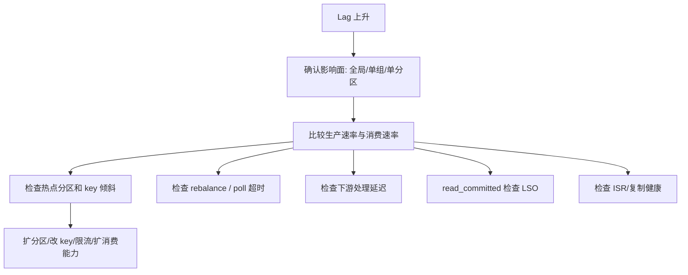

## Consumer Lag 监控、归因与处理路径

Consumer lag 是 Kafka 生产排障里最常见但也最容易误判的指标。lag 不是单一含义，它取决于你用的是 client 侧 records-lag-max，还是 consumer group 工具里的 CURRENT-OFFSET、LOG-END-OFFSET 和 LAG；还取决于 read_committed 场景下末尾是 LSO 还是高水位。

lag 升高不一定说明消费者线程少，也不一定说明 broker 慢。可能是生产突增、下游慢、单分区热点、rebalance 抖动、offset 提交滞后、fetch 配置不合理、事务 LSO 停滞或副本复制压力。必须先明确指标口径，再分层归因。

## 关键对象和状态归属

| 对象 | 作用 | 关键边界 |
| --- | --- | --- |
| records-lag-max | consumer client 侧基于 current offset 的指标 | 反映运行时读取进度，而不是 committed offset backlog |
| CURRENT-OFFSET | 消费组已提交恢复点 | 用于估算重启后还需处理的范围 |
| LOG-END-OFFSET | group 工具展示的日志末尾口径 | 事务模式下要额外理解 LSO |
| LSO | read_committed 可见末尾 | 开放事务会让 lag 口径发生变化 |
| Partition Hotspot | 某些分区 lag 远高于其他分区 | 通常来自 key 倾斜或下游处理不均 |
| Downstream Sink | 数据库、搜索、缓存、HTTP 服务等下游 | 慢下游会让 poll 处理周期变长并触发 rebalance 风险 |

## Lag 归因的分层路径

1. 先确认 lag 是全 topic、全 group、单 partition 还是单 consumer。
2. 比较生产速率和消费速率，判断是输入突增还是处理能力下降。
3. 检查 partition 分布，识别热点 key 或 leader 热点。
4. 查看 rebalance 日志和 poll 间隔，判断是否被组协调打断。
5. 检查下游 sink 延迟和错误率，确认业务处理是否拖慢。
6. 如果 read_committed，检查开放事务和 LSO 是否停滞。
7. 结合 broker 复制指标确认是否存在 ISR 和高水位推进问题。

## 图解：Lag 归因的分层路径



## 核心机制拆解

- records-lag-max 来自 consumer client，基于 current offset；group 工具展示的是提交位移视角。
- max.poll.records 只限制 poll 返回条数，不改变底层 fetch 行为，不能把它当作网络拉取大小开关。
- read_committed consumer 的 lag 相对 LSO 计算，不能直接和 read_uncommitted 口径混用。

## 性能和容量观察

- lag 持续增长说明长期消费速率低于生产速率；lag 波动可能只是批量处理和提交周期造成。
- 单分区 lag 高通常不能靠同组增加更多 consumer 解决。
- 下游慢时提高 fetch 大小可能让内存压力更糟，而不是解决根因。

## 生产排障入口

- 用 `kafka-consumer-groups.sh --describe` 看每个 partition 的 CURRENT-OFFSET、LOG-END-OFFSET、LAG。
- 结合 consumer 端 records-lag-max、poll latency、commit latency 和业务处理耗时。
- 对 read_committed 业务，额外观察事务生产者是否有长事务或异常未提交。

## 可执行观察示例

```bash
kafka-consumer-groups.sh --bootstrap-server broker:9092 --describe --group order-service
kafka-consumer-groups.sh --bootstrap-server broker:9092 --describe --group order-service --members --verbose
# 同时对照 consumer JMX: records-lag-max、poll-latency、commit-latency
```

## 设计取舍和边界

- 批量处理能提高吞吐，但会让 lag 指标呈阶梯式波动。
- 频繁提交 offset 让恢复点更接近当前处理进度，但增加 coordinator 压力。
- 扩 consumer 只有在有可分配 partition 且下游能承受时才有效。

## 依据与版本边界

本页依据 Kafka 4.2 官方文档、Javadoc、Implementation、Operations、Configuration 或对应组件文档整理。涉及默认值、协议行为和版本差异时，应以当前集群 Kafka 版本、客户端版本和实际配置为准；本页不把具体业务集群经验写成跨版本绝对结论。

### 来源

`kafka-consumer-javadoc`、`kafka-monitoring`、`kafka-basic-operations`、`kafka-consumer-configs`

### 事实声明

`kafka-claim-0021`、`kafka-claim-0029`、`kafka-claim-0030`、`kafka-claim-0031`、`kafka-claim-0032`、`kafka-claim-0045`、`kafka-claim-0047`、`kafka-claim-0103`、`kafka-claim-0104`、`kafka-claim-0108`
