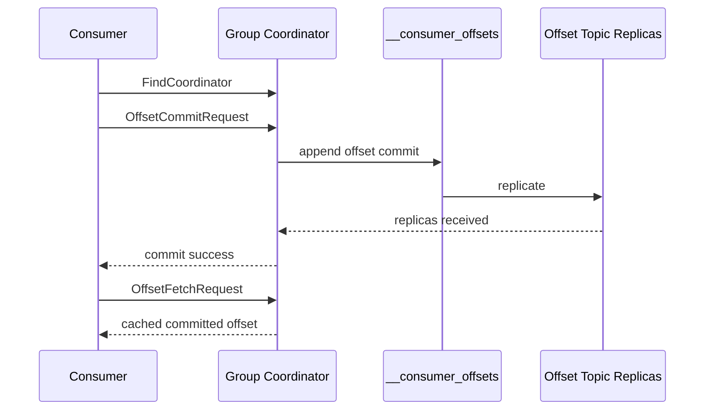

## __consumer_offsets、Coordinator Cache 与 Commit 持久性

`__consumer_offsets` 是 Kafka 消费组恢复能力的核心内部 topic。Consumer 提交 offset 时不是写本地文件，也不是写业务 topic，而是发给该 group 的 coordinator broker，由 coordinator 把提交追加到 compacted internal topic，并在内存中维护已加载 offsets cache。

Committed offset 是可恢复状态，但不是业务审计日志。`__consumer_offsets` 是 compacted topic，某个 group-partition 只需要最新 offset，因此旧提交会被压缩。offset commit 成功需要内部 topic 副本复制，但 coordinator cache 加载、leader 迁移和 compaction 都会影响观察和恢复。

## 关键对象和状态归属

| 对象 | 作用 | 关键边界 |
| --- | --- | --- |
| Group Coordinator | 某个 group 对应的 coordinator broker | 负责 offset commit/fetch 和组状态 |
| FindCoordinator | consumer 发现 coordinator 的请求 | coordinator 迁移时需要重新发现 |
| __consumer_offsets | 保存消费组 offset 和组元数据的内部 compacted topic | 其分区 leader 决定 coordinator 分布 |
| Offset Cache | coordinator 内存中加载的 offsets | 提升 offset fetch 性能 |
| CoordinatorLoadInProgressException | coordinator 正在加载 offsets cache 时的短暂异常 | 常见于 leader 切换或刚启动 |
| Compaction | 保留每个 key 最新提交 | 降低内部 topic 长期膨胀 |

## Offset commit 的内部持久化链路

1. consumer 通过 FindCoordinator 找到 group coordinator。
2. consumer 发送 OffsetCommitRequest。
3. coordinator 校验 group/generation/权限等状态。
4. coordinator 将 offset 追加到 `__consumer_offsets` 对应分区。
5. 内部 topic 副本复制完成后，coordinator 返回 commit 成功。
6. coordinator 把已加载 offset 缓存在内存中，用于后续 offset fetch。

## 图解：Offset commit 的内部持久化链路



## 核心机制拆解

- coordinator 按 group 名称映射管理消费组，consumer 必须能在 coordinator 迁移后重新发现。
- 成功 commit 响应在 offsets topic 副本接收后返回，这是 committed offset 可恢复性的基础。
- offsets topic 被周期性压缩，因为恢复只需要每个 group-partition 的最新提交。

## 性能和容量观察

- commit 频率过高会增加 coordinator 和 internal topic 压力。
- coordinator cache 加载期间 offset fetch 可能短暂失败。
- 内部 topic 复制健康会直接影响 offset commit 持久性和消费组恢复。

## 生产排障入口

- commit latency 飙升时检查 coordinator broker、`__consumer_offsets` 分区 leader 和 ISR。
- offset fetch 出现 CoordinatorLoadInProgressException 时确认是否刚发生 coordinator 迁移或重启。
- 消费组恢复异常时检查 offsets topic 是否被错误删除、复制不足或权限受限。

## 可执行观察示例

```bash
kafka-consumer-groups.sh --bootstrap-server broker:9092 --describe --group order-service
kafka-topics.sh --bootstrap-server broker:9092 --describe --topic __consumer_offsets
```

## 设计取舍和边界

- 集中由 coordinator 处理 offset 让恢复语义统一，但 coordinator 热点会影响大规模 group。
- compaction 降低存储成本，但不适合作为完整提交历史审计。
- 频繁提交缩小重复窗口，却增加内部 topic 写入压力。

## 依据与版本边界

本页依据 Kafka 4.2 官方文档、Javadoc、Implementation、Operations、Configuration 或对应组件文档整理。涉及默认值、协议行为和版本差异时，应以当前集群 Kafka 版本、客户端版本和实际配置为准；本页不把具体业务集群经验写成跨版本绝对结论。

### 来源

`kafka-implementation-distribution`

### 事实声明

`kafka-claim-0022`、`kafka-claim-0048`、`kafka-claim-0049`、`kafka-claim-0050`、`kafka-claim-0110`、`kafka-claim-0111`、`kafka-claim-0112`、`kafka-claim-0113`
