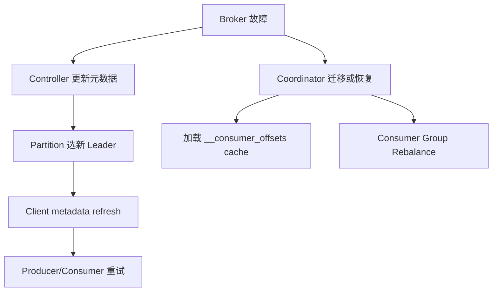

## 故障恢复、状态重建与影响面判断

Kafka 故障恢复不是一个动作，而是一组状态重建过程：broker 本地日志恢复、controller 元数据恢复、partition leader 重新选举、follower 追赶、group coordinator 加载 offset cache、consumer 重新分配分区、producer 刷新 metadata 并重试。

故障恢复要先判断影响面。单 broker 故障、controller quorum 不可用、coordinator 迁移、磁盘目录损坏、ISR 缩小和消费者进程重启，对业务的影响完全不同。不要把所有问题都归为“Kafka 挂了”。

## 关键对象和状态归属

| 对象 | 作用 | 关键边界 |
| --- | --- | --- |
| Broker Restart | broker 重新启动并恢复本地日志 | 启动时会校验最新 segment 并截断无效数据 |
| Controlled Shutdown | 计划内停机时迁移 leader 并 sync 日志 | 需要其他 live replica 存在才更平滑 |
| Controller Quorum | KRaft 控制面多数派 | 多数派不可用会影响元数据变更和 leader 管理 |
| Group Coordinator Recovery | coordinator 迁移或重启后加载 offsets cache | 加载期间可能出现 CoordinatorLoadInProgressException |
| Consumer Rebalance | 成员故障后的分区重新分配 | 决定消费接管速度和重复处理窗口 |
| Producer Retry | leader 变化后的 metadata refresh 和重试 | 需要结合幂等、timeout 和业务重试边界 |

## Broker 故障后的恢复顺序

1. broker 失联后，controller 检测分区 leader 或 replica 状态变化。
2. 受影响 partition 在可选副本中选新 leader。
3. 客户端请求失败后刷新 metadata，重新访问当前 leader。
4. 故障 broker 恢复时先作为 follower 追赶日志。
5. 如果它是某些 group 的 coordinator，offset cache 需要重新加载。
6. consumer group 根据成员状态进行 rebalance，分区被其他成员接管。

## 图解：Broker 故障后的恢复顺序



## 核心机制拆解

- 计划内 controlled shutdown 和硬故障的影响不同，前者可以迁移 leader 降低不可用时间。
- broker 重启后通常以 follower 身份回来，长期 leader 均衡需要自动或手动 preferred leader election。
- coordinator 恢复时 offset cache 加载是独立阶段，可能让 offset fetch/commit 短暂失败。

## 性能和容量观察

- 大量 partition leader 同时迁移会造成 metadata 风暴和客户端重试。
- broker 重启恢复速度受 segment 数、磁盘、日志校验和 replica catch-up 影响。
- controller quorum 节点应避免与高负载数据 broker 混部在关键生产环境中。

## 生产排障入口

- 先按控制面、数据面、协调面和客户端面划分故障。
- 数据面看 leader、ISR、URP、磁盘和 broker 日志；协调面看 group coordinator、rebalance 和 offset cache；控制面看 KRaft quorum。
- 恢复后继续观察 leader 分布、ISR 回补和 lag 是否回落，避免只看进程启动成功。

## 可执行观察示例

```bash
kafka-metadata-quorum.sh --bootstrap-server broker:9092 describe --status
kafka-topics.sh --bootstrap-server broker:9092 --describe --under-replicated-partitions
kafka-consumer-groups.sh --bootstrap-server broker:9092 --describe --group order-service
```

## 设计取舍和边界

- 更高 replication factor 提升故障容忍，但增加存储和复制成本。
- 更快故障检测缩短接管时间，但可能误判短暂抖动。
- 计划内滚动重启成本更高，但比硬停机更可控。

## 依据与版本边界

本页依据 Kafka 4.2 官方文档、Javadoc、Implementation、Operations、Configuration 或对应组件文档整理。涉及默认值、协议行为和版本差异时，应以当前集群 Kafka 版本、客户端版本和实际配置为准；本页不把具体业务集群经验写成跨版本绝对结论。

### 来源

`kafka-implementation-log`、`kafka-basic-operations`、`kafka-implementation-distribution`、`kafka-kraft-operations`

### 事实声明

`kafka-claim-0026`、`kafka-claim-0035`、`kafka-claim-0036`、`kafka-claim-0049`、`kafka-claim-0050`、`kafka-claim-0071`、`kafka-claim-0113`、`kafka-claim-0117`、`kafka-claim-0119`
