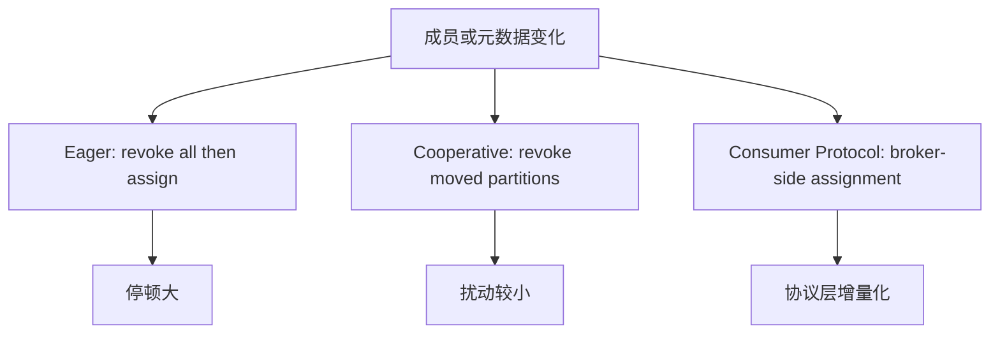

## Rebalance 协议：Eager、Cooperative 与 Consumer Protocol

Rebalance 协议决定消费组变化时分区如何重新分配。传统 eager 模式倾向先撤销再整体分配；cooperative 模式强调增量迁移；Kafka 4.0 后新的 consumer rebalance protocol 已 GA，但需要显式配置 group.protocol=consumer，且 assignment 计算转移到 broker-side coordinator。

不能把所有 rebalance 都叫“全量停顿”。不同协议、不同 assignor、不同客户端版本和不同框架会有不同影响。Connect 的 cooperative rebalance 也属于 Connect worker 协议语境，不应和普通 Consumer API 的 group.protocol 混成一个概念。

## 关键对象和状态归属

| 对象 | 作用 | 关键边界 |
| --- | --- | --- |
| Eager Rebalance | 传统撤销后重新分配模式 | 实现简单但扰动大 |
| Cooperative Rebalance | 增量迁移分区所有权 | 减少不必要撤销，但要求协议和 assignor 支持 |
| Consumer Protocol | Kafka 4.x 新 group protocol | broker-side coordinator 计算 assignment |
| group.protocol | consumer 端选择 classic 或 consumer | 默认 classic，consumer 需要显式设置 |
| Broker-side Heartbeat Control | consumer protocol 下心跳节奏由 broker 控制 | heartbeat.interval.ms 客户端设置不再适用 |

## 三类 Rebalance 思路对比

1. eager 模式中，成员通常撤销现有分区后等待新 assignment。
2. cooperative 模式尽量只撤销必须迁移的分区，保留未变化所有权。
3. consumer protocol 中，coordinator 在 broker 侧计算 assignment 并支持增量协议。
4. 升级时需要确认 broker 版本、client 版本、group.protocol 和 assignor。

## 图解：三类 Rebalance 思路对比



## 核心机制拆解

- Kafka 4.0 新 consumer rebalance protocol GA，但不是默认启用。
- consumer protocol 下 group coordinator 计算 assignment，而不是客户端 group leader。
- broker 控制心跳节奏后，一些 classic 协议下的客户端配置边界会变化。

## 性能和容量观察

- cooperative 和 consumer protocol 的收益主要体现在降低稳定组的扰动，而不是提高单分区处理速度。
- 频繁成员上下线仍会带来协调成本，协议只能降低不能消除。
- 升级协议前要压测客户端、框架和监控对回调语义的假设。

## 生产排障入口

- 确认消费者实际使用的 group.protocol。
- 查看 rebalance 日志，区分 revoke all 还是增量迁移。
- 升级后如果心跳配置不生效，检查是否切到 consumer protocol。

## 可执行观察示例

```properties
# Kafka 4.x 新 consumer group protocol 需要显式启用
group.protocol=consumer
```

## 设计取舍和边界

- eager 简单稳定，但扰动大。
- cooperative 降低停顿，但状态管理和回调处理更复杂。
- 新 consumer protocol 更现代，但要求 broker/client 版本和配置一致。

## 依据与版本边界

本页依据 Kafka 4.2 官方文档、Javadoc、Implementation、Operations、Configuration 或对应组件文档整理。涉及默认值、协议行为和版本差异时，应以当前集群 Kafka 版本、客户端版本和实际配置为准；本页不把具体业务集群经验写成跨版本绝对结论。

### 来源

`kafka-consumer-rebalance-protocol`、`kafka-connect-administration`、`kafka-consumer-configs`

### 事实声明

`kafka-claim-0012`、`kafka-claim-0013`、`kafka-claim-0056`、`kafka-claim-0085`、`kafka-claim-0109`
