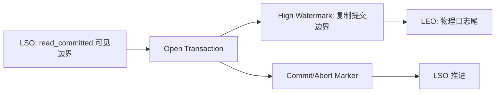

## 高水位、Last Stable Offset 与读可见性边界

Kafka 里“日志末尾”不是一个单一概念。LEO 描述物理日志尾部，高水位描述已提交可见边界，LSO 描述事务消费者 read_committed 能读取到的最后稳定位置。只有把这几个边界区分开，才能解释为什么数据写进日志却读不到、为什么 offset 会有 gap、为什么 seekToEnd 在 read_committed 下不是物理尾部。

高水位与 LSO 都不是业务处理完成标记。高水位关注复制提交，LSO 关注事务完成。read_uncommitted 可以看到包括未提交事务在内的日志边界，read_committed 只能看到已提交事务消息，并且会停在第一个开放事务之前。

## 关键对象和状态归属

| 对象 | 作用 | 关键边界 |
| --- | --- | --- |
| LEO | Log End Offset，日志物理末尾下一位置 | 不等于消费者一定可读到的位置 |
| High Watermark | 已复制提交边界 | 普通消费者可见范围与它相关 |
| LSO | Last Stable Offset，最后稳定 offset | read_committed 消费者最多读到这里 |
| Open Transaction | 尚未 commit 或 abort 的事务 | 会阻塞 LSO 推进 |
| Control Marker | 事务 commit/abort 标记 | 占用 offset 但不返回应用 |
| Offset Gap | 消费者看到 offset 不连续 | 可能由事务控制记录或 aborted transaction 导致 |

## 事务场景下可见边界如何形成

1. 事务生产者开始事务并写入若干 partition。
2. 这些记录可能已经进入日志并被复制。
3. 如果事务仍开放，LSO 停在第一个开放事务之前。
4. read_uncommitted 可以按日志边界读取更多内容。
5. read_committed consumer 只返回已提交事务消息，不越过 LSO。
6. 事务 commit 或 abort 后写入控制标记，LSO 才能继续推进。

## 图解：事务场景下可见边界如何形成



## 核心机制拆解

- KafkaConsumer.endOffsets 在 read_uncommitted 下返回 high watermark，在 read_committed 下返回 LSO。
- read_committed 的 poll 只返回已提交事务消息，并且最多读到 LSO。
- 事务控制标记占用 offset 但不返回给应用，因此消费者看到 offset gap 是正常现象。

## 性能和容量观察

- 长事务会让 read_committed 消费者可见进度停滞，引发 lag 解释困难。
- 大量事务 marker 会增加日志和消费端 offset gap，但这是语义成本。
- 事务 topic 的容量和延迟评估必须把 coordinator、marker、LSO 等成本算进去。

## 生产排障入口

- 消费者读不到新数据时，检查 isolation.level 和是否存在开放事务。
- seekToEnd 结果异常时，确认 read_committed 下返回的是 LSO。
- offset 不连续时，不要立刻判断为消息丢失，先检查事务 marker 和 aborted transaction。

## 可执行观察示例

```bash
# 对比不同 isolation.level 的消费者行为需要用应用或测试客户端显式设置。
# 观察事务主题时，同时检查 producer transaction 日志和 consumer lag 口径。
```

## 设计取舍和边界

- read_committed 提供更强事务可见性，但牺牲部分实时可见进度。
- read_uncommitted 更接近日志物理进度，但可能读到未提交或已中止事务数据。
- 事务语义越强，监控解释就越需要区分 HW、LEO 和 LSO。

## 依据与版本边界

本页依据 Kafka 4.2 官方文档、Javadoc、Implementation、Operations、Configuration 或对应组件文档整理。涉及默认值、协议行为和版本差异时，应以当前集群 Kafka 版本、客户端版本和实际配置为准；本页不把具体业务集群经验写成跨版本绝对结论。

### 来源

`kafka-consumer-javadoc`、`kafka-design-doc`、`kafka-topic-configs`、`kafka-consumer-configs`

### 事实声明

`kafka-claim-0029`、`kafka-claim-0047`、`kafka-claim-0059`、`kafka-claim-0069`、`kafka-claim-0103`、`kafka-claim-0104`、`kafka-claim-0105`
