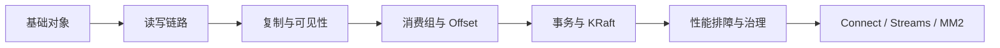

## 知识地图与学习路径

Kafka 知识地图的目标是帮你把散点概念串成学习路径。第一层是 Topic、Partition、Offset、Producer、Consumer；第二层是写入、读取、复制和消费组；第三层是幂等、事务、KRaft、Connect、Streams、跨集群复制和生产治理。

知识地图不是题库答案，也不是参数清单。它只说明先学什么、为什么这样学、每一层要建立哪些判断能力。真正回答问题时，仍然要回到对应的机制页、来源和生产证据。

## 关键对象和状态归属

| 对象 | 作用 | 关键边界 |
| --- | --- | --- |
| 基础对象层 | Topic、Partition、Broker、Replica、Offset、Consumer Group | 建立 Kafka 的状态归属模型 |
| 读写链路层 | Producer path、Broker append、Follower fetch、Consumer fetch | 建立请求如何进入系统的路径 |
| 语义边界层 | 顺序、持久性、offset、幂等、事务、可见性 | 区分 Kafka 保证和业务保证 |
| 运行治理层 | 监控、lag、容量、ACL、quota、升级、故障恢复 | 把知识落到生产排障 |
| 生态扩展层 | Connect、Streams、MirrorMaker 2 | 理解 Kafka 平台周边能力 |

## 推荐学习顺序

1. 先学 overview 和 core objects，明确分区日志模型。
2. 再学 write/read path、producer partitioning、consumer group。
3. 继续学 replication、offset、log segment、retention 和 compaction。
4. 进入 transaction、leader epoch、KRaft 和可见性边界。
5. 最后学 performance、failure recovery、security、Connect、Streams 和 MirrorMaker。

## 图解：推荐学习顺序



## 核心机制拆解

- 学习 Kafka 的顺序应该从数据模型开始，而不是从参数开始。
- 每个页面都要能回答三个问题：状态在哪里、请求怎么走、失败后如何恢复。
- 题库应该从知识库派生，不能让题目里的结论超过知识库内容。

## 性能和容量观察

- 基础阶段不追求调参，只建立分区、顺序和 offset 语义。
- 进阶阶段用指标和命令验证理解，比如 lag、ISR、leader、segment。
- 高级阶段用系统设计和故障案例综合多个页面。

## 生产排障入口

- 如果某个问题答不深，先定位它属于分区日志、复制、消费组、事务还是运维治理。
- 如果页面看起来像模板，应该回到该主题独有的对象和链路。
- 如果结论涉及版本或默认值，必须回看来源和当前集群版本。

## 生产观察指标

- 学习时每个主题都要能画出入口、对象、状态变化和可观测证据。
- 复习时检查是否能从知识库跳到题库，再从题库回到具体机制页。
- 遇到版本相关结论，必须查 source_ids 和 claim_ids，而不是凭记忆。
- 对每个核心对象都要能说清它属于控制面、数据面、协调面还是应用边界。

## 常见误区

- 从参数开始背，最后不知道参数影响哪条链路。
- 把题库答案当知识库，导致会背但不会排障。
- 把 Kafka、Connect、Streams、MirrorMaker 的语义混在一起。
- 忽略版本边界，把 Kafka 4.x 的新协议套到旧集群。

## 可执行观察示例

```text
学习闭环：
1. 读知识页，画出对象和链路。
2. 用命令观察一个真实 topic 或测试集群。
3. 回到题库，用自己的话解释机制、边界和证据。
```

## 设计取舍和边界

- 先学参数容易形成碎片记忆，先学链路更慢但更稳。
- 先刷题能快速暴露薄弱点，但知识库不足时会变成背答案。
- 生产经验要吸收，但必须和官方语义区分开。

## 依据与版本边界

本页依据 Kafka 4.2 官方文档、Javadoc、Implementation、Operations、Configuration 或对应组件文档整理。涉及默认值、协议行为和版本差异时，应以当前集群 Kafka 版本、客户端版本和实际配置为准；本页不把具体业务集群经验写成跨版本绝对结论。

### 来源

`kafka-docs-home`、`kafka-design-doc`、`kafka-consumer-javadoc`、`kafka-producer-javadoc`、`kafka-implementation-log`、`kafka-kraft-operations`、`kafka-connect-user-guide`、`kafka-streams-core-concepts`

### 事实声明

`kafka-claim-0001`、`kafka-claim-0002`、`kafka-claim-0003`、`kafka-claim-0006`、`kafka-claim-0010`、`kafka-claim-0023`、`kafka-claim-0070`、`kafka-claim-0082`、`kafka-claim-0087`
