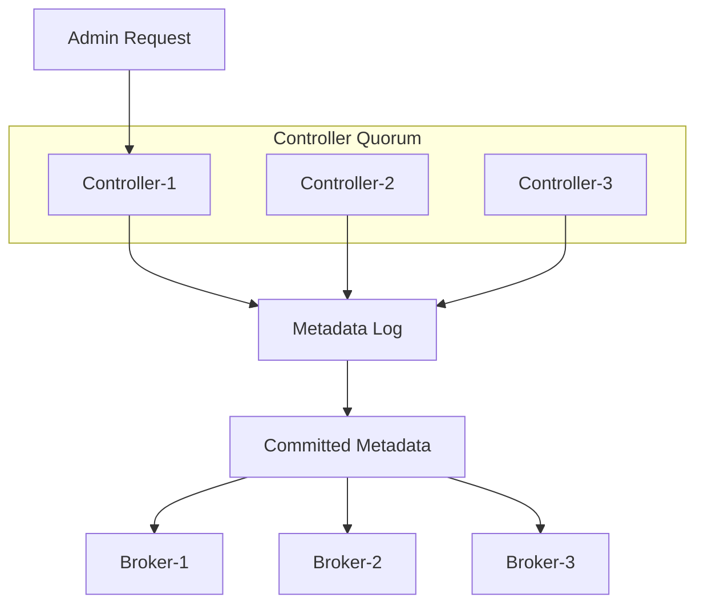

## KRaft 元数据日志与 Controller Quorum

KRaft 是 Kafka 现代控制面的核心。它把集群元数据存放在 Kafka 自己的 metadata log 中，由 controller quorum 维护，不再依赖 ZooKeeper 承担新集群控制面。理解 KRaft，要把 broker 处理数据请求和 controller 维护元数据状态分开。

KRaft 不等于“所有 broker 都参与元数据共识”。只有 controller quorum 参与元数据投票。process.roles 可以让节点作为 broker、controller 或两者兼任；合并角色适合小环境，但关键生产环境通常更希望控制面和数据面可独立滚动、扩容和隔离。

## 关键对象和状态归属

| 对象 | 作用 | 关键边界 |
| --- | --- | --- |
| process.roles | 定义节点是 broker、controller 或两者 | 决定节点参与数据面、控制面还是同时参与 |
| Controller Quorum | 选定 controllers 组成的元数据多数派 | 多数派可用是控制面可用基础 |
| Metadata Log | 保存 topic、partition、ACL 等元数据变更的日志 | 是 KRaft 控制面状态来源 |
| controller.quorum.bootstrap.servers | broker/controller 发现 controller quorum 的入口 | KRaft 节点必须配置 |
| Static / Dynamic Quorum | 静态 voters 或动态 add/remove controller | 动态 quorum 与 kraft.version 和版本边界相关 |
| Storage Formatting | 格式化 metadata 目录和 cluster id | Kafka 移除自动格式化以避免空日志误选主风险 |

## KRaft 控制面如何维护集群元数据

1. controller 节点格式化时写入 cluster id 和初始 voters 信息。
2. controller quorum 选出 active controller。
3. Admin 请求或 broker 状态变化形成 metadata log 记录。
4. controller quorum 复制并提交元数据变更。
5. broker 从控制面获取最新 metadata 并服务客户端请求。
6. controller 故障时 quorum 多数派选出新的 active controller。

## 图解：KRaft 控制面如何维护集群元数据



## 核心机制拆解

- 三个 controller 通常只能容忍一个 controller 故障，五个可以容忍两个，这是多数派系统的基本边界。
- Kafka 移除自动格式化空目录，是为了避免多数 controller 以空 metadata log 形成错误 leader。
- 动态 controller quorum 需要符合版本和配置条件，不能把 Kafka 4.x 能力套到旧集群。

## 性能和容量观察

- controller 节点需要稳定磁盘和网络，不能只按普通 broker 资源理解。
- 频繁 topic/partition/ACL 变更会增加控制面压力。
- 控制面抖动会体现为 metadata 更新慢、leader 变更异常和客户端请求失败。

## 生产排障入口

- 使用 metadata quorum describe 查看 quorum 状态。
- 检查 controller 日志、metadata log 和 storage formatting 信息。
- 如果 controller 多数派不可用，不要先扩 producer 或 consumer，应该先恢复控制面。

## 可执行观察示例

```bash
kafka-metadata-quorum.sh --bootstrap-server broker:9092 describe --status
kafka-storage.sh random-uuid
kafka-storage.sh format --config server.properties --cluster-id CLUSTER_ID
```

## 设计取舍和边界

- 独立 controller 角色增加机器成本，但让控制面更可控。
- 动态 quorum 提高运维灵活性，但要求版本和流程正确。
- 控制面高可用不是无限节点越多越好，过多 voters 会增加共识开销。

## 依据与版本边界

本页依据 Kafka 4.2 官方文档、Javadoc、Implementation、Operations、Configuration 或对应组件文档整理。涉及默认值、协议行为和版本差异时，应以当前集群 Kafka 版本、客户端版本和实际配置为准；本页不把具体业务集群经验写成跨版本绝对结论。

### 来源

`kafka-kraft-operations`

### 事实声明

`kafka-claim-0070`、`kafka-claim-0071`、`kafka-claim-0072`、`kafka-claim-0073`、`kafka-claim-0074`、`kafka-claim-0114`、`kafka-claim-0115`、`kafka-claim-0116`
