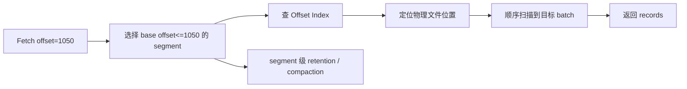

## 日志段、稀疏索引与 Offset 查找

Kafka 的 partition 在磁盘上不是一个无限增长的大文件，而是一组按起始 offset 命名的 segment 文件以及对应索引。日志段和稀疏索引解决什么问题：让追加写保持简单，让历史读取可以通过 offset 快速定位，同时让删除和压缩以 segment 为单位进行。

offset 查找不是数据库 B+Tree 精确索引。Kafka 的 offset index 是稀疏索引，先定位到接近目标 offset 的物理位置，然后继续顺序扫描。segment 删除也不是逐条删除，而是按 segment 生命周期处理，因此 retention 的粒度和 log.segment 配置强相关。

## 关键对象和状态归属

| 对象 | 作用 | 关键边界 |
| --- | --- | --- |
| Log Directory | broker 上保存 topic-partition 目录的位置 | 磁盘分布不均会造成单盘热点和恢复风险 |
| Segment File | 实际存储 record batch 的日志文件 | 文件名通常对应该 segment 的 base offset |
| Offset Index | offset 到文件物理位置的稀疏映射 | index.interval.bytes 影响索引密度和文件大小 |
| Time Index | 时间戳到 offset 的辅助索引 | 支持按时间查找 offset 的场景 |
| Active Segment | 当前正在追加写的 segment | 只有 roll 后才进入删除或压缩候选 |
| Recovery | 启动时校验最新 segment 并在必要时截断到最后有效 offset | 体现 Kafka 对文件损坏的本地恢复边界 |

## Consumer 按 offset 读取时 broker 如何定位文件位置

1. broker 根据 topic-partition 找到对应 log directory。
2. 通过目标 offset 找到 base offset 不大于目标值的 segment。
3. 在 offset index 中找到不超过目标 offset 的最近索引项。
4. 跳到该文件物理位置并顺序扫描到目标 batch。
5. 返回从目标 offset 开始的一段 record batch。
6. 后台 retention 或 compaction 根据 segment 状态处理旧文件。

## 图解：Consumer 按 offset 读取时 broker 如何定位文件位置



## 核心机制拆解

- segment 让日志可以滚动、删除、压缩和恢复，避免单文件无限增长。
- 稀疏索引在索引大小和定位速度之间折中，index.interval.bytes 越小，索引越密，文件越大。
- log compaction 不改变 offset，也不重排剩余记录，这保证 offset 作为位置语义仍然成立。

## 性能和容量观察

- segment 太小会增加文件数量、句柄、恢复和清理开销。
- segment 太大又会让删除粒度变粗、恢复和 compact 工作更重。
- 索引太稀可能增加读取时的顺序扫描距离，索引太密则增加磁盘占用。

## 生产排障入口

- 读取特定 offset 失败时，确认 offset 是否已经因 retention 被删除。
- 磁盘目录文件过多时检查 segment 大小、partition 数和 topic 保留策略。
- 启动恢复慢时关注最新 segment 校验、日志目录数量和磁盘吞吐。

## 可执行观察示例

```bash
kafka-dump-log.sh --files /var/lib/kafka/data/orders-0/00000000000000000000.log --print-data-log
kafka-run-class.sh kafka.tools.GetOffsetShell --broker-list broker:9092 --topic orders --time -1
```

## 设计取舍和边界

- 更长 retention 增强回放能力，但放大磁盘和恢复压力。
- 更小 segment 提高删除及时性，但增加文件管理开销。
- 更密索引降低查找扫描距离，但会消耗更多磁盘空间。

## 依据与版本边界

本页依据 Kafka 4.2 官方文档、Javadoc、Implementation、Operations、Configuration 或对应组件文档整理。涉及默认值、协议行为和版本差异时，应以当前集群 Kafka 版本、客户端版本和实际配置为准；本页不把具体业务集群经验写成跨版本绝对结论。

### 来源

`kafka-implementation-log`、`kafka-topic-configs`、`kafka-design-doc`

### 事实声明

`kafka-claim-0023`、`kafka-claim-0024`、`kafka-claim-0025`、`kafka-claim-0026`、`kafka-claim-0046`、`kafka-claim-0065`
