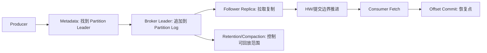

## 整体定位、日志模型与技术边界

Kafka 的核心不是“消息先进先出”这么简单，而是把事件流抽象成可持久化、可复制、可回放的分区日志。Topic 给业务提供事件流名称，Partition 决定并行度、顺序性和 offset 空间，Broker 承载分区副本并处理 produce/fetch 请求，Consumer Group 决定同一批数据如何被多个消费者分摊。理解 Kafka，要先把它看成一套“分区日志 + 复制提交 + 拉取消费 + 位移恢复”的系统，而不是普通队列的替代品。

Kafka 不负责业务事务本身，也不负责替调用方判断一条消息是否真的处理成功。它能提供的是分区内顺序、复制后的日志可见性、可回放的 offset 空间、消费组协调和一定范围内的幂等/事务能力。跨系统一致性、业务幂等、schema 演进、下游写入原子性和权限治理，需要由应用、表格式、数据库、Schema Registry 或平台治理共同完成。

## 关键对象和状态归属

| 对象 | 作用 | 关键边界 |
| --- | --- | --- |
| Topic | 逻辑事件流名称，承载分区集合和主题级配置 | 不要把 Topic 当成物理文件；真正决定顺序和并行的是 Partition |
| Partition | 追加写日志分片，是 offset、分区内顺序、复制和消费分配的基本单位 | 分区数决定同组消费并行上限，也影响恢复、文件数量和热点风险 |
| Broker | 承载分区副本，处理客户端请求，并参与控制面状态维护 | Broker 是数据面入口，不是全局路由中间层，客户端会定位目标 leader |
| Replica | Partition 在不同 Broker 上的副本，分为 leader 和 follower | leader 处理读写，follower 追赶复制，ISR 影响提交和可用性 |
| Offset | Partition 内的逻辑位置，描述下一条要读或已经提交的恢复点 | offset 不是业务处理完成证明，提交时机决定重复或漏处理风险 |
| Consumer Group | 把分区分配给组内消费者，实现并行消费和故障接管 | 同组内一个分区同一时刻最多给一个消费者 |

## 一条事件从发送到可回放的主线

1. Producer 获取 topic metadata，确定目标 partition leader。
2. Record 进入 producer 按分区维护的缓冲和 batch。
3. Broker leader 将 batch 追加到 partition active segment。
4. Follower 从 leader 拉取日志，ISR 和高水位推进决定提交可见边界。
5. Consumer 根据分配关系向 partition leader fetch，并推进本地 position。
6. 应用在合适时机提交 offset，作为重启后的恢复点。
7. 保留策略或日志压缩在后台改变可回放范围，但不会改变已有 offset 的含义。

## 图解：一条事件从发送到可回放的主线



## 核心机制拆解

- 分区日志是 Kafka 的中心抽象。写入路径围绕 leader append 展开，读取路径围绕 offset fetch 展开，复制路径围绕 follower fetch 和 ISR 展开。
- Kafka 的吞吐来自分区并行、顺序写、批量请求、压缩和 pull 模型；这些能力相互关联，不能只靠单个配置项解释。
- Kafka 的边界也来自同一模型：topic-wide 全局顺序不存在，offset 只在分区内有意义，consumer group 并行度受分区数限制，保留策略会限制可回放窗口。

## 性能和容量观察

- 吞吐优先时关注 batch.size、linger.ms、compression.type、partition 数、broker 网络和磁盘顺序写。
- 低延迟优先时关注 linger、request 排队、acks、ISR 状态、fetch 等待和消费者处理时间。
- 稳定性优先时关注 replication factor、min.insync.replicas、retention、quota、consumer lag、UnderReplicatedPartitions。

## 生产排障入口

- 先用 `kafka-topics.sh --describe` 确认 topic、partition、leader 和 ISR。
- 再用 `kafka-consumer-groups.sh --describe` 区分 CURRENT-OFFSET、LOG-END-OFFSET 和 LAG。
- 最后结合 broker 指标判断是生产端、broker 存储/网络、复制链路还是消费端处理瓶颈。

## 可执行观察示例

```bash
kafka-topics.sh --bootstrap-server broker:9092 --describe --topic orders
kafka-consumer-groups.sh --bootstrap-server broker:9092 --describe --group order-service
kafka-configs.sh --bootstrap-server broker:9092 --entity-type topics --entity-name orders --describe
```

## 设计取舍和边界

- 增加分区能提升并行潜力，但也增加元数据、文件、恢复和顺序治理成本。
- 更强持久性通常需要 acks=all 与 min.insync.replicas 配合，但会降低部分故障场景下的可用性。
- 保留更久能提升回放能力，但会提高磁盘、水位、清理和容量规划压力。

## 依据与版本边界

本页依据 Kafka 4.2 官方文档、Javadoc、Implementation、Operations、Configuration 或对应组件文档整理。涉及默认值、协议行为和版本差异时，应以当前集群 Kafka 版本、客户端版本和实际配置为准；本页不把具体业务集群经验写成跨版本绝对结论。

### 来源

`kafka-docs-home`、`kafka-design-doc`、`kafka-consumer-javadoc`、`kafka-implementation-log`、`kafka-implementation-network`、`kafka-topic-configs`

### 事实声明

`kafka-claim-0001`、`kafka-claim-0002`、`kafka-claim-0005`、`kafka-claim-0006`、`kafka-claim-0016`、`kafka-claim-0019`、`kafka-claim-0021`、`kafka-claim-0023`、`kafka-claim-0027`、`kafka-claim-0059`
