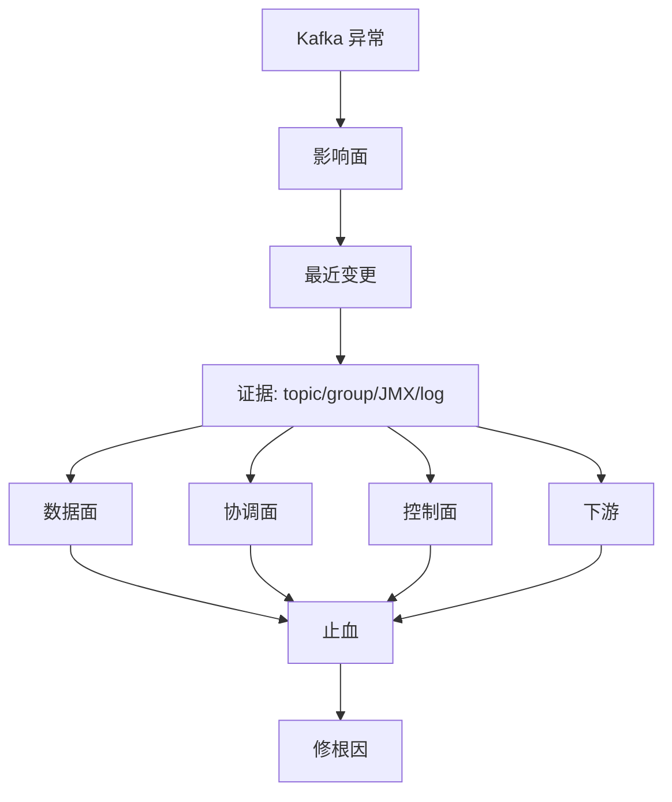

## 生产故障案例手册：Lag、ISR、磁盘、事务与 Rebalance

Kafka 故障排查要避免“看到 lag 就加消费者”“看到超时就加 timeout”的直觉式处理。更可靠的方法是按症状建立证据链：影响面、最近变更、客户端指标、broker 指标、内部 topic、控制面状态和下游系统。

案例手册不是故障答案库，因为真实事故常常有多个根因叠加。本页给出的是归因路径和证据清单，具体处理必须结合版本、配置、业务峰值和变更记录。

## 关键对象和状态归属

| 对象 | 作用 | 关键边界 |
| --- | --- | --- |
| Lag Case | 消费积压或可见进度停滞 | 区分 current offset、committed offset 和 LSO |
| ISR Case | 副本落后、URP、UnderMinIsr | 影响 acks=all 写入成功率 |
| Disk Case | 磁盘打满或 log dir 不均 | 常由 retention、compaction 或热点 topic 引起 |
| Rebalance Case | 频繁分区重分配 | 常由成员抖动、poll 超时或协议变化引起 |
| Transaction Case | read_committed 读端停滞 | 常由开放事务或 producer 异常引起 |

## 通用 Kafka 事故处理顺序

1. 确定影响面：全集群、单 broker、单 topic、单 partition、单 group。
2. 确认最近变更：客户端版本、topic 配置、broker 重启、ACL/quota、流量峰值。
3. 收集证据：topic describe、consumer group describe、broker JMX、客户端日志、controller 日志。
4. 按数据面、协调面、控制面、外部系统分层归因。
5. 先止血：限流、扩容、回滚、暂停异常生产者或迁移热点。
6. 再修根因：key 设计、容量、协议、下游幂等、发布流程。

## 图解：通用 Kafka 事故处理顺序



## 核心机制拆解

- Lag、ISR、timeout、rebalance 是不同层的症状，不能互相替代。
- UnderMinIsr 会让 acks=all 写入失败，是持久性配置生效的表现，不应简单视为 Kafka bug。
- CoordinatorLoadInProgressException 常见于 coordinator 正在加载 offsets cache 的恢复窗口。

## 性能和容量观察

- 止血阶段优先保护集群稳定，可能需要限流或暂停部分低优先级流量。
- 根因修复阶段再考虑扩分区、改 key、改 retention 或调协议。
- 事故后要补监控、压测和发布门禁，不只补参数。

## 生产排障入口

- Lag 高：分区热点、下游慢、rebalance、事务 LSO、生产突增逐项排除。
- ISR 缩小：看 broker 磁盘、网络、replica fetcher、GC 和机架故障。
- 磁盘满：看 retention、compaction、topic 增长、replica 分布和 cleaner backlog。

## 可执行观察示例

```bash
kafka-topics.sh --bootstrap-server broker:9092 --describe --under-replicated-partitions
kafka-consumer-groups.sh --bootstrap-server broker:9092 --describe --group order-service
kafka-log-dirs.sh --bootstrap-server broker:9092 --describe
```

## 设计取舍和边界

- 先止血可能牺牲部分延迟或低优先级业务，但能避免全局雪崩。
- 回滚最快，但如果根因是容量或数据倾斜，回滚只能暂时缓解。
- 扩容有效但成本高，且不能修复错误 key 或下游幂等问题。

## 依据与版本边界

本页依据 Kafka 4.2 官方文档、Javadoc、Implementation、Operations、Configuration 或对应组件文档整理。涉及默认值、协议行为和版本差异时，应以当前集群 Kafka 版本、客户端版本和实际配置为准；本页不把具体业务集群经验写成跨版本绝对结论。

### 来源

`kafka-monitoring`、`kafka-basic-operations`、`kafka-consumer-javadoc`、`kafka-topic-configs`、`kafka-consumer-configs`、`kafka-implementation-distribution`

### 事实声明

`kafka-claim-0031`、`kafka-claim-0032`、`kafka-claim-0045`、`kafka-claim-0052`、`kafka-claim-0057`、`kafka-claim-0103`、`kafka-claim-0107`、`kafka-claim-0113`
