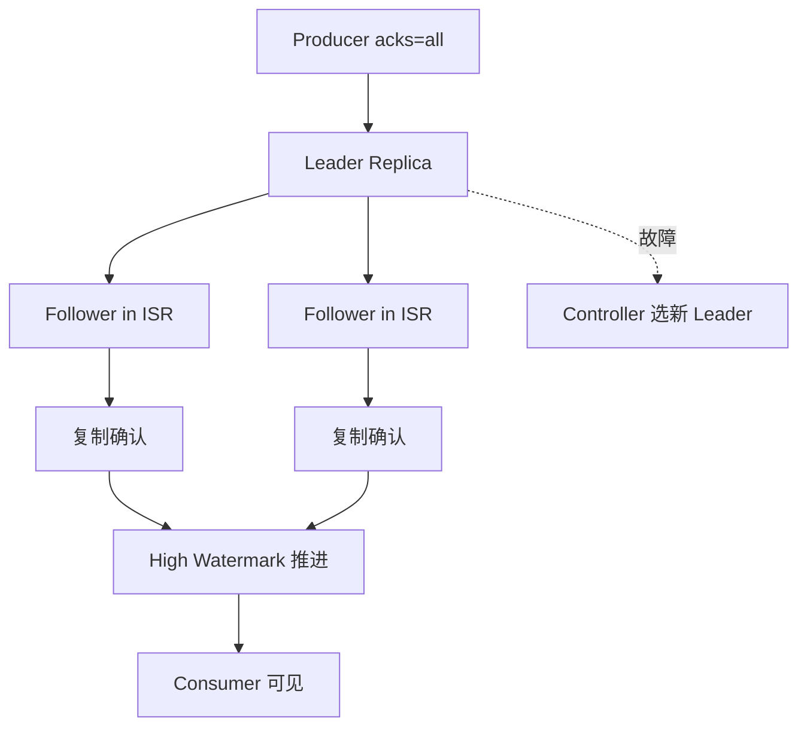

## 副本复制、ISR 与持久性边界

Kafka 复制解决什么问题：在 broker 故障时保住已提交日志，并让分区能切换到其他副本继续服务。它的核心对象是 leader、follower、ISR、高水位、acks 和 min.insync.replicas。副本复制不是“写到所有副本才成功”的简单模型，而是围绕当前 ISR 集合和提交边界推进。

acks=all 不等于所有副本都存到了磁盘，也不等于业务一定不丢。它表示当前 ISR 副本都确认写入；如果 ISR 小于 min.insync.replicas，写入应失败。持久性还受 replication factor、unclean leader election、磁盘故障、应用重试和业务幂等等因素影响。

## 关键对象和状态归属

| 对象 | 作用 | 关键边界 |
| --- | --- | --- |
| Leader Replica | 分区当前读写入口 | 负责接收 produce/fetch 并维护高水位推进 |
| Follower Replica | 从 leader 拉取日志的副本 | 落后过多会退出 ISR，恢复后再追赶 |
| ISR | 与 leader 保持同步的副本集合 | acks=all 和 min.insync.replicas 的核心边界 |
| High Watermark | 已提交日志可见边界 | 消费者只读取已提交消息，事务场景还要看 LSO |
| min.insync.replicas | topic 或 broker 级最小同步副本要求 | 与 acks=all 共同形成写入持久性门槛 |
| ELR | Kafka 4.x 中与 KRaft 选主相关的 Eligible Leader Replicas 能力 | 需要按版本边界理解，不能套用到所有集群 |

## 写入成功和高水位推进的复制链路

1. Producer 发送 batch 到 partition leader。
2. Leader 追加本地日志并等待 ISR 中 follower 复制。
3. Follower fetch 到数据并更新自己的日志末尾。
4. 当 ISR 满足确认条件后，leader 推进提交边界并返回成功。
5. 消费者只能看到已经提交的消息；read_committed 还受 LSO 控制。
6. leader 故障时 controller 在合适副本中选新 leader，客户端刷新 metadata。

## 图解：写入成功和高水位推进的复制链路



## 核心机制拆解

- ISR 是动态集合，反映哪些副本足够同步；它不是 replication factor 本身。
- min.insync.replicas 是写入可用性和持久性之间的硬边界，ISR 低于该值时 acks=all 写入会失败。
- Kafka 的设计声明是已提交消息在至少一个 ISR 副本存活时不会丢失，因此关键在于“已提交”和“ISR 存活”两个条件。

## 性能和容量观察

- follower 慢会增加 produce 延迟，严重时造成 ISR 缩小和 NotEnoughReplicas。
- 副本数越高，容错能力越强，但网络、磁盘和跨机架复制成本越高。
- 高吞吐 topic 应关注每个 broker 的 leader 分布和 replica fetch 压力。

## 生产排障入口

- 观察 UnderReplicatedPartitions、UnderMinIsrPartitionCount 和 AtMinIsrPartitionCount。
- 检查 broker 磁盘、网络、GC、replica fetcher 日志和 leader 分布。
- 如果 acks=all 写入失败，先确认 ISR 是否低于 min.insync.replicas，而不是盲目降低 acks。

## 可执行观察示例

```bash
kafka-topics.sh --bootstrap-server broker:9092 --describe --topic orders
kafka-configs.sh --bootstrap-server broker:9092 --entity-type topics --entity-name orders --describe
# 重点看 ISR、Replicas、Leader、min.insync.replicas 以及 broker JMX 复制指标
```

## 设计取舍和边界

- 提高 min.insync.replicas 增强故障下的数据安全，但会在更多场景拒绝写入。
- 降低持久性配置能提升可用性和延迟表现，但扩大数据丢失窗口。
- 跨机架副本提升机房级容错，但会提高复制延迟和带宽消耗。

## 依据与版本边界

本页依据 Kafka 4.2 官方文档、Javadoc、Implementation、Operations、Configuration 或对应组件文档整理。涉及默认值、协议行为和版本差异时，应以当前集群 Kafka 版本、客户端版本和实际配置为准；本页不把具体业务集群经验写成跨版本绝对结论。

### 来源

`kafka-design-doc`、`kafka-topic-configs`、`kafka-producer-javadoc`、`kafka-monitoring`、`kafka-eligible-leader-replicas`

### 事实声明

`kafka-claim-0006`、`kafka-claim-0007`、`kafka-claim-0032`、`kafka-claim-0057`、`kafka-claim-0059`、`kafka-claim-0042`、`kafka-claim-0043`、`kafka-claim-0044`
