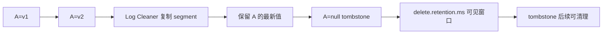

## 保留策略、日志压缩与 Tombstone 语义

Kafka 的数据不是默认永久存在。保留策略解决“日志增长如何受控”，日志压缩解决“按 key 保留最新状态如何可回放”。cleanup.policy=delete、compact 或两者结合，决定旧 segment 是按时间/大小删除，还是由 log cleaner 重新拷贝并清理过期 key 版本。

保留策略和日志压缩不是同一件事。delete 关注时间/大小窗口，compact 关注每个 key 至少保留最新值。compaction 不保证保留每一次历史变更，也不会改变 offset。null value 的 tombstone 表示删除标记，但消费者只有在 delete.retention.ms 窗口内读到日志头部，才一定能看到 tombstone。

## 关键对象和状态归属

| 对象 | 作用 | 关键边界 |
| --- | --- | --- |
| cleanup.policy | topic 级清理策略，可为 delete、compact 或两者 | 决定后台清理的基本语义 |
| Retention | 按时间或大小删除旧 segment | 控制可回放窗口，不关心 key 最新值 |
| Log Cleaner | 后台清理线程，复制 segment 并移除过期 key 版本 | 清理消耗磁盘和 IO，但不会阻塞正常读取 |
| Tombstone | key 非空、value 为 null 的删除标记 | 用于 compacted topic 表达删除语义 |
| min/max compaction lag | 控制消息多久后可进入或必须进入 compact 候选 | 是状态恢复延迟与存储压力之间的调节器 |
| Changelog Topic | 常见于状态存储恢复的 compacted topic | 依赖最新 key 状态而非完整历史事件 |

## Compacted Topic 中一个 Key 的生命周期

1. 应用写入 key=A,value=v1。
2. 随后写入 key=A,value=v2，两个 offset 都仍然存在一段时间。
3. log cleaner 后台扫描 dirty segment，保留该 key 较新的记录。
4. 如果写入 key=A,value=null，Kafka 把它视为 tombstone。
5. tombstone 在 delete.retention.ms 窗口内允许下游观察删除。
6. 窗口后 tombstone 本身也可被清理，最终恢复时看不到该 key。

## 图解：Compacted Topic 中一个 Key 的生命周期



## 核心机制拆解

- delete retention 以 segment 为单位删除，日志读取通过 copy-on-write 风格的 segment list 保持一致。
- log compaction 保留每个 key 至少最新值，同时保留 offset 顺序，不重新编号。
- tombstone 不是普通空字符串，而是 key 存在且 payload 为 null 的删除语义。

## 性能和容量观察

- compact 会消耗后台 IO，cleaner 过慢会让 dirty ratio 上升并影响磁盘占用。
- retention 太短会破坏消费者回放和新消费者 bootstrap。
- compaction lag 配置太激进可能增加 IO，太宽松会拖慢状态恢复或占用磁盘。

## 生产排障入口

- 如果消费者回放缺历史事件，先确认 topic 是否 compacted，而不是怀疑消费漏了。
- 如果删除事件没被新消费者看到，检查是否已经超过 delete.retention.ms。
- 如果磁盘持续增长，检查 cleaner 是否落后、key 是否为空、segment 是否尚未 roll。

## 可执行观察示例

```bash
kafka-configs.sh --bootstrap-server broker:9092 --entity-type topics --entity-name user-state --alter --add-config cleanup.policy=compact
kafka-configs.sh --bootstrap-server broker:9092 --entity-type topics --entity-name user-state --describe
```

## 设计取舍和边界

- 事件审计流通常适合 delete retention，不适合只保留最新状态。
- 状态快照或 changelog 适合 compact，但必须接受历史版本被清理。
- delete+compact 可以同时控制状态和磁盘窗口，但语义更复杂，消费端必须明确可见范围。

## 依据与版本边界

本页依据 Kafka 4.2 官方文档、Javadoc、Implementation、Operations、Configuration 或对应组件文档整理。涉及默认值、协议行为和版本差异时，应以当前集群 Kafka 版本、客户端版本和实际配置为准；本页不把具体业务集群经验写成跨版本绝对结论。

### 来源

`kafka-topic-configs`、`kafka-design-doc`、`kafka-implementation-log`

### 事实声明

`kafka-claim-0008`、`kafka-claim-0009`、`kafka-claim-0025`、`kafka-claim-0064`、`kafka-claim-0065`、`kafka-claim-0066`、`kafka-claim-0067`、`kafka-claim-0068`
