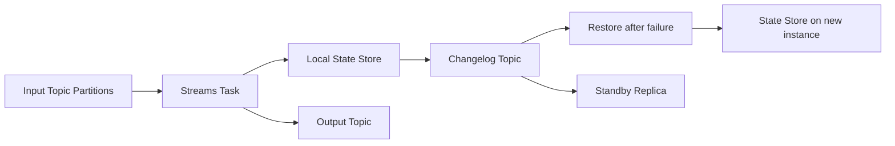

## Streams 拓扑、任务、状态存储与恢复

Kafka Streams 不是 broker 里的一个服务，而是嵌入应用进程的客户端库。应用定义 processor topology，运行时按输入 topic partition 创建固定任务，task 执行处理逻辑并维护本地 state store，状态通过 changelog topic 复制和恢复。

Streams 的状态在应用实例本地，不是 Kafka broker 直接提供的查询服务。interactive queries 原生查询本实例本地 state store；如果要查询整个应用全局状态，需要额外 RPC 层把请求路由到持有对应 key 的实例。

## 关键对象和状态归属

| 对象 | 作用 | 关键边界 |
| --- | --- | --- |
| Topology | 由 source、processor、sink 组成的处理图 | 描述数据如何从输入 topic 转换到输出 topic |
| Task | 由输入 partition 派生的固定并行单元 | task 与 partition 的绑定决定并行度和状态归属 |
| State Store | task 本地嵌入的状态存储 | 用于聚合、join、窗口等有状态计算 |
| Changelog Topic | state store 对应的 Kafka 变更日志 | 故障后通过 replay 恢复本地状态 |
| Standby Replica | 预热的状态副本 | 减少故障切换时的恢复时间 |
| processing.guarantee | 处理语义配置 | at_least_once 与 exactly_once_v2 对事务和提交有不同要求 |

## 有状态 Streams 应用的恢复链路

1. 应用启动并根据拓扑和输入 partition 创建 tasks。
2. 每个 task 读取对应 partition 的记录并更新本地 state store。
3. state store 的变更写入 changelog topic。
4. 实例故障后，tasks 被分配到其他实例。
5. 新实例从 changelog topic replay，重建本地 state store。
6. 如果存在 standby replica，恢复时间可以明显缩短。

## 图解：有状态 Streams 应用的恢复链路



## 核心机制拆解

- Streams 并行度来自输入 stream partitions 形成的固定 task 数，不是无限增加应用实例就能提升。
- state store 本地化提升访问效率，但把恢复和再平衡成本转移到 changelog replay。
- exactly_once_v2 会让消费者使用 read_committed，并启用 producer 幂等和事务相关语义。

## 性能和容量观察

- 状态大小、changelog 吞吐和 standby replica 数决定恢复时间。
- repartition topic 会增加 shuffle-like 成本，key 设计直接影响状态分布。
- interactive queries 的全局查询能力要自己设计服务发现和跨实例路由。

## 生产排障入口

- 恢复慢时检查 changelog topic 大小、standby replicas、state dir 磁盘和 restore 速率。
- 输出延迟高时检查是否有 repartition、rocksdb 压力、commit interval 或事务等待。
- 状态查询不完整时确认请求是否路由到拥有目标 key 的实例。

## 可执行观察示例

```java
StreamsBuilder builder = new StreamsBuilder();
builder.stream("orders")
  .groupByKey()
  .count(Materialized.as("order-counts"))
  .toStream()
  .to("order-count-results");
KafkaStreams streams = new KafkaStreams(builder.build(), props);
streams.start();
```

## 设计取舍和边界

- 本地状态让低延迟处理成为可能，但恢复依赖 changelog。
- standby replica 降低恢复时间，但增加资源和复制成本。
- exactly_once_v2 增强语义，但增加事务协调和提交成本。

## 依据与版本边界

本页依据 Kafka 4.2 官方文档、Javadoc、Implementation、Operations、Configuration 或对应组件文档整理。涉及默认值、协议行为和版本差异时，应以当前集群 Kafka 版本、客户端版本和实际配置为准；本页不把具体业务集群经验写成跨版本绝对结论。

### 来源

`kafka-streams-core-concepts`、`kafka-streams-architecture`、`kafka-streams-config`、`kafka-streams-interactive-queries`

### 事实声明

`kafka-claim-0087`、`kafka-claim-0088`、`kafka-claim-0089`、`kafka-claim-0090`、`kafka-claim-0091`
