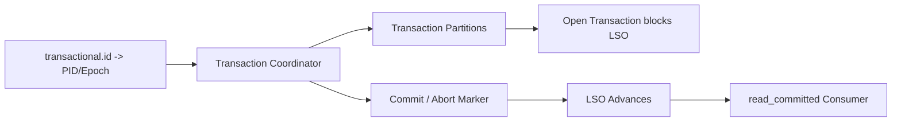

## Transaction Coordinator、Producer ID、Epoch 与 LSO 推进

事务协调器是 Kafka 事务语义的控制点。设置 transactional.id 后，producer 获得跨 session 的事务身份，事务协调器管理事务状态，提交或中止后写入控制标记，read_committed consumer 通过 LSO 判断哪些记录稳定可见。

事务协调器不理解外部数据库事务，也不会替应用决定业务补偿。Producer epoch 防止旧 producer 继续写入，事务 marker 控制 Kafka 内读可见性，但 Kafka 外部副作用必须另行设计。

## 关键对象和状态归属

| 对象 | 作用 | 关键边界 |
| --- | --- | --- |
| transactional.id | 事务生产者跨会话身份 | 决定事务恢复和 fencing 范围 |
| Producer ID / Epoch | 生产者身份和版本 | 防止旧实例或旧事务泄漏 |
| Transaction Coordinator | 管理事务状态和分区参与者 | 决定 commit/abort 结果 |
| Transaction Marker | commit 或 abort 控制记录 | 影响 read_committed 可见性 |
| LSO | 第一个开放事务之前的稳定边界 | read_committed consumer 停在这里 |

## 一个事务如何影响消费者可见性

1. producer 初始化事务，coordinator 建立 transactional.id 关系。
2. producer 开始事务并写入多个 topic partition。
3. 事务未完成时，相关 partition 的 LSO 可能停在开放事务之前。
4. commitTransaction 请求到 coordinator。
5. coordinator 写入 commit marker 并完成事务状态变更。
6. read_committed consumer 看到 LSO 推进并读取已提交数据。

## 图解：一个事务如何影响消费者可见性



## 核心机制拆解

- transactional.id 隐含启用幂等，并使可靠语义跨 producer session 延续。
- read_committed 的可见性取决于事务结果，开放事务会阻止 LSO 越过。
- Kafka 4.x 事务协议还引入服务端 transaction.version 相关防护，属于现代版本边界。

## 性能和容量观察

- 长事务和大事务都会拖慢 LSO 推进。
- 事务参与 partition 越多，coordinator 和 marker 成本越高。
- 事务 topic 的复制配置不足会削弱事务可靠性。

## 生产排障入口

- read_committed 消费停滞时查开放事务和 producer 错误。
- ProducerFencedException 说明实例身份被新 epoch 替代，不能继续使用旧 producer。
- 事务提交失败后按异常类型判断 abort 还是关闭 producer。

## 可执行观察示例

```java
producer.initTransactions();
producer.beginTransaction();
producer.send(new ProducerRecord<>("out-a", key, value));
producer.send(new ProducerRecord<>("out-b", key, value));
producer.commitTransaction();
```

## 设计取舍和边界

- 事务提升 Kafka 内原子性，但引入 coordinator 和 LSO 成本。
- 较短事务降低可见性阻塞，但会增加提交频率。
- 多个输出分区的事务更强，但协调和排障更复杂。

## 依据与版本边界

本页依据 Kafka 4.2 官方文档、Javadoc、Implementation、Operations、Configuration 或对应组件文档整理。涉及默认值、协议行为和版本差异时，应以当前集群 Kafka 版本、客户端版本和实际配置为准；本页不把具体业务集群经验写成跨版本绝对结论。

### 来源

`kafka-producer-javadoc`、`kafka-producer-configs`、`kafka-consumer-configs`、`kafka-transaction-protocol`

### 事实声明

`kafka-claim-0011`、`kafka-claim-0061`、`kafka-claim-0062`、`kafka-claim-0063`、`kafka-claim-0102`、`kafka-claim-0103`、`kafka-claim-0104`、`kafka-claim-0120`
