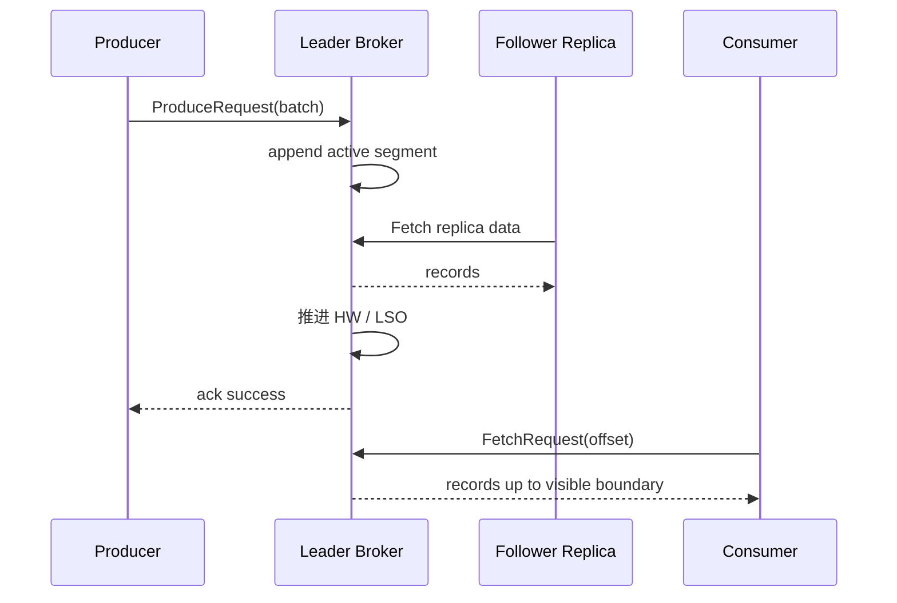

## 写入、复制、读取与可见性链路

Kafka 的读写链路是一条以 partition leader 为中心的链路：Producer 先定位 leader 并发送 batch，leader 追加日志，follower 拉取复制，高水位或 LSO 控制消费者可见范围，Consumer 再按 offset 拉取数据。很多“Kafka 会不会丢、会不会重复、为什么读不到”都要沿着这条链路拆开看。

写入成功、日志已追加、消息已提交、消费者可见、业务已处理是五个不同状态。Producer 的 acks 影响客户端何时收到成功；ISR 和 min.insync.replicas 影响提交和持久性；read_committed 又会让消费者停在 LSO，而不是简单读到物理日志尾部。

## 关键对象和状态归属

| 对象 | 作用 | 关键边界 |
| --- | --- | --- |
| Producer Batch | 按 partition 聚合后的记录批次 | batch 是吞吐、压缩和重试的核心单位 |
| Leader Log | 目标 partition 的主写入日志 | leader append 后还要等待配置要求的复制确认 |
| Follower Fetch | follower 向 leader 拉取日志 | 复制落后会影响 ISR 和高水位推进 |
| High Watermark | 消费者可见的已提交边界之一 | 和物理 log end offset 不是同一个概念 |
| Last Stable Offset | 事务消费者 read_committed 的可见边界 | 开放事务会让 LSO 落后于 high watermark |
| Consumer Fetch | 按 offset 从 leader 拉取记录 | pull 模型让消费者控制位置和回放 |

## 从 Producer 成功到 Consumer 可见的状态推进

1. Producer 通过 metadata 找到 partition leader。
2. Record 进入 RecordAccumulator 并按 partition 聚合成 batch。
3. Sender 把 ProduceRequest 发给 leader broker。
4. Leader append 到 active segment，并根据 acks 与 ISR 状态等待确认。
5. Follower 复制后高水位推进，普通消费者可以读到已提交消息。
6. 事务场景下 read_committed consumer 还要受 LSO 限制。
7. Consumer poll 返回数据后推进 position，是否提交 offset 取决于应用策略。

## 图解：从 Producer 成功到 Consumer 可见的状态推进



## 核心机制拆解

- Producer 写入路径是 push 到 leader，Consumer 读取路径是 pull from leader，副本复制也是 follower pull。
- acks=all 不是“所有副本都确认”，而是所有当前 ISR 副本满足确认；如果 ISR 小于 min.insync.replicas，写入会失败。
- 事务读可见性通过 LSO 限制，read_committed 消费者不会越过未完成事务边界。

## 性能和容量观察

- batch 越充分，网络和压缩效率越好，但 linger 和排队会影响延迟。
- 复制越慢，HW 推进越慢，acks=all 写入延迟和失败率都会上升。
- 消费者 fetch 设置和处理速度会影响端到端延迟，但不能改变 broker 已提交边界。

## 生产排障入口

- Producer 成功率下降时同时看 RecordErrorRate、request timeout、NotEnoughReplicas 和 ISR 指标。
- Consumer 读不到新数据时区分是没有写入、未提交、事务未完成、offset 错误还是分区没分配。
- 端到端延迟升高要拆成 producer batch 等待、broker 排队、复制等待、consumer fetch 等待和业务处理时间。

## 可执行观察示例

```bash
kafka-console-producer.sh --bootstrap-server broker:9092 --topic orders
kafka-console-consumer.sh --bootstrap-server broker:9092 --topic orders --from-beginning
kafka-consumer-groups.sh --bootstrap-server broker:9092 --describe --group order-service
```

## 设计取舍和边界

- 更强复制确认提升持久性，但会把 follower 慢、ISR 缩小暴露为写入延迟或失败。
- 更激进 batch 提升吞吐，但会增加低流量 topic 的等待时间。
- 事务可见性提升一致性，但会让读端可见边界从 HW 收缩到 LSO。

## 依据与版本边界

本页依据 Kafka 4.2 官方文档、Javadoc、Implementation、Operations、Configuration 或对应组件文档整理。涉及默认值、协议行为和版本差异时，应以当前集群 Kafka 版本、客户端版本和实际配置为准；本页不把具体业务集群经验写成跨版本绝对结论。

### 来源

`kafka-design-doc`、`kafka-producer-javadoc`、`kafka-implementation-log`、`kafka-topic-configs`、`kafka-consumer-configs`

### 事实声明

`kafka-claim-0016`、`kafka-claim-0018`、`kafka-claim-0019`、`kafka-claim-0020`、`kafka-claim-0024`、`kafka-claim-0057`、`kafka-claim-0059`、`kafka-claim-0103`
