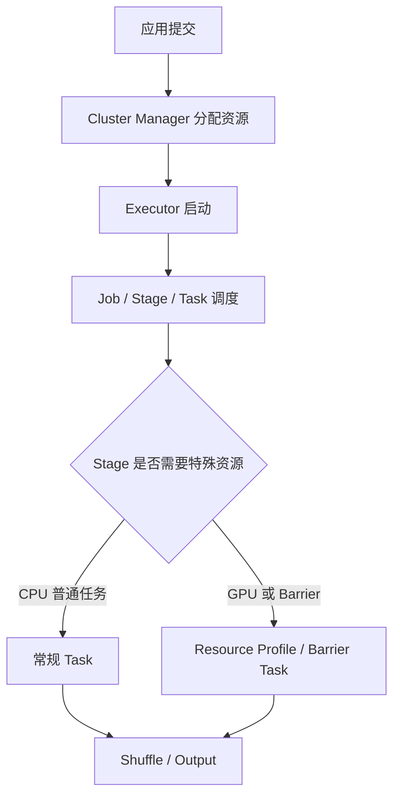

## 高级资源问题要先分清调度层级
Spark 资源问题不能只看 executor 个数。资源分配至少有三层：集群管理器决定应用能拿到多少容器或 Pod；SparkContext 内部决定多个 job 如何共享资源；每个 stage 和 task 决定 CPU、内存、GPU、本地磁盘、网络和 shuffle 数据如何被消耗。

如果把这些层级混在一起，就会出现典型误判：明明是外部 shuffle 数据不可用，却去加 executor；明明是数据库或对象存储限流，却去调 fair scheduler；明明是 GPU 资源发现和 task 资源请求不一致，却去改 driver memory。

## 调度和资源对象
| 对象 | 负责的调度边界 | 观察重点 |
| --- | --- | --- |
| Cluster Manager | 应用级资源分配和隔离 | YARN/K8s/Standalone 事件、申请失败原因 |
| Executor | Spark task 执行容器 | cores、memory、overhead、local disk、GPU 地址 |
| Fair Scheduler Pool | 同一 SparkContext 内多 job 共享 | pool 配置、权重、minShare、排队时间 |
| Dynamic Allocation | 按 backlog 和 idle 伸缩 executor | backlog、idle timeout、shuffle 存活策略 |
| Barrier Execution | 需要一组 task 同时启动和协调的场景 | 可用 slot、同步失败、整体重试 |
| Stage-level Resource | 不同 stage 需要不同资源 | resource profile、task resource、executor 资源 |
| Push-based Shuffle / Reliable Shuffle | 降低 shuffle 拉取和 executor 回收风险 | shuffle 服务、合并块、fetch failure |

## Dynamic Allocation 的真正前提
动态资源不是打开 `spark.dynamicAllocation.enabled` 就完事。executor 被回收时，shuffle 文件、缓存块和本地状态可能随之消失。官方调度文档明确给出多种 shuffle 数据存活路径，例如 external shuffle service、shuffle tracking、decommission shuffle block 迁移或可靠 shuffle 存储。

因此，动态资源要和 shuffle 策略一起评估。长作业、迭代作业、join 很重的 SQL、Structured Streaming 都不能只看 executor 利用率。要看 executor 移除后下游是否出现 fetch failure、stage 重提、缓存失效或 checkpoint 延迟。

## Barrier 和 Stage 级资源
Barrier 类任务需要一组 task 一起启动，适用于同步训练或强协调计算。它的风险是资源不足时无法部分启动，失败也可能导致整组重试。理解这个机制时不要把 barrier 讲成普通调度优化，它是改变 task 启动和失败边界的协调机制。

Stage-level resource 解决的是不同 stage 资源需求不同的问题，例如某些 stage 需要 GPU，其他 stage 只需要 CPU。它要求资源发现、executor 配置、task 配置和集群管理器资源模型一致。Kubernetes、YARN 和 Standalone 的支持细节不同，生产前必须在目标平台验证。



## 硬件和网络不是背景知识
硬件规划直接影响 Spark 性能。官方硬件建议强调数据靠近存储系统、本地磁盘承载 spill 和 shuffle、中等内存避免超大 JVM、网络对 shuffle-heavy 作业很关键。生产调优不能只改 Spark 参数，还要看节点磁盘、网络、对象存储、HDFS 距离和 executor 布局。

如果应用大量 groupBy、join、repartition，网络和磁盘通常比 CPU 更早成为瓶颈。看到 shuffle read/write 大、fetch wait 高、spill 多、local disk 打满时，加 CPU 核数可能没有用，甚至会让更多 task 同时争抢同一块磁盘。

## 示例：动态资源配置阅读方式
```properties
spark.dynamicAllocation.enabled=true
spark.dynamicAllocation.shuffleTracking.enabled=true
spark.dynamicAllocation.executorIdleTimeout=120s
spark.dynamicAllocation.schedulerBacklogTimeout=1s
```

这段配置要进一步核对：shuffle tracking 是否适合本作业，executor idle 的定义是否会误杀后续还需要 shuffle 的 executor，backlog 触发是否导致资源抖动，Structured Streaming 是否因为批次间空闲被频繁回收。

## 生产核验清单
1. 资源瓶颈属于集群申请、executor 内部、stage 特殊资源还是外部系统。
2. 动态资源是否配套 shuffle 数据存活策略。
3. fair scheduler 是否解决的是同一应用内多 job 争用，而不是集群级排队。
4. GPU、FPGA 或自定义资源是否在集群管理器、executor 和 task 三层都声明一致。
5. 本地磁盘、网络和对象存储是否有独立监控。

## 来源与事实边界
本页依据 Spark Job Scheduling、Configuration、Kubernetes 部署和 Hardware Provisioning 文档整理。Barrier、GPU 和 push-based shuffle 的具体支持程度与部署平台和版本有关，必须以目标集群实测为准。
