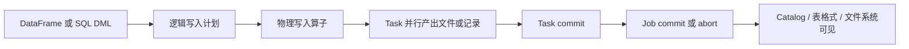

## 写入链路讲的是结果何时可见，不只是调用 save
Spark 写入不是把 DataFrame 直接变成文件这么简单。用户调用 `write`、`writeTo`、`saveAsTable` 或 SQL DML 后，Spark 需要把逻辑计划变成写入物理计划，让 task 并行产出数据文件或提交消息，再由提交协议、数据源、catalog 和底层存储决定结果如何对外可见。

这类问题必须把三层分开：Spark 负责计划和 task 执行；DataSource 负责格式、分区、schema、能力声明和提交接口；外部表格式、文件系统或数据库负责最终原子性、隔离性、事务日志或可见性。把三层混在一起，就会误以为 `mode("overwrite")` 天然等于事务覆盖，也会误以为 action 成功就代表下游业务已经 exactly-once。

## DataFrameWriter、Writer V2、Catalog 与 Committer
| 对象 | 职责 | 不能误解的边界 |
| --- | --- | --- |
| `DataFrameWriter` | 面向路径或表执行传统 load/save 写入 | API 形态不等于强事务保证 |
| `DataFrameWriterV2` | 面向 catalog 表的 create、replace、append、overwrite 等操作 | 需要数据源和 catalog 支持相应能力 |
| DataSource | 声明读写能力、schema、分区和 option 解释方式 | 不同 source 的 option 语义可能不同 |
| Catalog | 管理表名、schema、分区、namespace 和表元数据 | 不等于数据文件本身一定已经物理优化 |
| Commit Protocol | 协调 task 输出和 job commit/abort | 在对象存储、表格式和外部系统中语义差异很大 |
| 外部存储或表格式 | 决定文件可见性、事务日志、清理和并发写入边界 | Spark 不能替外部系统补齐所有隔离保证 |

## 从逻辑计划到输出目录
典型写入链路是：用户提交写入请求，Analyzer 解析目标表或路径，Optimizer 处理投影、过滤、分区和写入节点，Planner 生成写入物理算子，Executor 上的 task 产出数据文件或提交记录，Driver 协调 job commit，最后 catalog 或外部存储暴露新结果。

这里最容易出错的是“成功”的含义。Spark 任务成功说明当前 Spark 作业按计划完成；目标目录是否有临时文件、覆盖是否原子、旧数据是否清理、并发写入是否安全、下游读者何时看到新版本，要继续看 source、table format、filesystem 和 catalog 的实现。



## SaveMode、覆盖与分区写入
`append`、`overwrite`、`ignore`、`errorIfExists` 描述的是用户意图，不是所有目标系统都能提供同等级别的隔离。文件路径写入、Hive 表写入、JDBC 写入、湖仓表格式写入，对覆盖、重试、临时目录、失败清理和并发控制的处理不同。

动态分区覆盖尤其需要谨慎。它通常只覆盖本次写入触达的分区，而不是无条件替换整张表。这个能力适合增量修正分区数据，但如果上游分区字段错误，可能留下旧分区或覆盖错误分区。生产中应把输入分区清单、输出分区清单和目标表元数据一起验收。

## 失败重试与幂等边界
Spark task 失败后可能重试，同一个逻辑分区可能产出多次尝试文件。良好的 committer 会让最终成功尝试可见，清理失败尝试；但外部数据库、消息系统或自定义 foreach 写入不一定天然幂等。写入外部系统时，要显式设计主键、批次号、事务表、去重表或幂等 upsert。

Structured Streaming 的 `foreachBatch` 常被误认为自动 exactly-once。它只是把每个 micro-batch 暴露给用户函数；如果函数里写 JDBC、调用接口或写消息，幂等责任在用户侧。可靠回答要说清 batchId、目标幂等键、失败重跑和下游可见性的关系。

## 生产核验清单
1. 目标是路径、catalog 表、Hive 表、JDBC 表还是湖仓表格式。
2. 写入模式是 append、overwrite、replace、merge 还是自定义 foreach。
3. 是否存在并发写入、读写并发、失败重试和 speculative execution。
4. 是否能从 Spark UI、event log、目标目录、表元数据和外部系统事务日志验证结果。
5. 是否有临时文件、孤儿文件、小文件、重复批次或旧分区残留。

## 示例：写入前后应保留的证据
```python
# 重点不是这几行 API，而是写入前后要能核对分区、文件数和目标表元数据。
(df
  .repartition("dt")
  .write
  .mode("overwrite")
  .partitionBy("dt")
  .parquet("/warehouse/app/orders"))

spark.read.parquet("/warehouse/app/orders").groupBy("dt").count().show()
```

如果目标是生产表，写入完成后还应该保留输入版本、输出分区列表、文件数量、平均文件大小、提交时间、作业 event log 和下游校验结果。这样后续排查才能区分写入失败、读者读旧版本、分区漏写和下游重复消费。

## 来源与事实边界
本页依据 Spark SQL Data Sources、Spark SQL Guide 和配置文档整理。Spark 官方文档说明了通用 load/save、数据源、表和 SQL 能力，但不同表格式和对象存储的事务语义必须再查对应项目文档，不能由 Spark 核心文档推断。
