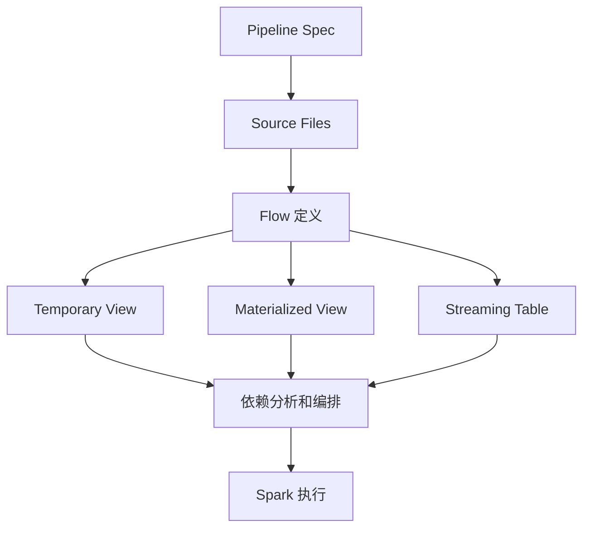

## Declarative Pipelines 是新编排入口，不是替代 Spark SQL 引擎
Spark Declarative Pipelines 让用户用声明式方式定义数据管道，关注目标数据集和转换逻辑，而不是手写完整执行编排。它引入 flow、dataset、pipeline、pipeline project 和 CLI 等对象，支持批处理和流处理场景。

理解 SDP 时要避免两个误区。第一，它不是另一个计算引擎，底层仍然建立在 Spark 能力之上。第二，它也不是自动解决所有数据治理问题，storage、catalog、checkpoint、依赖关系、权限和目标表语义仍要配置和验证。

## 核心对象
| 对象 | 含义 | 边界 |
| --- | --- | --- |
| Flow | 从源读取、转换并写入目标 dataset 的处理单元 | 需要明确 batch 或 streaming 语义 |
| Dataset | pipeline 中可查询的输出对象 | 可以是 streaming table、materialized view 或 temporary view |
| Streaming Table | 接收一个或多个 streaming flow 的表 | checkpoint 和增量语义必须配置 |
| Materialized View | batch flow 预计算出的表 | 刷新和依赖顺序由 pipeline 管理 |
| Temporary View | pipeline 执行范围内的中间视图 | 不能当作持久对外表使用 |
| Pipeline Project | 包含定义文件和 spec 的项目 | storage、catalog、database、configuration 要显式配置 |
| CLI | init、run、dry-run 等执行入口 | dry-run 能提前发现部分错误，但不代表生产运行成功 |

## 从命令式作业到声明式管道
传统 Spark 作业常见写法是：读源、转换、写出、外部调度器控制顺序。SDP 的思路是声明应该存在什么表、这些表如何从其他数据集产生，然后由 pipeline 分析依赖并编排执行顺序。

这对 ETL 项目很有价值：代码结构更接近数据依赖图，dry-run 能提前发现语法、分析和环形依赖问题，batch 和 streaming 定义可以在同一项目里组织。但它也要求团队把数据集、存储位置、catalog、checkpoint 和权限规划好。



## Python 和 SQL 定义边界
SDP 支持 Python 和 SQL 方式定义 pipeline。Python 方式通常通过 `pyspark.pipelines` 装饰器声明 materialized view、temporary view 或 table；SQL 方式用声明式 SQL 定义。两者表达的是数据集关系，不是随意执行副作用代码。

如果管道里混入大量外部 API 调用、非幂等写入、全局变量和动态依赖，就会削弱声明式编排价值。更好的做法是把外部副作用放到边界清晰的 source/sink 或独立任务里，让 pipeline 内部保持可分析的数据依赖。

## Dry-run 和生产运行的差异
dry-run 可以发现语法错误、分析错误、引用不存在、列不存在和循环依赖等问题，但它不读取真实数据、不写真实目标，也不能证明外部系统权限、数据量、状态大小、网络和 sink commit 都没问题。生产发布仍要做小规模真实运行和回滚验证。

pipeline spec 里的 storage 很关键。流式表需要 checkpoint，物化视图需要输出位置，catalog/database 决定命名空间。路径、权限和保留策略没有规划好，pipeline 结构再漂亮也会在运行期失败。

## 示例：Python 声明式定义的阅读方式
```python
from pyspark import pipelines as dp

@dp.materialized_view
def customers_clean():
    return spark.read.table("bronze.customers").where("id IS NOT NULL")

@dp.table
def orders_stream():
    return spark.readStream.table("bronze.orders")
```

这段代码表达了数据集定义，但还要继续问：目标 catalog 是谁，storage 在哪里，streaming table checkpoint 在哪里，schema 变化怎么办，失败重跑是否幂等，权限由谁管理。

## 生产核验清单
1. pipeline spec 是否固定 storage、catalog、database 和关键配置。
2. 每个 flow 是 batch 还是 streaming，是否有明确 source/sink。
3. dry-run 是否纳入 CI，但是否还保留真实小样本运行。
4. streaming table 的 checkpoint、状态保留和失败恢复是否验证。
5. 与传统 Spark 写入、Structured Streaming 和外部调度器的职责边界是否清楚。

## 来源与事实边界
本页依据 Spark Declarative Pipelines、Spark SQL Data Sources 和 Structured Streaming APIs 整理。SDP 是 Spark 4.1.1 文档中的官方能力，具体生产可用性还要结合部署方式、依赖版本和团队发布流程验证。
