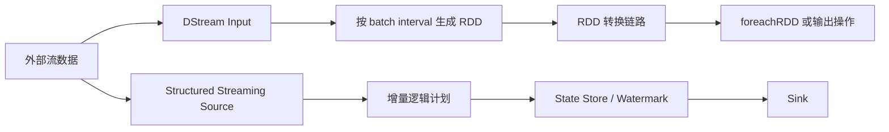

## DStreams 是历史边界，不是现代 Spark 流处理主线
Spark Streaming DStreams 是上一代流处理引擎。官方文档已经明确说明它是 previous generation，并建议新的流式应用和 pipeline 使用 Structured Streaming。知识库仍然需要保留 DStreams，是因为很多老系统、迁移项目和知识追溯和迁移讨论会涉及它。

正确理解方式不是“DStreams 过时所以不用学”，而是知道它解决过什么问题、模型边界在哪里、为什么 Structured Streaming 成为主线、迁移时哪些语义不能直接照搬。

## DStreams 和 Structured Streaming 的模型差异
| 维度 | DStreams | Structured Streaming |
| --- | --- | --- |
| 抽象 | DStream，内部是连续 RDD 序列 | 流式 DataFrame/Dataset，基于 Spark SQL 增量执行 |
| 时间推进 | batch interval 切分批次 | trigger 生成 micro-batch 或 continuous 运行 |
| 状态 | updateStateByKey、mapWithState、checkpoint | state store、watermark、output mode、checkpoint |
| 优化 | 主要沿 RDD 转换链路执行 | 可利用 Catalyst、SQL plan、source/sink 语义 |
| 输出 | foreachRDD、saveAs 等输出操作 | sink、foreachBatch、output mode |
| 迁移难点 | API、checkpoint、状态和输出语义都可能变 | 需要重建查询语义和恢复边界 |

## StreamingContext 生命周期
DStreams 使用 StreamingContext 作为入口。它创建输入流、定义转换、启动接收和处理。生命周期约束很重要：context 启动后不能再添加新的 streaming computation；停止后不能重启同一个 context；同一个 JVM 内活动 StreamingContext 数量有限制。

这些约束让 DStreams 更像“启动后运行的一组 RDD 批处理模板”。如果业务需要动态增删查询、统一 SQL 表达、精细状态管理和水位线，Structured Streaming 的抽象更适合。

## Receiver、批次和 Checkpoint
DStreams 的输入可以来自 receiver，也可以来自 direct 模式来源。receiver 模式要考虑接收器资源、WAL、反压和数据可靠性。批次间隔设置过短会导致处理赶不上输入；设置过长会增加延迟。checkpoint 既用于恢复元数据，也用于某些有状态转换。

Structured Streaming 的 checkpoint 记录 query 进度、offset、state store 和 sink 提交相关信息。两者都叫 checkpoint，但内容和兼容性不同。迁移时不能复用旧 checkpoint，也不能假设同样的 state 恢复语义。



## 迁移不是 API 替换
DStreams 迁移到 Structured Streaming 时，要重新确认 source、状态、输出和恢复。Kafka offset 的读取方式、窗口语义、迟到数据处理、状态清理、输出模式、sink 幂等、checkpoint 目录都要重设。尤其是 `foreachRDD` 迁移到 `foreachBatch`，业务幂等不能丢。

如果老系统依赖 RDD 级别灵活处理，迁移时可以先把输入和输出语义固定，再逐步把中间计算改成 DataFrame/SQL。不要在同一次迁移里同时改 source、状态逻辑、sink 和业务口径，否则回归困难。

## 示例：DStreams 到 Structured Streaming 的思维替换
```python
# DStreams 思维：每个 batch 是一个 RDD。
# Structured Streaming 思维：定义一张持续更新的结果表。
stream_df = spark.readStream.format("kafka").option("subscribe", "orders").load()
result = stream_df.selectExpr("CAST(value AS STRING) AS raw")
query = result.writeStream.format("parquet").option("checkpointLocation", "/ck/orders").start("/out/orders")
```

这段代码并不能说明端到端语义已经正确。还要继续确认 Kafka 起始 offset、value 解析、坏消息、输出目录、checkpoint、重复 batch、下游读取和清理策略。

## 生产核验清单
1. 老应用是否仍使用 DStreams，原因是历史包袱、API 依赖还是特定 source。
2. batch interval、processing time 和输入速率是否匹配。
3. checkpoint 是元数据恢复、状态恢复还是业务幂等的一部分。
4. foreachRDD 或 foreachBatch 内部写外部系统是否幂等。
5. 迁移前后窗口、迟到数据、状态清理和输出模式是否一致。

## 来源与事实边界
本页依据 Spark Streaming DStreams Guide 和 Structured Streaming Guide/APIs 整理。DStreams 是遗留边界，生产新建流处理应优先评估 Structured Streaming；迁移方案必须结合具体 source、sink 和状态逻辑验证。
