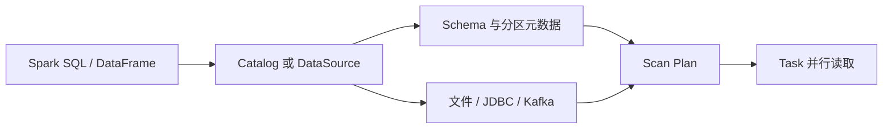

## 外部数据源决定扫描边界和一致性边界
Spark 计算通常从外部系统读数据：文件、Hive 表、JDBC 数据库、Kafka、对象存储、湖仓表格式或自定义 connector。Spark 可以统一成 DataFrame，但统一 API 不等于统一语义。每个数据源都有自己的 schema、分区、并行度、谓词下推、失败重试和一致性边界。

这类页面要回答三个问题：Spark 能不能少读数据，能不能并行读数据，读到的数据是不是业务上期望的版本。只说 `spark.read.format(...).load(...)` 是远远不够的。

## 数据源差异
| 数据源 | 关键能力 | 主要风险 |
| --- | --- | --- |
| Parquet | 列式存储、列裁剪、谓词下推、分区发现、schema evolution 边界 | schema merge 成本、分区字段类型、过多小文件 |
| ORC | 列式存储、向量化读取、Hive 生态兼容 | Hive 配置、压缩和统计信息差异 |
| JSON/CSV/XML | 通用文本格式，适合交换和落地 | schema 推断成本、坏记录、类型不稳定 |
| JDBC | 连接外部数据库，可按分区列并行读取 | 数据库压力、事务隔离、pushdown 能力、分页一致性 |
| Hive Tables | 依赖 Hive Metastore 管理表和分区元数据 | 元数据过期、分区未修复、权限和 SerDe 差异 |
| Kafka Source | 流式或批式读取 topic/partition/offset | offset 边界、反压、schema 解析、端到端语义 |

## Schema、分区发现和文件枚举
文件源读取成本常常不在真正扫描数据，而在列目录、枚举文件、读取 footer、合并 schema 和生成 partition splits。Parquet/ORC 的列裁剪和谓词下推能减少读取，但前提是过滤条件和列选择能被数据源识别，而且文件布局支持裁剪。

分区发现也不是免费的。目录分区字段可能被推断成字符串、日期或数字；新增分区可能没有进入 metastore；对象存储上的 list 操作可能很慢。生产排查小文件和慢启动时，要把文件数量、目录层级、分区数量和元数据缓存一起看。

## JDBC 并行读取不是数据库压测工具
Spark JDBC 可以通过 partitionColumn、lowerBound、upperBound 和 numPartitions 并行读取，但这不等于数据库能承受任意并发。分区列选择不均匀会导致倾斜，边界设置错误会漏读或重复读，数据库隔离级别和查询时间也会影响一致性。

JDBC 写入同样要谨慎。Spark task 重试可能导致重复写，批量插入失败可能留下部分结果，目标表主键和事务策略必须明确。对核心业务表，通常要通过临时表、批次号、merge 或数据库事务来做幂等保护。

## Kafka 与流式来源
Kafka Source 的核心对象是 topic、partition、offset 和 consumer group 之外的 Spark 查询状态。Structured Streaming 会把进度写入 checkpoint，但端到端结果仍取决于 sink 是否幂等。Kafka 读到 offset 不代表业务处理完成，Spark batch 成功也不代表外部系统已经去重。

流式读取还要关注 schema 演进。Kafka value 通常是 bytes，解析 Avro、JSON 或 Protobuf 的逻辑在 Spark 计划中或 UDF 中完成。schema registry、坏消息、迟到事件和水位线都不是 Kafka Source 单独能解决的问题。

## Hive Metastore 和 Catalog
Hive Metastore 管的是表、分区、schema、位置和 SerDe 等元数据。Spark 可以读 Hive 表，但权限、分区修复、SerDe 兼容、统计信息和表格式语义都需要单独验证。读表慢有时不是 Spark 执行慢，而是 metastore 调用、分区枚举或权限检查慢。



## 示例：JDBC 读取参数要和数据库能力一起评估
```python
jdbc_df = (spark.read.format("jdbc")
  .option("url", "jdbc:postgresql://db/app")
  .option("dbtable", "orders")
  .option("partitionColumn", "id")
  .option("lowerBound", "1")
  .option("upperBound", "100000000")
  .option("numPartitions", "16")
  .load())
```

这里要确认 id 是否均匀、数据库是否能承受 16 个并发查询、读取是否需要一致性快照、where 条件是否能下推、网络带宽是否足够。Spark 侧参数只是入口，瓶颈可能在数据库。

## 生产核验清单
1. 文件源：文件数、平均大小、分区层级、schema merge、坏文件策略。
2. 列式格式：列裁剪、谓词下推、向量化读取、统计信息是否生效。
3. JDBC：分区列分布、数据库连接数、隔离级别、下推 SQL、重试幂等。
4. Kafka：起止 offset、checkpoint、schema 解析、坏消息处理、sink 幂等。
5. Hive：metastore 延迟、分区修复、权限、SerDe、表统计信息。

## 来源与事实边界
本页依据 Spark SQL Data Sources、Structured Streaming APIs 和 Spark SQL Guide 整理。具体 connector 的事务语义、schema registry 规则和数据库隔离级别必须查对应外部系统文档。
