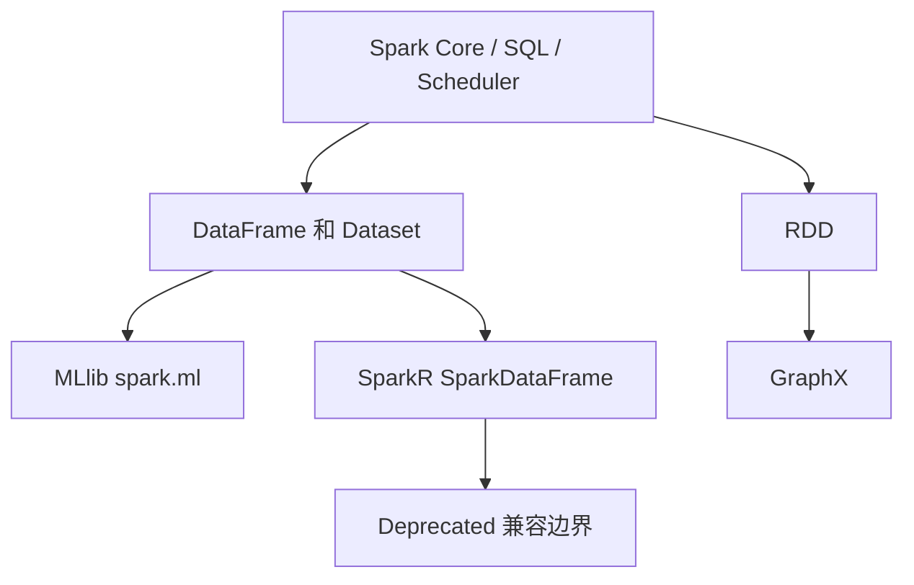

## 非核心 API 要讲定位，不要讲成 Spark 主干
Spark 官方导航仍然包含 MLlib、GraphX 和 SparkR。它们是 Spark 生态的一部分，但面试和生产选型里不能把它们与 Spark SQL、DataFrame、Structured Streaming 的主线混为一谈。

更可靠的表达是：Spark 核心提供分布式计算、调度、SQL 和流式执行能力；MLlib、GraphX、SparkR 是面向特定场景的上层 API 或兼容入口。它们共享 Spark 执行资源，但各自有发展状态、生态替代和工程边界。

## 三个模块的定位
| 模块 | 定位 | 当前回答重点 |
| --- | --- | --- |
| MLlib | Spark 的机器学习库，DataFrame-based `spark.ml` 是主 API | pipeline、feature、estimator/model、evaluation、persistence |
| GraphX | 基于属性图和 RDD 的图计算 API | VertexRDD、EdgeRDD、aggregateMessages、Pregel、迭代缓存 |
| SparkR | R 语言访问 Spark 的前端，Spark 4.0 起 deprecated | 兼容边界、迁移风险、SparkDataFrame 和 Arrow |

## MLlib：分布式训练不等于模型质量保证
MLlib 提供分类、回归、聚类、协同过滤、特征处理、pipeline、模型保存加载和统计工具。官方文档明确 DataFrame-based `spark.ml` 是 primary API，RDD-based `spark.mllib` 处于 maintenance mode。

回答 MLlib 时要把执行能力和模型治理分开。Spark 能并行处理数据和训练部分算法，但数据泄漏、训练/验证切分、指标选择、特征漂移、模型上线、在线推理和 A/B 实验不是 Spark 自动解决的。Spark 只是训练和特征计算基础设施的一部分。

## GraphX：图计算建立在 RDD 边界上
GraphX 引入属性图抽象，顶点和边带属性，底层和 RDD 体系关系很深。它适合 PageRank、连通分量、三角计数、邻居聚合和 Pregel 风格迭代算法。关键对象是 Graph、VertexRDD、EdgeRDD、Triplet、aggregateMessages 和 Pregel。

GraphX 的风险在于迭代 lineage、缓存、checkpoint 和内存。图算法通常反复迭代，如果不 materialize、不 unpersist、不 checkpoint，可能出现内存压力和超长 lineage。它不是通用图数据库，也不负责在线图查询和事务更新。

## SparkR：要明确 deprecated 状态
SparkR 是 R 用户访问 Spark 的接口，提供 SparkDataFrame、SQL、部分 MLlib 和 Arrow 转换能力。但官方文档已经说明 SparkR 从 Apache Spark 4.0.0 开始 deprecated，并将在未来版本移除。因此它应该作为兼容性和迁移边界来讲，而不是新项目首选方向。

如果历史团队仍有 SparkR，要重点评估迁移路径：是否转 PySpark、SQL、Scala/Java；R 侧依赖是否能替换；Arrow 转换是否稳定；模型训练和数据分析是否可以拆分到其他平台。



## 示例：MLlib Pipeline 的边界
```python
from pyspark.ml import Pipeline
from pyspark.ml.feature import StringIndexer, VectorAssembler
from pyspark.ml.classification import LogisticRegression

indexer = StringIndexer(inputCol="label_raw", outputCol="label")
assembler = VectorAssembler(inputCols=["f1", "f2", "f3"], outputCol="features")
lr = LogisticRegression(featuresCol="features", labelCol="label")
pipeline = Pipeline(stages=[indexer, assembler, lr])
model = pipeline.fit(train_df)
```

这段代码说明了 pipeline 结构，但不说明模型可用。还要验证训练/验证切分、类别分布、特征泄漏、指标、模型漂移和线上推理一致性。

## 生产核验清单
1. 新项目优先判断是否真的需要 MLlib、GraphX 或 SparkR，而不是默认使用。
2. MLlib 要说明 DataFrame API 主线、RDD API maintenance mode 和 pipeline 边界。
3. GraphX 要说明图算法、迭代、缓存、checkpoint 和非图数据库边界。
4. SparkR 要明确 deprecated 状态和迁移方案。
5. 所有上层 API 都要回到 Spark 资源、调度、存储和监控证据。

## 来源与事实边界
本页依据 MLlib、GraphX、SparkR 和 Spark SQL 官方文档整理。模块状态以 Spark 4.1.1 文档为准；具体生产选型还要考虑团队语言栈、生态工具和长期维护成本。
