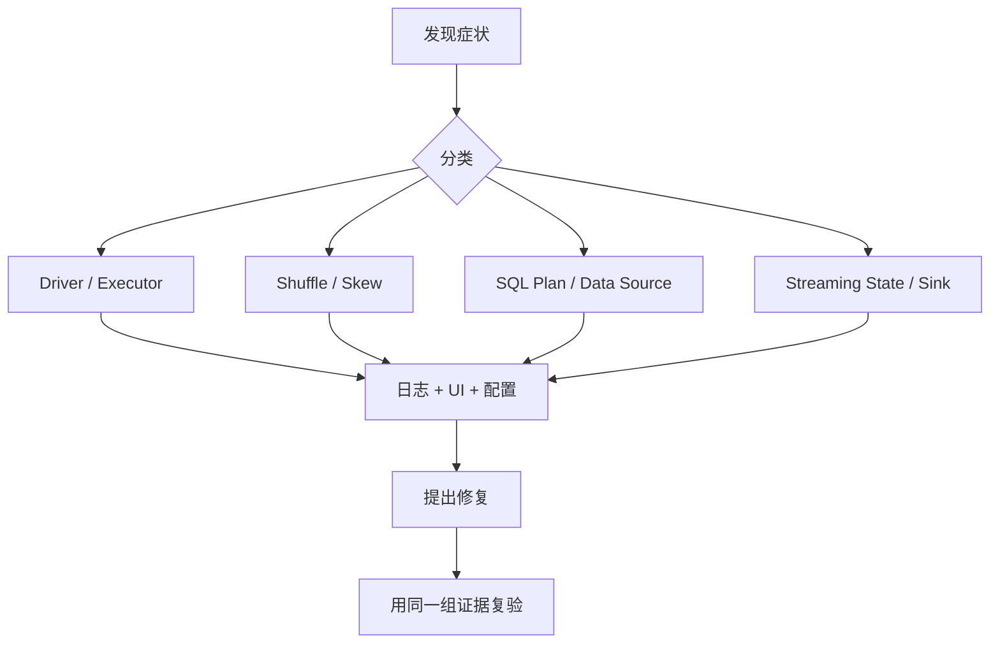

## 排障案例库的目标是形成证据链
Spark 生产排障不能靠“调大内存”“加 executor”“开 AQE”这种单点动作。真正可靠的方法是先给症状分类，再收集证据，最后验证修复。症状不同，证据入口也不同：Driver OOM 看结果面和控制面；Executor OOM 看 task、spill、GC 和容器日志；FetchFailed 看 shuffle 输出可用性；流式延迟看 batch 进度、state 和 sink commit。

案例库不是替代原理页，而是把原理落到生产判断。每个案例都要回答：入口在哪里，状态属于哪一层，结果何时可见，哪些指标能证明判断，修复后如何验证。

## 案例一：Driver OOM
常见触发是 `collect`、`toPandas`、过大的 `take`、广播变量过大、过多 task metadata、过大 query plan 或 streaming progress 堆积。Driver OOM 不是 executor 算不动，而是控制面或结果面承受不了。

证据链：driver log 中 OOM 堆栈，Spark UI 中 result size、job/stage 数量、task 数量，代码里是否有结果收集，配置里的 driver memory 和 maxResultSize。修复优先级是减少回收结果、改写为分布式写出、限制采样规模、优化 plan，而不是盲目加 driver 内存。

## 案例二：Executor OOM 与 Spill
Executor OOM 常见于 join、aggregation、sort、cache、Python UDF 和数据倾斜。Spill 是降级机制，不是健康状态。偶发 spill 可以接受，持续大 spill、GC 时间高、task 长尾和容器被 kill 说明内存或数据布局有问题。

证据链：executor log、container/pod 退出原因、Spark UI task metrics、peak execution memory、spill bytes、GC time、input records 分布。修复可能是调整 join 策略、降低单 task 数据量、处理倾斜、减少 cache、使用更合适的序列化或增加 executor memory overhead。

## 案例三：FetchFailed 和 Stage 重提
FetchFailed 说明下游 task 拉取上游 shuffle block 失败。原因可能是 executor 丢失、磁盘清理、网络问题、shuffle 服务问题、动态资源回收或本地磁盘压力。它往往牵连上游 shuffle map stage，而不是只重试当前 reduce task。

证据链：FetchFailed 堆栈、lost executor 时间、shuffle service 日志、local disk 使用率、dynamic allocation 事件、stage 重提次数。修复要看是资源生命周期问题、网络问题还是磁盘问题。动态资源场景尤其要确认 shuffle tracking、external shuffle service 或 decommission 策略。

## 案例四：数据倾斜
数据倾斜的表现是少数 task 特别慢、输入记录或 shuffle read 远高于其他 task、某些 key 特别大。不要只凭“作业慢”判断倾斜，也不要一上来加 executor。加资源只能缓解，不能消除热点 key。

证据链：Spark UI task 分布、shuffle read records/bytes、SQL plan 中 Exchange 和 join key、热点 key 统计、AQE skew join 是否触发。修复可能是过滤异常 key、salting、拆分热点 key、调整 join 策略、预聚合或改变数据模型。

## 案例五：Structured Streaming 延迟堆积
流式延迟增加可能来自 source 输入变大、state 膨胀、watermark 不推进、sink commit 慢、checkpoint I/O 慢、trigger 太频繁或外部系统限流。只看 processingTime 不够，要拆成 source、state、execution、sink 和 checkpoint。

证据链：Streaming query progress、inputRowsPerSecond、processedRowsPerSecond、stateOperators、eventTime watermark、batch duration、sink commit 时间、checkpoint 目录增长。修复要按瓶颈层处理，不能只调 trigger interval。

## 案例六：写入重复或结果不可见
Spark 作业成功不代表外部业务 exactly-once。task 重试、foreachBatch 重跑、JDBC 部分成功、对象存储临时文件、下游读旧分区都可能导致重复或不可见。排障要看 batchId、目标主键、提交日志、输出目录和下游读取方式。

## 最小排障证据包
1. Spark application id、提交参数、Spark 版本和部署模式。
2. Spark UI 或 History Server 链接、event log、driver/executor 日志。
3. SQL explain formatted、关键 stage/task metrics、shuffle 和 spill 指标。
4. 输入数据规模、分区数、文件数、热点 key、输出文件布局。
5. Structured Streaming progress、checkpoint 状态和 sink 侧日志。
6. 修复前后同口径指标对比。

## 来源与事实边界
本页依据 Spark Monitoring、Tuning Guide、SQL Performance Tuning、Structured Streaming APIs 和 SQL Data Sources 整理。案例库提供排障框架，不替代对具体集群、存储、数据库、消息系统和表格式的日志分析。
