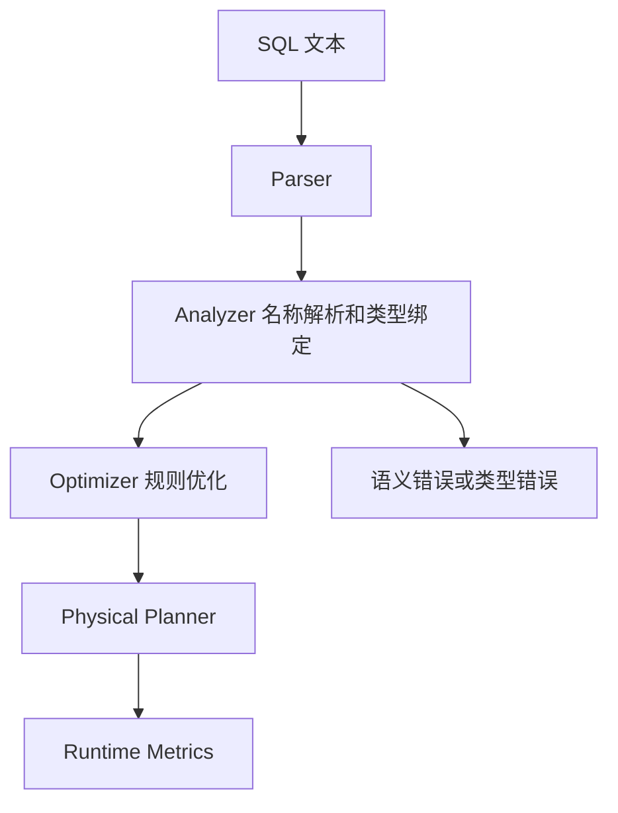

## SQL 语义错误不是调优问题
Spark SQL 页面如果只讲 Catalyst、AQE 和 Join，还不够完整。优化器决定怎么执行，但 SQL 语义决定“应该算出什么”。ANSI 模式、类型转换、Null 处理、名称解析、函数语义和 UDF 边界都会在物理计划之前影响结果。

很多生产事故并不是慢，而是结果悄悄不对。例如字符串转数字失败、除零、日期解析、Null join、列名歧义、大小写配置、隐式类型提升、UDF 返回类型不一致，这些问题不能靠加 executor 或打开 AQE 解决。

## 语义层对象
| 对象 | 影响 | 观察入口 |
| --- | --- | --- |
| ANSI mode | 溢出、非法转换、除零等行为可能从容忍变成报错 | SQLConf、异常类型、迁移说明 |
| Data Types | 决定比较、聚合、序列化和表达式计算方式 | schema、cast、explain analyzed |
| Null Semantics | 影响过滤、join、聚合、排序和去重结果 | SQL Reference、测试用例、结果差异 |
| Name Resolution | 决定列名、表名、函数名如何绑定 | analyzed logical plan |
| Built-in Functions | 有官方语义和类型规则 | SQL Reference、函数文档 |
| UDF/UDAF/UDTF | 扩展表达式能力，但可能削弱优化器可见性 | physical plan、codegen、Python/JVM 边界 |

## ANSI 与类型转换
ANSI 模式不是“更严格”这么简单，它改变的是错误暴露方式。宽松模式下某些非法转换可能返回 null 或容忍结果；ANSI 模式下可能直接失败。升级或迁移时，如果只跑性能基准，不跑语义回归，就容易把历史脏数据变成线上失败。

类型转换要重点看三类场景：第一，源数据是字符串但业务当数值或时间用；第二，join key 两侧类型不同；第三，聚合或计算中存在 decimal 精度、溢出和除零。计划里看得到 cast，但 cast 是否符合业务含义，需要通过数据样本和异常分布验证。

## Null 语义与三值逻辑
SQL 里的 null 不是普通值。`NULL = NULL`、`IN`、`NOT IN`、外连接过滤、聚合忽略 null、排序 null 位置，都可能改变结果。最危险的是反连接、去重和指标口径：看起来 SQL 很短，实际业务含义可能完全不同。

如果结果异常，先不要马上怀疑 shuffle 或 AQE。应该先把 analyzed logical plan、关键字段 null 比例、过滤条件和 join 条件拿出来核对。语义层不正确，物理执行再快也只是更快地产生错误结果。

## UDF 的能力和代价
UDF 可以快速表达业务逻辑，但它会带来三个边界。第一，优化器可能看不懂 UDF 内部逻辑，难以下推、重排或裁剪。第二，Python UDF 会跨 JVM/Python 边界，引入序列化和 worker 内存问题。第三，UDF 的异常、null 处理和返回类型经常缺少系统性测试。

优先选择内置函数和 SQL 表达式。只有当内置表达式无法表达时，再使用 UDF，并为 null、异常值、边界类型和性能做专门测试。面向生产的 UDF 还要考虑版本发布、依赖分发和回滚。

## 从语义到执行计划


诊断顺序应该是：先确认 SQL 语义是否符合业务，再看优化器选择是否合理，最后看运行时瓶颈。尤其是字段口径、Null、时间、时区、decimal 和 UDF，必须在单元测试或抽样校验里固定下来。

## 示例：Null 与类型转换的自检
```sql
SELECT
  CAST(raw_amount AS DECIMAL(18, 2)) AS amount,
  CASE WHEN user_id IS NULL THEN 'missing_user' ELSE 'known_user' END AS user_bucket
FROM source_table
WHERE event_time IS NOT NULL;
```

这段 SQL 的重点不是写法，而是要明确：非法 amount 如何处理，user_id 为空是否保留，event_time 为空是否丢弃，decimal 精度是否足够。把这些口径写成测试，比临时调参数更重要。

## 生产核验清单
1. 升级 Spark 或切换 ANSI 配置前，运行语义回归测试。
2. 对 join key、分区字段、金额、时间字段做类型和 null 分布统计。
3. 用 `explain extended` 或 `explain formatted` 查看 analyzed plan。
4. 优先用内置函数替代 UDF，必要 UDF 要补 null、异常、类型和性能测试。
5. 对下游核心指标保留小样本可复算数据。

## 来源与事实边界
本页依据 Spark SQL Reference、Spark SQL Guide 和 SQL Performance Tuning 整理。官方 SQL Reference 是语义来源；性能调优文档不能替代语义判断。
