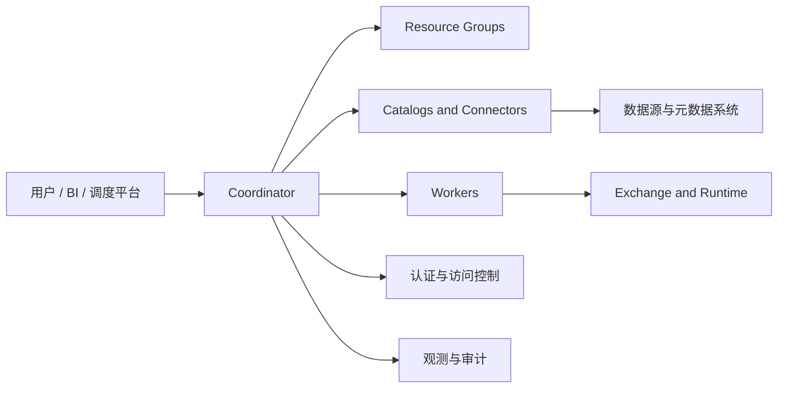

## 设计 Trino，第一步不是决定几台机器，而是先决定“它在这套架构里扮演什么角色”
Trino 可以是统一查询入口、联邦查询层、湖仓交互层，也可以只是某个团队的共享分析服务。但不同角色的设计重点完全不同。如果一上来就讨论 Coordinator 配多少核、Worker 配多少内存，通常说明问题还没定义清楚。

更成熟的设计应该先回答：

- 这套 Trino 主要承接谁的请求。
- 以短查询为主，还是以大批量重查询为主。
- 是否要跨多个 catalog 和多个安全域。
- 是否要承担写入、回填或只读分析。
- 是否需要 fault-tolerant execution。

这些问题本身，就是系统设计的骨架。

## 设计 Trino 服务时必须先做的六个决定
### 1. 服务角色：共享查询层，还是专项分析层
如果是共享查询层，资源治理、安全、审计和多租户边界会非常重要；如果是专项分析层，重点可能会更多落在某一类数据源、某一类查询模式和稳定吞吐上。

### 2. Catalog 策略
Trino 的 `catalog` 不是目录名，而是一个到具体 connector 与配置的命名边界。系统设计时必须提前决定：

- catalog 如何命名和分环境。
- 哪些数据源暴露给哪些用户或团队。
- 连接凭据、元数据和源系统限制怎样治理。

catalog 设计混乱，会直接放大安全、审计和运维复杂度。

### 3. 工作负载分层
共享 Trino 如果同时承接 adhoc、报表、批量回填、写入任务和管理员操作，必须明确资源分层与路由规则。否则集群看似有很多资源，实际上只是让不同工作负载互相踩踏。

### 4. 底层数据准备度
Trino 的性能高度依赖底层布局与 connector 能力。设计系统时必须假设：

- 分区、文件大小、对象数量会直接影响 split 生成与扫描效率。
- pushdown 和统计信息是否可用，会决定优化器能不能做出合理计划。
- 写入 connector 的语义边界不一致，不能简单把“能查”当成“能稳写”。

这说明 Trino 设计从来不只是引擎设计，还包括数据源契约设计。

### 5. 安全与审计边界
如果 Trino 是统一入口，就必须把 TLS、认证、用户映射、访问控制、内部通信安全和底层源系统凭据治理一起设计。否则它会变成跨源访问的一块软肋，而不是收口点。

### 6. 故障与恢复模型
默认 Trino 查询在执行期遇到节点故障会失败，所以系统设计里必须明确：

- 关键负载能不能接受人工重跑。
- 是否需要启用 `QUERY` 或 `TASK` retry。
- 若使用 `TASK`，是否有可靠 exchange manager 以及对应 connector 支持。
- 短查询与大批量查询是否需要拆集群。

## 一个更贴近真实生产的 Trino 设计视图

这张图最想强调的是：Trino 的系统设计不只是一组执行节点，而是入口治理、catalog 边界、运行时资源、安全和底层源系统共同组成的服务。

## 四类特别常见的设计误判
1. 把所有工作负载放进同一套共享集群，却没有清晰资源分层。
2. 忽略底层表布局和统计信息，把性能问题完全推给 Trino 参数。
3. 只设计认证，不设计查询层访问控制与审计。
4. 需要大型批量容错执行，却没有把 exchange manager 和 connector 支持边界一起设计。

## 一个更稳的设计顺序
1. 先定服务角色和主要负载。
2. 再定 catalog、安全和租户边界。
3. 再定资源组和工作负载分层。
4. 再核对底层数据布局、统计信息和 connector 语义。
5. 最后才决定 fault-tolerant execution、扩容方式和参数细化。

## 本页结论
Trino 系统设计的核心不是“堆多少机器”，而是“查询服务边界怎么被组织起来”。如果回答里能把服务角色、catalog、resource group、安全、底层数据准备度和恢复模型串成一条因果链，就已经比只谈参数或节点规模深入得多。
