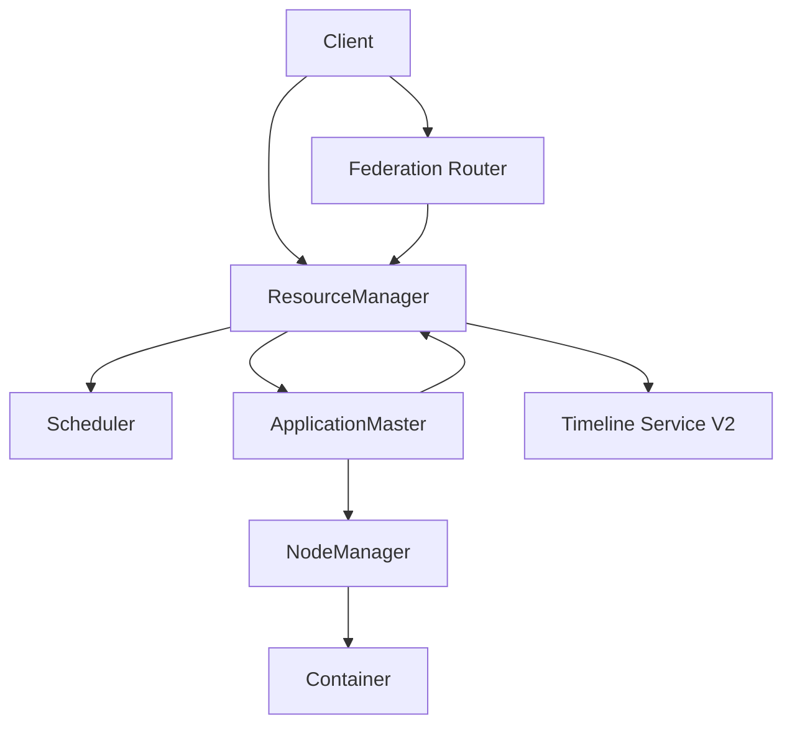

## YARN 的架构不是“一堆节点调度任务”这么简单，而是明确分层的控制面与执行面
YARN 的角色拆得越清楚，后面的容量治理、恢复、排障和性能解释就越稳定。更可靠的理解方式，是先把它拆成三层：

- 控制面：`ResourceManager` 及其内部的应用接纳与调度能力。
- 应用协调面：每个应用自己的 `ApplicationMaster`。
- 节点执行面：各机器上的 `NodeManager` 与被启动的 `Container`。

如果只会说“RM 管全局、NM 管节点”，深度还是不够。真正的关键在于每一层到底握着什么状态、做什么决定、又不能替下一层做什么。

## ResourceManager 为什么是全局控制面
ResourceManager 不只是一个接收提交请求的入口。按照官方架构文档，它至少承担两类全局职责：

1. 接纳和跟踪应用。
2. 通过调度器按策略分配集群资源。

更细一点说，RM 内部至少可以从职责上拆成两部分：

- 接纳与应用状态管理：负责记录应用进入系统、尝试次数、运行状态等。
- 调度：根据队列策略、资源供给、节点分区和应用需求分配 Containers。

一个非常重要的原理点是：调度器本身是“纯调度器”。它决定资源给谁，不负责理解 Spark 算子，也不负责业务任务失败后怎样补救。

## Scheduler 为什么必须单独理解
很多人把 Scheduler 当成 RM 的一个“内部实现细节”，其实它是 YARN 最核心的策略边界之一。调度器负责的不是执行，而是回答下面这些问题：

- 当前这份资源该给哪个队列、哪个应用。
- 当前应用能否先拿到 AM Container。
- 不同租户之间的容量保证和弹性借用如何平衡。
- 节点标签、节点属性和放置约束怎样影响可分配范围。

因此，Scheduler 的问题通常表现为“应用一直在 Accepted”“某队列迟迟拿不到资源”“资源碎片很多但新容器上不来”。它不是节点执行失败，而是全局分配策略问题。

## ApplicationMaster 是“每应用一个小控制器”
AM 是 YARN 架构里最容易被低估的角色。它既不是 RM 的附属线程，也不是 NM 的子进程逻辑，而是每个应用自己带着的一层协调器。

它的典型职责包括：

- 向 RM 注册自己。
- 代表应用申请和释放 Containers。
- 感知任务执行结果，决定是否重试或重新申请资源。
- 与 NM 协作，把真正的任务进程拉起来。

这意味着同样运行在 YARN 上，Spark on YARN 和 MapReduce on YARN 的“作业编排风格”可以不同，因为 AM 本来就带有框架特性。

## NodeManager 是单机资源代理，而不是被动守护进程
NM 的职责不只是“启动容器”。官方 NodeManager 文档对应的真实角色更接近单机资源代理：

- 接收 ContainerLaunchContext 并真正拉起容器。
- 做本地化资源准备，比如分发 jar、配置和依赖文件。
- 进行节点健康检查，并通过 heartbeat 报告给 RM。
- 负责本地日志与日志聚合相关动作。
- 在配置允许时支撑 NM restart 等运维能力。

所以节点问题往往首先落在 NM：磁盘不健康、日志目录异常、本地化失败、容器起不来、节点被标成 unhealthy，这些都不是 RM 调度层的问题。

## Container 才是 YARN 分配资源的基本单位
YARN 的资源不是直接分给“任务”或“线程”，而是先分给 Container。Container 是一份资源配额加启动上下文的组合，它定义了：

- 资源规格，比如内存、vcores 及扩展资源。
- 运行地点，即在哪个节点上起。
- 启动所需的环境、命令和依赖。

因此，解释 YARN 时如果不提 Container，就很容易把它误讲成“类似线程池”。而真正的调度、隔离、失败恢复边界，往往都要回到 Container 看。

## 可选但重要的扩展面：Timeline Service 与 Federation
很多集群并不一定把这些能力都打开，但在生产设计题里它们很重要：

- `Timeline Service V2`：承接应用历史、实体和指标的存储边界，偏观测面。
- `Federation`：把一个超大 YARN 部署拆成多个子集群，通过 Router 和状态存储做更大规模的全局接入，偏扩展面。

这两类组件不属于“最小运行必需”，但会直接影响可观测性和大规模架构设计。

## 一个更稳的角色关系图

## 本页结论
YARN 的架构核心不是“一主多从”，而是“RM 全局控制、AM 应用协调、NM 节点执行、Container 资源载体”。只要这四层关系讲清楚，再补上 Scheduler 的策略边界和可选的 Timeline / Federation 扩展面，YARN 的架构题就不会再停留在背名词层。
