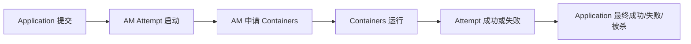

## YARN 真正管理的不是“一个任务”的生命周期，而是三层生命周期叠在一起
很多人会说“作业提交、运行、结束”，但对 YARN 来说，这个说法太粗。更准确的视角至少有三层：

- Application 生命周期。
- ApplicationAttempt 生命周期。
- Container 生命周期。

如果不分这三层，Accepted、AM 失败重启、容器退出、应用最终失败这些现象就很容易混成一团。

## 第一层：Application 生命周期
Application 是用户视角最直观的一层。一次提交就是一个 Application，它会经历：

- 被接收。
- 等待资源。
- 实际运行。
- 结束、失败或被杀掉。

这一层回答的是“这次提交整体怎么样了”。RM UI 上最先看到的通常也是这层信息。

## 第二层：ApplicationAttempt 生命周期
Attempt 是 Application 的运行尝试。只要 AM 失败、恢复触发或重试策略允许，Application 下面就可能出现新的 Attempt。

这层非常关键，因为它解释了两类很常见的现象：

- 应用没彻底死，但当前 AM 已经换过一轮。
- RM 侧看起来还是同一个 Application，但底层执行上下文已经不是第一次尝试。

所以真正分析故障时，要继续问一句：是 Application 失败了，还是 Attempt 失败了？

## 第三层：Container 生命周期
Container 的生命周期比 Attempt 更细：

- 被申请。
- 被调度并分配到节点。
- 在 NM 上启动。
- 运行中。
- 成功退出、失败退出或丢失。

很多节点侧故障其实只发生在这一层。也就是说，Application 看起来还活着，不代表所有 Containers 都健康。

## 这三层生命周期如何串起来

这条主线的关键是：Application 包裹 Attempt，Attempt 再包裹一批 Containers。外层状态稳定，不代表里层没波动。

## 为什么生命周期分层会直接影响排障
假设你看到“应用失败”，如果不分层，很容易上来就去找 Spark 日志或 RM 错误文案。更稳的路径其实是：

1. 先看 Application 整体停在哪。
2. 再看是不是某个 Attempt 挂了。
3. 再追到哪个 Container 退出、哪个节点异常。

这种分层方式，会让排障明显收敛得更快。

## 生命周期不只属于运行时，也影响设计题
系统设计里也离不开这三层：

- 队列治理影响的是 Application 能否被及时接纳。
- AM 重试策略影响的是 Attempt 如何恢复。
- 节点健康和本地化机制影响的是 Container 是否能稳定运行。

所以生命周期不是单纯的“过程描述”，而是设计与恢复的共同基础。

## 本页结论
YARN 的生命周期必须按 Application、Attempt、Container 三层理解。只要把这三层关系讲出来，很多“Accepted 卡住”“AM 重启”“容器退出”“应用最终失败”的现象就都能找到准确落点。
