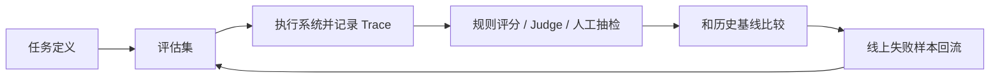

## 一次好看的 demo 很有吸引力，但它几乎从来不能替代评估系统
大模型系统天然带有随机性，而且它的输出质量受模型版本、prompt、上下文、检索结果、工具调用、解码策略和用户分布共同影响。也就是说，用户看到的一次流畅回答，只能证明“这次这个样本看起来还行”，却不能证明系统在真实样本分布上稳定可靠。评估的作用，就是把这种模糊感受转成一组可以复核、比较、回滚和持续迭代的证据。

## 解决什么问题
这一页主要回答六个问题：

1. 为什么 benchmark 分数高不等于业务效果就好。
2. 为什么评估必须从“最终答案”扩展到“链路中的对象和 trace”。
3. 为什么任何模型、prompt、检索和工具改动都要跑回归。
4. 为什么线上失败样本必须回流到评估集，而不是只存在日志里。
5. 为什么 LLM-as-Judge 只能作为工具，而不能替代清晰的评分标准。
6. 为什么评估本身要被设计成开发流程的一部分，而不是上线前一次性动作。

## 核心对象
| 对象 | 作用 | 如果缺失会怎样 |
| --- | --- | --- |
| Task Spec | 定义任务目标、允许行为和禁止行为 | 评估结果失去统一标准 |
| Eval Set | 承载真实样本、边界样本、负例和历史失败样本 | demo 很好看，真实分布却崩溃 |
| Judge / Rubric | 把输出转成可比较分数或标签 | 不同人评价标准完全不同 |
| Component Trace | 记录检索、工具、推理等中间证据 | 出错时只看到最终答案，定位不了根因 |
| Regression Baseline | 比较改动前后的质量变化 | 局部修复导致全局退化却没人发现 |
| Online Feedback Loop | 把线上失败样本转回离线评估 | 系统永远靠人工救火 |

### 为什么“任务定义”是评估的第一个对象
因为没有任务定义，所有后续动作都会失焦。比如“回答正确”对客服助手、RAG 搜索助手和自动执行 agent 的含义并不相同。只有先写清期望行为、禁用行为和成功标准，评估结果才不是一堆看起来有数字的噪声。

## 执行链路
一个更完整的评估闭环通常包含：

1. 明确任务目标与评分规则。
2. 构建包含真实样本、边界样本、负例和拒答样本的评估集。
3. 执行模型、RAG 或 agent 链路并保留 trace。
4. 用规则、人工或 LLM-as-Judge 对输出及中间结果打分。
5. 对比历史基线，判断是否出现回归。
6. 把线上失败样本重新标注并纳入下一轮评估。



### 为什么只看最终答案不够
因为 LLM 系统越来越多地由多个组件组成。RAG 会经过切分、召回、重排和引用，Agent 会经过规划、工具选择、参数构造和执行。只看最终答案，很难分清是“检索没召回”还是“召回了但模型没用上”，更难知道修复应该落在哪一层。

## 一致性与容错
评估系统本身也会漂移，常见来源包括：

1. 评估集被少量演示样本主导，无法代表真实分布。
2. Judge prompt 或评分规则悄悄变化，导致历史分数不可比。
3. 线上新增失败模式，但离线评估集没有更新。
4. 团队只记录平均分，不记录典型失败类别和组件 trace。

### 为什么评估漂移特别危险
因为它会让团队产生一种错觉：分数在提高，系统在进步。但实际上，可能只是样本越来越简单、评分越来越宽松，或者团队只保留了“自己容易做对”的数据。

## 性能模型
评估除了正确性，还应该有最基础的资源意识：

1. 离线评估的样本规模影响成本和反馈速度。
2. 自动 Judge 能提高吞吐，但会引入额外偏差和成本。
3. Trace 越详细，定位价值越高，但记录与分析成本也更高。
4. 回归频率越高，越容易及时发现问题，但工程开销也越大。

### 为什么很多团队迟迟建立不了评估闭环
因为评估会占用额外时间和预算，看起来不像“做功能”那样直接产出新能力。但没有评估，模型、prompt 和知识库每改一次都像在黑箱里摸索，长期成本更高。

## 生产排障
当系统出错时，评估体系能决定我们是否有能力快速定位：

1. 如果最终答案错了，先看任务标签是否明确。
2. 如果是 RAG，继续看召回、重排和证据引用是否失效。
3. 如果是 Agent，继续看工具选择、参数构造和执行结果。
4. 如果是模型升级后出问题，直接比对回归集上的前后差异。

### 高价值排障视角
1. 这次失败是新问题，还是评估集里本来就存在的老问题。
2. 问题根因在数据、检索、模型、prompt 还是工具。
3. 这次修复是否只修好了一个样本，却破坏了一批旧样本。

## 样例
下面这条评估样本结构，体现了“可执行评估”的最低要求：输入、期望行为和评分点都要显式化。

```json
{
  "case_id": "rag_042",
  "input": "公司 2025 年退款规则是什么？",
  "must_include": ["7 天无理由", "电子产品除外"],
  "must_not_do": ["编造未给出的细则"],
  "expected_sources": ["policy_2025_refund.md"]
}
```

而下面这个回归摘要则说明，真正有价值的不是“这次分数更高了”，而是知道哪些维度升了、哪些维度降了：

```yaml
regression_summary:
  overall_score: +3.2
  retrieval_grounding: +6.8
  format_stability: +1.0
  refusal_correctness: -4.5
  new_failures:
    - safety_refusal_011
    - tool_args_023
```

## 相邻技术边界
评估不是模型结构本身，也不是检索系统本身，更不是人工运营的替代品。它更像连接研发、测试、上线和运营的一条公共证据链。Benchmark 只能覆盖一部分问题，业务评估、组件诊断和线上反馈才决定系统是否真的可用。

## 本页结论
大模型评估的关键，不是把系统拿去跑几个榜单，而是建立一条从任务定义、评估集、trace、打分、回归到线上回流的完整闭环。只有这样，模型、prompt、RAG 和 Agent 的每次改动才真正可控。
