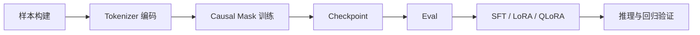

## 训练实践最有价值的地方，不是“我也训过一个模型”，而是第一次真正看见 token、loss、mask 和数据之间的因果关系
从 API 使用者转向模型训练学习者时，最大的转变不是学会更多命令，而是建立因果感。你会第一次看到数据如何经过 tokenizer 进入模型，看到 causal mask 如何限制可见上下文，看到 next-token prediction 怎样形成 loss，看到 SFT、LoRA 和 QLoRA 分别修改的是哪一层对象。小模型复现的价值就在这里，但它不能被误读成“已经具备生产级预训练经验”。

## 解决什么问题
这一页主要回答五个问题：

1. 为什么从 NLP 走到 LLM，主线不是“概念越来越多”，而是链路越来越完整。
2. tokenizer、Transformer、预训练、SFT、LoRA、QLoRA 和评估如何被串成一条训练闭环。
3. 为什么训练实践必须显式讨论数据管线和 checkpoint，而不只是 loss。
4. 为什么小模型实验的学习价值和工程边界要分开说。
5. 为什么训练实践最终还是要和推理、评估和业务目标接起来。

## 核心对象
| 对象 | 作用 | 如果理解不清会怎样 |
| --- | --- | --- |
| Corpus / Sample Builder | 组织训练样本和切分 | loss 下降却学到脏信号 |
| Tokenizer | 定义文本进入模型的离散空间 | 长度和词表成本被误判 |
| Causal Mask | 限制 decoder-only 只能看历史 | 训练目标的本质被讲错 |
| Checkpoint | 保存参数、优化器和训练状态 | 训练中断无法恢复或复现实验 |
| SFT / PEFT Layer | 决定后续如何做任务适配 | 微调和知识更新被混谈 |
| Eval Set | 判断训练提升是否真的有业务价值 | 只看 loss，不看任务效果 |

### 为什么 checkpoint 和 eval 也是训练对象
因为训练从来不是只跑一个循环。真实实践里，checkpoint 决定能否恢复和比较版本，eval set 决定训练是否在学对东西。没有这两层，训练结果很难进入工程闭环。

## 执行链路
一个最小但完整的训练实践链路通常包含：

1. 构造和清洗样本。
2. tokenizer 编码并形成训练序列。
3. 通过 causal mask 做 next-token prediction。
4. 周期性保存 checkpoint 和运行验证。
5. 在需要任务适配时进入 SFT、LoRA 或 QLoRA。
6. 用任务评估和推理表现判断训练是否有效。



### 为什么 next-token prediction 是训练主线
因为 decoder-only LLM 训练的最基础形式，就是用前面的 token 预测下一个 token。这个目标看似简单，却把语言模式、事实统计和任务格式都压进了统一训练框架里。后续 SFT、PEFT 和评估，都建立在这条主线之上。

## 一致性与容错
训练实践里常见的误判包括：

1. 只看 loss，不看验证集和推理效果。
2. tokenizer 改了，却还拿旧实验直接比较。
3. 数据切分不稳，训练集和验证集互相污染。
4. LoRA 训练后效果变化，却没有固定 base model 和 eval set。

### 为什么“loss 下降了”不等于“任务更好了”
因为 loss 只说明模型对当前训练目标拟合得更好，不说明格式稳定、业务正确、拒答合理或推理成本可接受。训练目标和业务目标之间，永远需要一层评估来桥接。

## 性能模型
训练实践的资源意识至少要覆盖：

1. tokenizer 粒度决定序列长度和训练成本。
2. batch size、sequence length 和模型大小决定显存压力。
3. checkpoint 频率影响训练恢复能力和 I/O 开销。
4. LoRA/QLoRA 能降低训练资源，但不降低评估要求。

### 为什么小模型实验仍然值得认真做资源记录
因为它能帮助学习者在小规模阶段就养成预算意识。等模型变大以后，这些对象只会更重要，不会更不重要。

## 生产排障
如果训练实验效果不稳，优先检查：

1. 数据和标签是否正确。
2. tokenizer 和序列长度是否合理。
3. checkpoint 恢复和实验版本是否一致。
4. 验证集和推理样例是否真的反映目标任务。
5. LoRA/QLoRA 是否加载到了正确底座模型上。

### 高价值排障问题
1. 是数据脏，还是 tokenizer 不适配。
2. 是 loss 假象，还是 eval 真退化。
3. 是微调方法不合适，还是问题本该交给 RAG。

## 样例
下面这个训练状态片段比单看 loss 更能支撑实验复盘：

```yaml
training_state:
  data_version: corpus_v5
  tokenizer_version: tok_v2
  checkpoint_step: 18000
  train_loss: 1.92
  eval_perplexity: 8.4
```

而这个最小训练循环片段，则提醒我们训练目标的本质是“右移一位预测下一个 token”：

```python
logits = model(token_ids[:, :-1])
labels = token_ids[:, 1:]
loss = cross_entropy(logits.reshape(-1, vocab_size), labels.reshape(-1))
```

## 相邻技术边界
训练实践页讨论的是“从样本到模型行为”的学习链，不等于生产级分布式训练系统，也不等于应用开发。它更像从原理走向工程的入口，帮助学习者知道后面更大规模系统到底在放大哪些对象。

## 本页结论
从 NLP 到 LLM 的训练实践，真正重要的是看懂链路和对象，而不是宣称自己“也训过一个模型”。当 tokenizer、mask、loss、checkpoint、PEFT 和 eval 被串起来时，训练知识才真正开始有工程价值。
