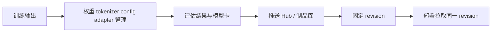

## 真实项目里最容易被低估的，不是训练本身，而是训练完成后到底交付了什么
很多团队把“模型产物”简单理解成一份权重文件，但在 Hugging Face 生态里，可上线、可复现、可回滚的资产从来不止权重。至少还包括 tokenizer、config、generation 配置、adapter、revision、模型卡和评估结果。只要其中一个对象被忽略，团队就很可能遇到“训练阶段能复现、推理阶段不一致、上线后无法回滚”的问题。

## 解决什么问题
这一页聚焦训练之后的资产治理问题：

1. 为什么 Hugging Face 交付物不能只看 `pytorch_model.bin` 或 `model.safetensors`。
2. 为什么 tokenizer、config、generation 配置、adapter 和 base model revision 必须成套管理。
3. Hub 在团队协作中到底承担仓库、注册表还是发布系统的角色。
4. 为什么很多线上偏差，本质上是资产边界不清，而不是训练本身失败。
5. 为什么部署前必须先回答“这份 adapter 依附于谁、这份 tokenizer 对应谁、这份评估结果验证的是哪次 revision”。

## 核心对象
| 对象 | 负责什么 | 常见误区 |
| --- | --- | --- |
| Model Weights | 存储底座模型或任务头参数 | 认为有权重就等于可上线 |
| Tokenizer Files | 约束编码、特殊 token、chat template | 训练和推理各用一套 tokenizer |
| Config / Generation Config | 说明模型结构和默认生成策略 | 只复制权重，不复制配置 |
| PEFT Adapter | 描述附着在底座模型上的增量参数 | 忘记记录 base model revision |
| Model Card / README | 记录用途、限制、许可证和用法 | 团队成员靠口头传递运行方式 |
| Hub Revision | 提供版本定位和回滚锚点 | 线上用了哪个版本没人说得清 |

### 为什么 tokenizer 不是附属文件
因为 tokenizer 直接决定“同一段文本如何进入模型”。如果训练用 tokenizer 和线上 tokenizer 有差异，模型看到的 token 序列就已经变了。此时就算权重一字不差，输出也完全可能不同。

## 执行链路
训练产物进入上线环境时，最稳的链路不是“把目录拷过去”，而是：

1. 确认底座模型 revision。
2. 绑定 tokenizer 与 config。
3. 如果用了 PEFT，明确 adapter 依附的 base model。
4. 保存评估结果和生成配置。
5. 推送到 Hub 或内部制品库，并用 revision 或 tag 固定版本。
6. 部署时显式拉取对应 revision，而不是拉“最新版本”。



### 为什么“latest”是高风险默认值
因为只要底座模型、adapter、generation 配置或 tokenizer 其中之一被悄悄更新，线上行为就可能变化。没有 revision pinning 的系统，经常会在没有显式发布动作的情况下自然漂移。

## 一致性与容错
资产治理里的高频故障模式通常是：

1. 保存了 adapter，但没有保存 base model 名称和版本。
2. Hub 上既有全量模型又有 adapter 目录，部署脚本却不知道该加载哪种模式。
3. 本地评估在 fp16 下进行，线上部署用量化模型，结果却沿用同一份验收结论。
4. 模型卡没有写清许可证、适用场景和禁用场景，后续团队误用。

### 为什么资产问题经常被误判成“模型效果波动”
因为它的外在表现就是回答风格变化、长度变化、格式变化，甚至准确率下降。但真正的根因可能只是换了 tokenizer revision、丢了 adapter、或者把训练用的 generation config 换成了部署默认值。

## 性能模型
资产边界不仅影响正确性，也影响性能：

1. 不同 checkpoint 大小决定加载时间。
2. 是否全量权重还是 adapter 叠加，决定冷启动路径。
3. generation 配置不同，会直接改变输出长度、延迟和成本。
4. 部署脚本是否缓存 revision，决定节点扩缩容时的启动稳定性。

### 为什么模型资产治理会影响吞吐
因为线上节点重启、自动扩容、蓝绿发布和回滚时，都需要重新拉取和加载资产。只要资产组织混乱，系统就会在最需要稳定的时候卡在下载、解析和错配上。

## 生产排障
当线上模型“明明没改代码却变了”时，优先排查的不是 prompt，而是资产：

1. 当前服务拉取的是哪个 model revision。
2. tokenizer、config、generation config 是否随版本一起固定。
3. adapter 是否成功挂载到正确的 base model 上。
4. 本次发布的评估报告对应的到底是不是当前 revision。
5. Hub 或内部制品库里是否存在同名不同义的目录。

### 值得长期保留的证据
1. 模型目录结构快照。
2. base model 与 adapter 的映射记录。
3. 发布 revision、上线时间和回滚 revision。
4. 每次 revision 对应的评估摘要。

## 样例
下面这份目录结构，比单独一份权重文件更接近一个真实可交付资产：

```text
my-llm-artifact/
├─ config.json
├─ generation_config.json
├─ tokenizer.json
├─ tokenizer_config.json
├─ special_tokens_map.json
├─ adapter_config.json
├─ adapter_model.safetensors
└─ README.md
```

下面这个片段说明，部署时应显式固定 base model revision，再加载 adapter，而不是默认取最新版本：

```python
from transformers import AutoModelForCausalLM, AutoTokenizer
from peft import PeftModel

base_revision = "v1.2.3"
base_model_id = "org/base-model"
adapter_id = "org/domain-adapter"

tokenizer = AutoTokenizer.from_pretrained(base_model_id, revision=base_revision)
model = AutoModelForCausalLM.from_pretrained(base_model_id, revision=base_revision)
model = PeftModel.from_pretrained(model, adapter_id)
```

## 相邻技术边界
Hub 不是训练算法，它更接近模型资产注册与协作平台；checkpoint 不是完整应用，它只描述一部分参数状态；adapter 不是独立底座模型，它依附于某个 base model 和 tokenizer 语义。理解这些边界后，才能把 Hugging Face 生态和更外层的模型服务、灰度发布、制品仓库管理正确衔接起来。

## 本页结论
Hugging Face 工程链路的后半段，核心不是“把文件传出去”，而是把模型资产组织成一套别人可以拉取、复现、部署、回滚、审计的结构。只谈训练、不谈资产治理，项目很容易在真正上线前后暴露出最难补救的问题。
