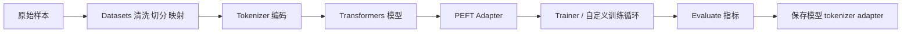

## Hugging Face 最容易被讲浅的地方，是把它说成“一个能跑 pipeline 的库”
一旦进入真实项目，Hugging Face 生态就不再是一个 `pipeline("text-generation")` 的快捷入口，而是一条从数据、分词、模型、训练、适配、评估到发布的完整工程链路。真正需要掌握的，不是谁会背库名，而是谁能解释每个对象在链路中承担什么职责、出问题时去哪里找证据、换模型或换任务时哪些边界会立刻暴露。

## 解决什么问题
这一页主要回答五个问题：

1. 为什么 Hugging Face 生态不能被压缩成 `Transformers = pipeline`。
2. `Datasets`、`Tokenizer`、`Model`、`PEFT`、`Evaluate` 在工程里分别接管哪一段工作。
3. 为什么训练、微调、推理、评估和部署必须共享一套对象边界，而不是各自维护一套“差不多”的理解。
4. 为什么很多“模型效果差”的问题，其实根因在数据编码、标签构造、adapter 加载或评估定义。
5. 为什么面向生产的知识库页必须把 Hub、版本、复现和回滚意识一起讲清。

## 核心对象
| 对象 | 作用 | 如果理解错了会发生什么 |
| --- | --- | --- |
| `Dataset` | 管理样本、字段、切分、映射和缓存 | 训练集和验证集污染，标签错位 |
| `Tokenizer` | 把原始文本映射成 token、mask 和特殊标记 | 长度预算失真，截断位置错误 |
| `Model / AutoModel` | 承载前向计算、损失和生成逻辑 | 任务头加载错误，推理输出异常 |
| `TrainingArguments / Trainer` | 组织训练、评估、保存和日志 | 看似跑通，实际没有可靠 checkpoint |
| `PEFT Adapter` | 在冻结底座模型上追加少量可训练参数 | 训练完成却无法单独复现或上线 |
| `Evaluate` | 定义指标和评估执行框架 | 训练提升只是损失下降，业务结果不清楚 |
| `Hub Artifact` | 保存模型、tokenizer、配置、adapter 和版本 | 团队无法知道线上究竟跑的是哪套资产 |

### 为什么一定要把对象拆开
因为 Hugging Face 生态的强项就是“对象职责明确”。`Datasets` 负责样本生命周期，`Tokenizer` 决定输入形态，`Transformers` 负责模型执行，`PEFT` 决定参数更新范围，`Evaluate` 负责把效果转成可比较证据。把这些对象揉成一个“训练脚本”，最后得到的往往只是一次无法稳定复现的实验。

## 执行链路
一条最常见、也最容易出错的链路是：

1. 用 `Datasets` 载入数据并完成字段清洗、切分和标签构造。
2. 用 `Tokenizer` 把文本转换成 `input_ids`、`attention_mask` 等模型输入。
3. 用 `AutoModelFor...` 或其他任务模型接收编码后的 batch。
4. 如果资源受限，用 `PEFT` 在底座模型外侧挂载 LoRA 等 adapter。
5. 用 `Trainer` 或自定义训练循环执行训练与验证。
6. 用 `Evaluate` 计算任务指标，并把 checkpoint 与 tokenizer 一起保存。



### `pipeline` 在链路里到底属于哪里
`pipeline` 主要适合链路中的“快速推理验证”这一段。它能帮助我们快速知道模型接口是否可用、输入输出是否符合预期，但它并不替代数据清洗、训练策略、评估定义和资产发布。把 `pipeline` 当成 Hugging Face 全部能力，等于只看到最前台的按钮，没有看到后台真正运转的系统。

## 一致性与容错
Hugging Face 生态里的常见故障，很多都不是框架崩掉，而是对象不一致：

1. 训练用的 tokenizer 和推理用的 tokenizer 版本不同。
2. 训练时构造的标签字段和评估时读取的字段不一致。
3. 保存了 adapter，却忘了记录 base model revision。
4. 指标脚本只适合英文样本，却被直接迁移到中文任务。
5. 训练集切分在本地变了，重新运行时却没有固定随机种子。

### 为什么“能跑通”不等于“可复现”
因为能跑通只说明一次实验完成了，并不说明别人用同样数据、同样 tokenizer、同样模型 revision、同样 adapter 和同样评估脚本还能得到一致结果。Hugging Face 真正的工程价值，恰恰在于它提供了这些对象的显式边界；如果团队自己把边界忽略掉，生态再完整也救不了结果漂移。

## 性能模型
Hugging Face 生态的性能瓶颈通常沿着三条线出现：

1. 数据侧：`map`、shuffle、动态 padding、数据格式转换是否高效。
2. 模型侧：模型大小、序列长度、batch size、梯度累积和精度策略是否匹配资源。
3. 微调侧：全量训练还是 PEFT，决定显存和训练时长的数量级差异。

### 为什么 PEFT 不是“免费提效”
PEFT 解决的是“减少需要更新的参数量”，不是自动解决数据质量、指标定义和推理部署问题。底座模型选错、数据标签不稳、eval 设计失真时，LoRA 只会更快地把错误拟合进去。

## 生产排障
看到 Hugging Face 相关问题时，不要只问“模型为什么变差”，而要顺着对象链路找证据：

1. 先看数据集字段、切分和 `map` 后样本是否正确。
2. 再看 tokenizer 的截断、padding、特殊 token 和最大长度。
3. 再看模型头、adapter 和 checkpoint 是否加载到了正确 revision。
4. 再看评估指标是任务不匹配，还是样本构造有偏差。
5. 最后才判断是否需要更换底座模型或训练策略。

### 高价值排障信号
1. `train_loss` 下降但业务指标不升。
2. 推理结果格式错乱，往往不是模型退化，而是 tokenizer 或 prompt 模板变了。
3. 微调后本地效果很好，上线后效果差，通常要查 base model、adapter、量化和生成参数是否一致。

## 样例
下面这个片段体现了最基础也最容易被漏掉的两件事：先规范 `Dataset` 字段，再让 tokenizer 只接管编码职责。

```python
from datasets import load_dataset
from transformers import AutoTokenizer

dataset = load_dataset("json", data_files={"train": "train.jsonl", "validation": "dev.jsonl"})
tokenizer = AutoTokenizer.from_pretrained("Qwen/Qwen2.5-1.5B-Instruct")

def preprocess(batch):
    texts = [f"问题：{q}\n答案：{a}" for q, a in zip(batch["question"], batch["answer"])]
    encoded = tokenizer(texts, truncation=True, padding="max_length", max_length=1024)
    encoded["labels"] = encoded["input_ids"].copy()
    return encoded

tokenized = dataset.map(preprocess, batched=True, remove_columns=dataset["train"].column_names)
```

下面这个片段说明，PEFT 的关键不是“挂上 LoRA 就结束”，而是保存时要明确谁是底座、谁是 adapter。

```python
from transformers import AutoModelForCausalLM
from peft import LoraConfig, get_peft_model

base_model = AutoModelForCausalLM.from_pretrained("Qwen/Qwen2.5-1.5B-Instruct")
lora_config = LoraConfig(
    r=8,
    lora_alpha=16,
    target_modules=["q_proj", "v_proj"],
    lora_dropout=0.05,
    task_type="CAUSAL_LM",
)
model = get_peft_model(base_model, lora_config)
model.print_trainable_parameters()
```

## 相邻技术边界
Hugging Face 生态不等于某个单一框架，也不等于模型服务平台。它更像一组围绕数据、模型和评估组织起来的基础设施组件：`Datasets` 解决样本生命周期，`Tokenizer` 解决编码边界，`Transformers` 解决模型执行，`PEFT` 解决适配成本，`Evaluate` 解决指标表达。真正的在线服务、并发调度和高吞吐部署，还需要接入更外层的 serving 系统。

## 本页结论
如果把 Hugging Face 讲成“一个能调模型的 Python 库”，知识点会非常碎；如果把它看成一条可复现的数据到模型工程链路，很多训练、微调、评估和部署问题就会自然落位。真正重要的不是会不会 `pipeline`，而是能不能说明每个对象在整条链路中为什么存在、出了错到哪里找证据。
