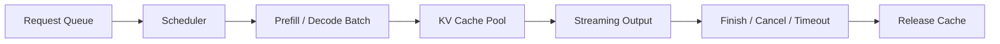

## 模型能生成答案，不等于推理服务已经具备上线能力
真实线上服务关心的不是单次脚本能不能输出，而是持续到来的请求如何共享 GPU、如何分摊 cache、如何控制长尾延迟、如何在超时和取消时释放资源、如何从指标里快速看见瓶颈。也就是说，推理服务的核心不是又多了一个 HTTP 接口，而是把模型推理组织成一套可观测、可调度、可治理的运行系统。

## 解决什么问题
这一页聚焦推理服务层的工程问题：

1. 为什么合批策略会同时影响吞吐和尾延迟。
2. 为什么 cache 内存和请求队列是长上下文时代的核心治理对象。
3. 为什么只看平均延迟会掩盖真实服务风险。
4. 为什么 streaming 能改善感知体验，但不自动降低总算力成本。
5. 为什么推理服务必须有一套结构化的可观测指标，而不是只看接口是否返回 200。

## 核心对象
| 对象 | 作用 | 典型风险 |
| --- | --- | --- |
| Request Queue | 承接请求进入服务后的等待阶段 | 高峰时排队爆炸 |
| Continuous Batching | 动态把多个请求拼入同一轮解码 | 吞吐提升但长尾变差 |
| KV Cache Pool | 管理不同请求的缓存内存 | 长上下文下显存挤爆 |
| Cancellation / Timeout | 释放无效请求占用的资源 | 取消后 cache 不释放 |
| Metrics / Traces | 描述 TTFT、tokens/s、queue、OOM 等 | 故障不可定位 |

### 为什么 continuous batching 不是简单的“批量更大”
因为它不是离线训练里的固定 batch，而是动态地把不同时间到达、不同长度、不同剩余输出预算的请求拼进同一轮推理中。它的好处是提升设备利用率，代价是调度复杂度和尾延迟控制都更难。

## 执行链路
一个典型推理服务会经历：

1. 请求进入队列并完成输入合法性检查。
2. 调度器根据 batch 策略把请求送入 `prefill` 或 `decode`。
3. cache 池记录并更新各请求占用的历史状态。
4. streaming 层将 token 持续返回客户端。
5. 请求结束、超时或取消后，服务释放 cache 和相关资源。



### 为什么取消和超时是资源治理问题
因为在长上下文或长输出请求下，一个已经无效的请求如果不及时释放 cache，就会继续占着显存和调度槽位，直接影响后续请求的可用性和延迟。

## 一致性与容错
推理服务侧的故障往往来自资源治理不彻底：

1. 请求长度差异太大，导致合批效率下降。
2. cache 水位过高，长上下文请求把短请求拖慢。
3. 只看平均延迟，不看 P95 / P99，于是长尾问题被隐藏。
4. streaming 正常，但服务实际积压越来越严重。

### 为什么观察平均值很危险
因为平均值很容易被大量短请求“冲淡”。真正影响用户体验和 SLO 的，往往是大 prompt、大输出、重试、取消和高并发叠加后的长尾延迟。

## 性能模型
推理服务的性能平衡，通常体现在这几组张力上：

1. batch 更积极，吞吐更高，但 TTFT 可能上升。
2. 上下文更长，任务能力更强，但 cache 和显存压力更大。
3. streaming 更及时，感知体验更好，但总输出时间未必减少。
4. 多模型或多 adapter 共存，灵活性更高，但冷启动和内存管理更复杂。

### 为什么缓存池决定了并发上限
因为 GPU 显存除了装模型权重，还要装每个活跃请求的 cache。模型越大、上下文越长、并发越高，缓存池越容易成为真正的上限，而不是“GPU 算力不够”这么简单。

## 生产排障
如果线上用户反馈“有时很快，有时突然卡很久”，重点排查：

1. 请求是不是在队列里等待，而不是卡在模型计算。
2. cache 水位是否在某些大请求后长期居高不下。
3. continuous batching 是否让短请求被长请求拖累。
4. 是否存在取消请求未释放资源的问题。

### 建议长期观察的指标面板
1. queue length 与 queue latency。
2. TTFT、tokens/s、P95 / P99。
3. cache 命中与 cache 占用。
4. OOM、timeout、cancel rate。
5. 按输入长度和输出长度分桶的延迟分布。

## 样例
下面这份面板定义片段，体现了推理服务关注的不是单一延迟，而是一组分层指标：

```yaml
dashboard:
  - ttft_ms_p95
  - decode_tokens_per_second
  - queue_latency_ms_p99
  - kv_cache_usage_percent
  - oom_count
  - timeout_count
```

而这个服务配置片段，则说明调度策略本身就是可治理对象：

```yaml
serving_policy:
  max_batch_size: 32
  max_wait_ms: 15
  max_input_tokens: 8192
  max_output_tokens: 1024
  cancel_on_client_disconnect: true
```

## 相邻技术边界
推理服务页讨论的是运行时调度与可观测性，不等于模型训练优化，也不等于业务应用设计。它位于两者之间：一端承接模型结构和推理成本，另一端承接 API、SLO、灰度和运维治理。没有这一层，团队就只能看到“模型会答”或“模型答慢”，却看不到系统真正的资源边界。

## 本页结论
推理部署真正难的部分，是把模型的逐 token 计算组织成一套稳定、可观测、可治理的服务系统。continuous batching、cache 池、队列、取消和指标体系，决定了模型能否从实验脚本升级为线上能力。
