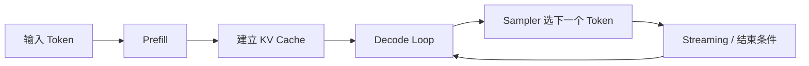

## 推理最容易被讲成“模型收到 prompt 后输出答案”，但真正的性能和稳定性都藏在中间过程里
一旦系统进入真实服务场景，推理就不再是“调一个模型接口”这么简单。用户感知到的首 token 延迟、回答速度、并发能力、显存压力和超时故障，往往都来自推理链路内部的不同阶段。谁如果不能把 `prefill`、`decode`、`KV cache`、采样策略和服务调度拆开讲清楚，后面不管是做 RAG、Agent 还是私有化部署，都会在排障时一团混乱。

## 解决什么问题
这一页主要回答六个问题：

1. 为什么 LLM 推理要分成 `prefill` 和 `decode` 两个阶段。
2. 为什么输出长度和输入长度影响的是不同瓶颈。
3. `KV cache` 到底省掉了什么计算，又为什么会吃掉大量显存。
4. 采样策略影响的是什么，不影响的又是什么。
5. 为什么“模型同样大”也可能出现完全不同的服务延迟。
6. 推理问题到底该从模型、上下文、调度还是服务指标哪一层排查。

## 核心对象
| 对象 | 作用 | 如果理解不清会怎样 |
| --- | --- | --- |
| Prefill | 一次性处理全部输入上下文 | 长 prompt 为什么慢解释不清 |
| Decode Loop | 逐 token 生成输出 | 回答越长越慢的根因讲不清 |
| KV Cache | 复用历史 K/V，减少重复计算 | 只会说“加速”，不会解释 OOM |
| Sampler | 把概率分布变成实际 token | 把随机性问题误判成知识问题 |
| Scheduler / Batching | 决定请求如何排队和合批 | 并发瓶颈和排队延迟看不懂 |
| Streaming Surface | 决定用户何时看到第一个 token | 误把感知速度当总耗时 |
| Serving Metrics | 记录 TTFT、tokens/s、P95、OOM 等指标 | 线上问题无法量化和复盘 |

### 为什么推理对象一定要按阶段拆
因为这些对象承担的是不同职责。`prefill` 主要消化输入上下文，`decode` 主要消化输出长度，`KV cache` 是计算和显存之间的交换，`sampler` 决定输出选择，`scheduler` 决定多请求如何共享资源。把它们揉成一句“模型推理慢”，几乎没有排障价值。

## 执行链路
一次典型请求的推理链路可以拆成下面几个阶段：

1. 文本先经 tokenizer 编码为输入 token。
2. `prefill` 阶段一次性处理全部输入上下文，生成首轮隐藏状态和 cache。
3. 解码器进入 `decode loop`，每次只扩展一个 token。
4. `KV cache` 复用历史上下文的 K/V，避免每步重复全量 attention。
5. 采样器根据 greedy、temperature、top_p 等策略决定下一个 token。
6. 服务层决定是否 streaming 返回、是否合批以及何时结束请求。



### 为什么 `prefill` 和 `decode` 必须分开讨论
因为两者面向的是不同资源压力。`prefill` 更受输入 token 数量影响，长上下文、长历史、RAG 证据过多时它会显著变慢；`decode` 更受输出 token 数和采样路径影响，回答越长、逐 token 过程越久。很多“模型慢”的说法，实际上没有区分这两种完全不同的慢。

## 一致性与容错
推理阶段的常见问题，很多不是直接报错，而是质量和服务特征异常：

1. chat template 不一致，导致输入 token 结构和训练分布偏离。
2. `stop sequences`、最大输出长度或 tool call 截断规则设置错误。
3. `KV cache` 增长失控，长上下文下显存被快速吃满。
4. streaming 看起来很快，但尾部 token 生成非常慢，端到端延迟依旧高。
5. 采样参数变化让输出更稳定或更发散，却被误判为“模型懂得更多”或“模型退化”。

### 为什么采样参数不能被当成知识修复手段
因为采样策略改变的是“如何从已有概率分布里选 token”，不是给模型注入新知识。温度调低、top_p 调小可以让输出更稳定，但不会自动修复事实错误、检索缺失或工具调用失误。

## 性能模型
推理的性能直觉至少要覆盖四条线：

1. 输入越长，`prefill` 越重，首 token 延迟通常越高。
2. 输出越长，`decode` 时间越长，总体 tokens/s 越关键。
3. 并发越高，调度和 cache 复用越重要，同时显存也更紧张。
4. batch 越大，吞吐可能更高，但单请求等待时间也可能增长。

### 为什么 `KV cache` 是典型的“用内存换算力”
如果不缓存历史 K/V，模型每生成一个 token 都要反复重算此前所有位置的 attention 相关状态；有了 cache，历史部分可以复用，解码阶段显著省算。但缓存是按请求、按上下文长度增长的，所以并发和长上下文会一起放大显存压力。

## 生产排障
面对推理故障时，建议按照这条顺序排查：

1. 先区分慢在 `prefill` 还是慢在 `decode`。
2. 再看上下文长度、输出长度和 batch 是否异常。
3. 再看 `KV cache` 占用、显存碎片和并发调度。
4. 再看采样、停止条件和 streaming 配置。
5. 最后才讨论是否需要换更小模型、改量化或做模型路由。

### 值得长期监控的核心指标
1. TTFT，也就是首 token 时间。
2. decode 吞吐，也就是每秒输出 token 数。
3. P95 / P99 延迟。
4. cache 占用与显存水位。
5. 超时、取消和 OOM 比例。

## 样例
下面这个生成配置片段，体现了采样和输出边界对推理行为的直接影响：

```json
{
  "max_new_tokens": 512,
  "temperature": 0.7,
  "top_p": 0.9,
  "do_sample": true,
  "stop": ["</tool_result>", "<END>"]
}
```

而这条服务侧指标日志，则更接近真实排障时需要看的证据：

```text
request_id=8f3a model=qwen2.5-7b
input_tokens=5240 output_tokens=196
ttft_ms=1840 decode_tps=38.6
kv_cache_mb=7312 queue_ms=220
status=ok
```

## 相邻技术边界
推理层不等于模型结构层，也不等于上层应用层。Transformer 解释的是模型如何计算，推理系统解释的是这些计算怎样在服务环境里被组织成稳定、可观测、可扩展的运行过程。没有这一层，训练讲得再清楚，也很难解释真实部署里的成本和延迟。

## 本页结论
LLM 推理的关键，不是“模型开始生成了”这一瞬间，而是 `prefill`、`decode`、`KV cache`、采样和服务调度如何共同决定用户看到的速度、成本和稳定性。谁能把这条链讲清楚，谁才真正进入了推理原理层。
