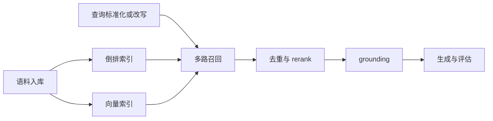

---
kb_id: llm-foundations/information-retrieval-bm25-dense-hybrid-and-rag-eval
title: 信息检索与 RAG：BM25、Dense、Hybrid、Rerank 为什么是生成系统的上游真瓶颈
domain: llm-foundations
component: information-retrieval
topic: bm25-dense-hybrid-rerank-query-rewrite-retrieval-eval
difficulty: advanced
status: reviewed
sidebar_position: 16
version_scope: IR textbook, BM25 docs, DPR paper, BEIR paper, RAG paper, OpenAI retrieval guide, Azure RAG evaluators, and 实践资料 fun-ir metadata as verified on 2026-04-27
last_verified_at: '2026-04-27'
source_ids:
  - practice-fun-ir
  - stanford-ir-book
  - azure-bm25-scoring
  - dpr-paper
  - beir-paper
  - rag-paper
  - openai-retrieval-guide
  - azure-rag-evaluators
claim_ids:
  - llm-foundation-claim-0030
  - llm-foundation-claim-0013
tags:
  - information-retrieval
  - bm25
  - dense-retrieval
  - hybrid-search
  - rerank
  - rag-eval
---
## 生成系统最容易被高估的地方，是以为“模型够强，就能弥补检索不准”
在 RAG 和知识问答系统里，模型只能消费它最终看到的证据。证据没被召回、被召回但排得太后、排在前面但没有进入 prompt，这三种情况都会直接限制最终答案上限。所以信息检索不是 RAG 的配角，而是决定系统上限的第一道门槛。

## 解决什么问题
这一页主要解释四件事：

1. 为什么 RAG 的基础其实是信息检索，不是单纯向量库。
2. BM25、Dense Retrieval、Hybrid Search 和 Rerank 分别解决什么问题。
3. Query Rewrite、候选集规模和上下文组装之间是什么关系。
4. 为什么检索评估必须和生成评估分层进行。

## 核心对象
| 对象 | 作用 | 常见误判 |
| --- | --- | --- |
| Corpus | 原始知识集合 | 只看模型，不看语料质量 |
| Inverted Index | 支撑关键词和 BM25 检索 | 认为传统检索已经过时 |
| Dense Index | 支撑向量相似检索 | 认为向量相似就等于答案相关 |
| Query Rewriter | 把用户问题改成更适合检索的查询 | 把改写当成万能补丁 |
| Retriever | 负责候选召回 | 候选集中没有正确证据 |
| Reranker | 负责候选精排 | 正确证据被噪声挤到后面 |
| Retrieval Eval Set | 验证召回和排序质量 | 只评最终答案，不评上游 |
| Grounding Layer | 决定哪些检索结果进入生成上下文 | 排名不错，但没被真正使用 |

### 为什么 BM25、Dense 和 Hybrid 不能被压成一个“检索模块”
因为它们解决的失配类型不同。BM25 擅长词面精确匹配，Dense 擅长语义相似，Hybrid 用来兼顾两类信号。如果不拆开讲，就无法解释为什么错误码、版本号、型号和法规条款场景里，纯向量检索经常不稳。

## 执行链路
一个更完整的检索链路通常是：

1. 语料进入倒排索引和向量索引。
2. 用户问题经过 query rewrite 或标准化。
3. BM25、Dense 或多路 Hybrid 并行召回候选。
4. 候选去重、合并后进入 rerank。
5. 排名前列的证据再进入 grounding 和生成。
6. 检索指标和最终答案指标分别评估。



## 一致性与容错
检索故障往往有三种形态：

1. Recall failure：正确证据根本没进入候选集。
2. Ranking failure：正确证据在候选集中，但排得太后。
3. Grounding failure：证据排得不错，但没有被真正送入生成上下文。

### 为什么向量相似不等于任务相关
Dense Retrieval 的相似度通常衡量语义邻近，但任务相关还取决于：

1. 是否包含完整答案所需字段。
2. 是否属于正确版本或正确租户。
3. 是否和问题里的编号、错误码、函数名完全一致。
4. 多个片段是否组合后才形成完整证据。

这也是为什么很多企业系统最后会回到 Hybrid，而不是完全抛弃 BM25。

## 性能模型
检索系统的性能不是只有单次查询延迟，还包括召回质量和成本的平衡：

1. BM25 往往查询快，适合精确匹配。
2. Dense Retrieval 需要 embedding 和向量检索成本。
3. Hybrid 会增加候选管理和合并成本，但通常提升稳健性。
4. Rerank 是质量提升利器，但也是延迟和成本来源之一。

### 为什么 top_k 不是越大越好
因为候选越多，rerank 和后续上下文组装成本越高；而且大量噪声候选可能让最相关证据的相对优势下降。真正重要的不是“召回更多”，而是“在给定预算内召回足够多且足够干净的候选”。

## 生产排障
排查 RAG 系统时，先分清问题是检索错还是生成错：

1. 如果正确证据根本不在候选集，先查索引、切分、BM25 / Dense 配置和 query rewrite。
2. 如果正确证据在候选集但排名靠后，先查 hybrid 合并和 rerank。
3. 如果正确证据排名靠前但答案仍错，先查 grounding 和生成。
4. 如果答案对但引用不稳，先查证据映射和 chunk 粒度。

### 高价值排障问题
1. 错误码或函数名为什么适合 BM25。
2. 为什么 Dense Retrieval 容易把语义相近但编号不对的文档召回来。
3. 为什么 Hybrid 往往更适合企业知识库。
4. 为什么最终答错不能自动说明模型有幻觉。

## 样例
一个常见的多路召回配置可以写成这样：

```yaml
retrieval_plan:
  bm25_top_k: 20
  dense_top_k: 20
  merge_strategy: reciprocal_rank_fusion
  rerank_top_k: 8
  final_grounding_docs: 4
```

```json
{
  "query": "报销系统 5027 错误码是什么意思",
  "bm25_hit": ["kb_17", "kb_03"],
  "dense_hit": ["kb_11", "kb_17"],
  "rerank_top": ["kb_17", "kb_03", "kb_11"],
  "grounded_docs": ["kb_17", "kb_03"]
}
```

这条 trace 能把召回、排序和 grounding 三层分开，让我们看到问题到底出在哪个阶段。

## 相邻技术边界
信息检索不是向量数据库同义词，也不是生成模型的一部分。它更接近 RAG 的上游供给系统，负责找到候选证据并排序。生成模型负责组织回答，RAG 负责把检索和生成衔接起来。把这三者混成一句“模型问答”会让系统设计和排障都变得含糊。

## 本页结论
RAG 的上限首先由检索决定。BM25、Dense、Hybrid、Rerank 和检索评估并不是传统时代的遗留物，而是生成系统能否拿到正确证据的基础设施。模型再强，也无法补回根本没被找到的事实。
