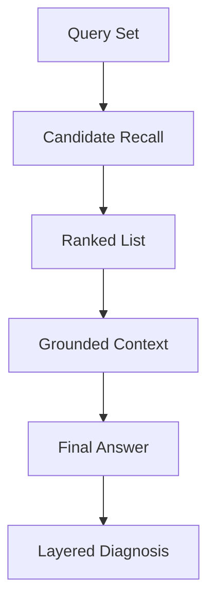

---
kb_id: llm-foundations/information-retrieval-evaluation-labeling-and-rag-failure-localization
title: 检索评估与故障定位：怎样区分 recall 问题、排序问题和生成问题
domain: llm-foundations
component: information-retrieval
topic: retrieval-evaluation-labeling-and-rag-failure-localization
difficulty: advanced
status: reviewed
sidebar_position: 17
version_scope: IR textbook, DPR paper, BEIR paper, OpenAI retrieval guide, Azure RAG evaluators, and RAG paper as verified on 2026-04-27
last_verified_at: '2026-04-27'
source_ids:
  - stanford-ir-book
  - dpr-paper
  - beir-paper
  - openai-retrieval-guide
  - azure-rag-evaluators
  - rag-paper
claim_ids:
  - llm-foundation-claim-0030
  - llm-foundation-claim-0013
tags:
  - information-retrieval
  - evaluation
  - rerank
  - rag
  - troubleshooting
---
## 很多 RAG 排障会一上来怪模型，但最值钱的动作是先把失败定位回检索链的哪一层
如果系统答错，第一反应往往是“模型幻觉了”。但在有检索的系统里，这个结论通常下得太早。更有价值的问题是：正确证据有没有被召回、有没有被排到前面、有没有被真正送进上下文、模型有没有正确使用这些证据。只有分清这四层，修复才会有方向。

## 解决什么问题
这一页主要解释三个操作面：

1. 检索评估为什么不能只看最终答案质量。
2. 如何把失败切分成 recall、ranking、grounding 和 generation 四类问题。
3. 为什么 label 设计和评估 trace 会直接决定你能不能排障。

## 核心对象
| 对象 | 作用 | 常见错误 |
| --- | --- | --- |
| Query Set | 待评估的问题集合 | 只收录简单样例，缺少真实难例 |
| Gold Evidence | 期望命中的证据集合 | 只有答案，没有标注证据 |
| Candidate Set | 召回阶段返回的候选文档 | 不记录候选，后续无法诊断 |
| Ranked List | rerank 后的排序结果 | 只看 top1，不看 topk 变化 |
| Grounded Context | 真正喂给模型的证据 | 排名不错但没进入上下文 |
| Answer Eval | 最终答案质量判断 | 把所有错误都归到生成层 |

## 执行链路
高质量检索评估，至少要把证据链完整保留下来：

1. 为每个 query 标注 gold evidence 或最小证据集合。
2. 记录原始召回候选和排序结果。
3. 记录最终送入模型的 grounded context。
4. 记录最终答案与引用。
5. 按层判断错误属于 recall、ranking、grounding 还是 generation。



## 一致性与容错
没有 gold evidence 的评估，很难真正诊断检索系统。因为只看最终答案时，你无法知道：

1. 是正确文档没被找到。
2. 还是找到了但没排前。
3. 还是排前了但没送进上下文。
4. 还是模型看到了也没用好。

### 为什么 label 质量决定评估质量
如果标注只写“答案应该是什么”，不写“哪些证据足够支撑这个答案”，检索评估就会退化成黑盒观感。这样即使你知道系统错了，也几乎不知道该调 BM25、调 Dense、调 rerank 还是调 prompt。

## 性能模型
分层评估会增加一定标注成本，但收益非常直接：

1. 可以减少盲目换模型的次数。
2. 可以更快知道是否要加 BM25、加 rerank 或改 chunk。
3. 可以把生成层优化和检索层优化分开做回归。

### 为什么 BEIR 一类 benchmark 很有价值但仍然不够
它能提供通用检索性能对比，但企业 RAG 还需要自己的业务证据标注、自己的 chunk 规则、自己的权限和版本边界。通用 benchmark 只能告诉你“模型大概行不行”，不能告诉你“当前业务为什么错”。

## 生产排障
真正高效的排障顺序往往是：

1. 先看 gold evidence 是否进入 candidate set。
2. 如果进入了，再看 rerank 后是否还在前列。
3. 如果还在前列，再看 grounded context 是否保留了它。
4. 如果保留了，再看模型为什么没有基于它回答。

### 一份可复用的诊断记录
```json
{
  "query": "合同什么时候付款",
  "gold_evidence": ["doc_8#page7"],
  "candidate_set": ["doc_2#page5", "doc_8#page7", "doc_4#page1"],
  "ranked_list": ["doc_2#page5", "doc_8#page7"],
  "grounded_context": ["doc_2#page5"],
  "failure_layer": "grounding"
}
```

```yaml
retrieval_eval_signals:
  recall_at_k:
    - 5
    - 20
  ranking_metrics:
    - mrr
    - ndcg
  grounding_checks:
    - evidence_entered_prompt
  answer_checks:
    - supported_by_citation
```

这两个样例的价值在于，它们能把“系统答错了”拆成可操作的优化路径。

## 相邻技术边界
这一页讲的是检索评估和故障定位，不是检索算法原理本身。BM25、Dense、Hybrid 解释的是怎么找；这里解释的是怎么知道“找错在哪”。它也不替代最终任务评估，而是为最终任务评估提供上游诊断能力。

## 本页结论
RAG 失败定位最怕黑盒化。只要系统没有记录 candidate set、ranked list 和 grounded context，团队就会反复把检索问题误判成生成问题。真正成熟的检索系统，一定会把评估和排障做成分层证据链。
