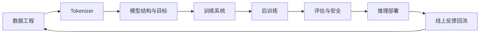

## LLM 全栈最容易被讲歪的地方，是把它拆成几个互不相干的课程章节
如果只学模型结构，很容易忽略数据和训练系统；如果只学应用开发，又容易把模型视作黑盒；如果只学推理部署，会对训练和评估缺乏根本判断。真正的全栈视角，不是把很多术语堆在一起，而是建立一条从数据进入系统，到模型被训练、评估、部署、治理并持续迭代的连续链路。

## 解决什么问题
这一页主要回答五个问题：

1. 为什么 LLM 全栈不能只讲 Transformer 和 loss。
2. 数据、tokenizer、训练系统、推理和评估为什么是前后相连的。
3. 为什么 scaling 规律必须和预算、数据质量和部署成本一起看。
4. 为什么白盒学习项目有价值，但不能直接等价成生产级经验。
5. 为什么安全和评估必须进入“全栈”而不是留到最后补上。

## 核心对象
| 对象 | 作用 | 如果漏掉会怎样 |
| --- | --- | --- |
| Corpus Pipeline | 决定训练信号来源、质量和合规性 | 模型学到噪声和污染 |
| Tokenizer | 决定文本如何进入模型和上下文预算 | 训练分布和推理分布脱节 |
| Model Architecture | 决定上下文建模、容量和计算形态 | 只会背结构，不懂代价 |
| Training System | 决定吞吐、并行、checkpoint 和容错 | 小实验经验无法扩展 |
| Scaling Strategy | 决定参数、数据和算力如何配比 | “越大越好”的误判盛行 |
| Inference Runtime | 决定上线后的延迟、吞吐和成本 | 训练成功却无法服务用户 |
| Eval / Safety Loop | 决定能力、风险和退化是否可控 | 模型上线像碰运气 |

### 为什么这些对象必须放在同一页里理解
因为它们之间不是松耦合关系。数据决定训练信号，tokenizer 决定信号如何被编码，模型和训练系统决定如何吸收这些信号，推理系统决定这些能力能否被稳定提供，评估和安全又决定系统是否值得上线。任何一环被忽略，整条链都会失真。

## 执行链路
一个完整的 LLM 工程链路可以概括成：

1. 数据采集、清洗、去重和配比。
2. tokenizer 训练或选型，并确定特殊 token 与模板边界。
3. 模型结构设计与预训练目标设定。
4. 训练系统组织数据吞吐、并行、checkpoint 和故障恢复。
5. 完成预训练后进入后训练、评估和安全校验。
6. 最终进入推理服务、上线、回归和长期治理。



### 为什么训练和部署不是割裂的两件事
因为很多训练阶段的选择会直接影响部署代价。比如 tokenizer 粒度会影响上下文长度，模型结构会影响 KV cache 规模，后训练方式会影响是否需要额外 adapter，数据分布会影响上线后的真实任务稳定性。没有这条链路意识，就很难做出合理折中。

## 一致性与容错
全栈视角最重要的好处之一，就是能更快发现“问题到底属于哪一层”：

1. 如果 loss 看着正常，但线上效果差，要怀疑评估集和真实分布脱节。
2. 如果 benchmark 提升但服务成本暴涨，要怀疑模型和推理层权衡失衡。
3. 如果白盒小模型实验很顺利，但大规模训练不稳，要怀疑训练系统和数据吞吐边界。
4. 如果模型答得像样，但引用和安全拒答不稳，要怀疑后训练、评估或应用层控制不足。

### 为什么全栈问题经常被误判成“模型不够强”
因为模型是最显眼的对象。但真实工程里，很多问题并不是“换更大的模型就能解决”，而是数据质量、上下文组织、推理预算、评估标准和安全策略没有跟上。

## 性能模型
全栈性能不是单指标，而是贯穿全链路的预算：

1. 数据工程决定清洗和存储成本。
2. 训练系统决定 GPU 利用率、吞吐和 checkpoint 体积。
3. scaling 决定参数量、训练 token 和算力配比。
4. 推理系统决定 TTFT、tokens/s、并发和单位请求成本。
5. 评估和安全又决定每次发布的额外验证开销。

### 为什么 scaling 规律不能离开部署成本
因为一个模型就算在训练侧更强，如果推理侧成本过高、延迟过长、显存压力过大，它在业务中也可能不是最优解。真正的工程决策从来不是只看离线能力。

## 生产排障
从全栈角度看问题时，排障顺序通常更清晰：

1. 先判断问题属于数据、训练、推理、评估还是安全层。
2. 再看问题是“能力没学到”，还是“能力有但没被正确调出来”。
3. 再确认是系统预算不够，还是对象边界没对齐。
4. 最后才决定是要改数据、换模型、调服务还是重做评估。

### 高价值排障视角
1. 训练集和评估集是否污染或错位。
2. 模型表现变化是来自新权重、新 tokenizer 还是新推理配置。
3. 安全拒答问题属于后训练不足，还是应用层权限控制缺失。

## 样例
下面这个全栈清单比“我们训练了个模型”更接近真实交付对象：

```yaml
llm_stack_artifacts:
  data_version: corpus_2026_04
  tokenizer_version: tok_v3
  model_checkpoint: pretrain_step_180k
  post_training_run: sft_domain_a_v2
  eval_suite: eval_release_17
  serving_config: deploy_qwen_32k_fp16
```

而这个分层问题归因片段，则说明全栈视角的核心是先分层再动手：

```text
现象：客服问答引用错误
先分层：检索命中正常 -> 生成引用错位 -> 推理层无异常 -> 应用层 citation 模板有缺陷
处理：修模板并回归，而不是直接重训模型
```

## 相邻技术边界
LLM 全栈页不是某一个具体框架的教程，也不是某篇论文的摘要。它更像一张从理论到工程的路由图，帮助我们把看似分散的学习内容组织成一个连续系统。只有先有这张图，深入到训练、推理、RAG 或 Agent 时才不容易失焦。

## 本页结论
LLM 全栈真正重要的，不是知道很多名词，而是知道这些名词如何在一条系统链路里彼此约束。谁能把数据、训练系统、推理、评估和安全讲成一条连续工程链，谁才真正具备从理论走向工程的能力。
