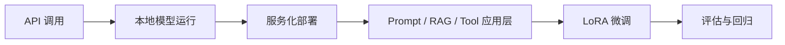

## 入门实训最容易走偏的地方，是把“会跑一个 demo”误当成“已经学会了大模型工程”
大模型学习路径如果没有层次，初学者通常会在两个极端里来回摆动：一类人永远停在云端 API 调用层，只会发请求、改 prompt；另一类人一开始就试图在本地部署复杂开源模型，结果大量时间花在驱动、显存、依赖和下载问题上，反而没有建立稳定的技术主线。更稳妥的实训路径，不是追求一口气做最难的事，而是按系统复杂度逐层引入对象和边界。

## 解决什么问题
这一页主要回答五个问题：

1. 为什么实训路径通常先学 API，再学本地模型，再学服务化和微调。
2. 每一阶段到底建立什么能力，而不是单纯增加“工具清单”。
3. 为什么 `vLLM` 这类推理框架应该放在“服务化”阶段，而不是基础概念阶段。
4. 为什么 LoRA 微调一定要晚于 tokenizer、评估和数据集基本功。
5. 为什么真正的实训设计必须把错误处理、成本意识和回滚意识一起带进来。

## 核心对象
| 对象 | 在实训中的作用 | 如果跳过会发生什么 |
| --- | --- | --- |
| API Client | 帮助建立请求、响应、token、错误码、成本感知 | 不知道一次调用真正发生了什么 |
| Local Model Runtime | 帮助理解权重、tokenizer、设备和依赖环境 | 只会“远程调用黑盒” |
| Serving Layer | 把模型变成可复用服务，而不是 notebook 单次脚本 | 不知道并发、延迟和吞吐从哪里来 |
| Prompt / Context Design | 决定任务约束、示例和输出结构 | 误把所有问题归因于模型大小 |
| LoRA / PEFT | 让训练实践成本降到可接受范围 | 不理解数据、评估和微调边界 |
| Eval / Regression Mindset | 约束每一步改动都能被比较 | 实训只剩“感觉这次输出更好了” |

### 为什么学习对象必须和系统复杂度同步增加
因为每多引入一个对象，就多一层新的失败模式。API 调用阶段的主要问题是参数和上下文；本地模型阶段加入了权重、显存、依赖；服务化阶段又加入并发、冷启动、监控；LoRA 阶段再加入数据质量和回归验证。如果初学路径不分层，失败信息会叠在一起，最终谁也不知道根因在哪。

## 执行链路
一条健康的实训链路通常是：

1. 先用 API 跑通最小问答或分类任务，理解请求、上下文、token 和成本。
2. 再切到本地模型，理解模型文件、tokenizer、设备和量化等运行前提。
3. 接着把本地模型包装成服务，观察吞吐、延迟、并发和日志。
4. 然后引入 Prompt 设计、RAG 或工具调用，建立应用层视角。
5. 最后再用 LoRA 做小规模任务适配，并把评估和回归纳入流程。



### 为什么先 API 再本地模型
先 API 的价值在于让学习者先抓住“请求是怎么被表达的、上下文怎样影响回答、错误如何被处理、token 如何计费”这些基础问题。等这些对象清楚后，再进入本地模型，才不会把一切失败都误判成“我显卡不够”或“环境没装好”。

## 一致性与容错
实训路径里最典型的问题不是学不会某个命令，而是阶段错位：

1. 在还没理解 prompt 和上下文预算前，就试图比较不同量化模型效果。
2. 在没有验证集和错误样本前，就开始 LoRA 微调。
3. 本地模型只在 notebook 里能跑，但没有任何服务化、日志和重试意识。
4. 用 API 调通后就直接宣布“系统可上线”，完全没有回归和监控设计。

### 为什么 LoRA 必须放在更后面
因为微调会把“数据问题、标签问题、评估问题、底座问题、部署问题”同时放大。如果前面的对象边界没建立起来，LoRA 的输出好坏就很难解释，最终只会停留在“这次好像更像我的风格”。

## 性能模型
实训也应该建立最基本的性能直觉：

1. API 阶段重点看 token 消耗、响应时延、重试和成本。
2. 本地阶段重点看模型大小、显存占用、加载时间和量化影响。
3. 服务化阶段重点看并发吞吐、KV cache、batching 和首 token 延迟。
4. 微调阶段重点看训练时长、显存占用、保存体积和验证频率。

### 为什么服务化是独立阶段
因为“能推理”不等于“能服务”。单进程脚本、交互式 notebook 和真正的推理服务之间，隔着日志、限流、并发、错误恢复、热更新和版本回滚这整整一层工程能力。

## 生产排障
从实训过渡到工程时，最值得建立的是分层排障意识：

1. API 返回异常，先看参数、认证、配额和输入格式。
2. 本地模型启动失败，先看模型文件、依赖版本、设备和显存。
3. 服务响应慢，先看 batch、并发、输出长度和加载时机。
4. 微调效果差，先看数据、标签、tokenizer、训练轮数和 eval。
5. 上线后行为变化，先看版本、revision、量化和生成参数。

### 典型误判
1. 把所有延迟问题都归因于模型太大，忽略了冗长 prompt 和输出长度。
2. 把所有效果问题都归因于没微调，忽略了任务定义和评估标准本身就不清楚。

## 样例
先 API 再本地的差别，不在于调用形式，而在于你能否清楚观察系统边界。下面这个 API 片段适合最早阶段建立输入、输出和错误处理意识：

```python
from openai import OpenAI

client = OpenAI()
resp = client.responses.create(
    model="gpt-4.1-mini",
    input="请用三句话解释什么是 LoRA。"
)
print(resp.output_text)
```

进入本地模型阶段后，学习重点会切换到“模型和 tokenizer 如何被实际装载”：

```python
from transformers import AutoTokenizer, AutoModelForCausalLM

model_id = "Qwen/Qwen2.5-1.5B-Instruct"
tokenizer = AutoTokenizer.from_pretrained(model_id)
model = AutoModelForCausalLM.from_pretrained(model_id, device_map="auto")

messages = [{"role": "user", "content": "解释一下 vLLM 解决了什么问题"}]
text = tokenizer.apply_chat_template(messages, tokenize=False, add_generation_prompt=True)
inputs = tokenizer(text, return_tensors="pt").to(model.device)
outputs = model.generate(**inputs, max_new_tokens=128)
print(tokenizer.decode(outputs[0], skip_special_tokens=True))
```

## 相邻技术边界
入门实训路径不是产品上线手册，也不是论文复现路径。它的目标，是让学习者按难度递进地建立一组稳定的工程心智模型：先理解模型调用，再理解本地运行，再理解服务化，再理解微调和评估。把它和真实生产运维、超大规模分布式训练混在一起，会让教学目标失焦。

## 本页结论
好的 LLM 实训路径，不是工具越多越好，而是阶段越清楚越好。只要 API、本地模型、服务化、Prompt、LoRA 和评估之间的对象边界建立起来，后面接 RAG、Agent、监控和安全时就会顺很多；反过来，如果这些层次没有建好，后续所有“高级主题”都会显得又重又乱。
