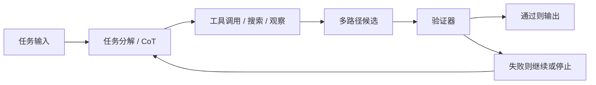

## 推理能力最容易被误解成“模型把步骤写出来了，所以它就真的想明白了”
这类误解在面试和工程实践里都非常常见。模型把中间步骤写得很像人类思考，不代表它已经获得形式证明级的可靠性；模型会调用工具或展开搜索，也不代表它一定更对。真正该建立的心智模型是：LLM 推理是一套概率生成过程，可以通过任务分解、搜索、工具、检索和验证被增强，但这些增强都要付出成本，也都需要被约束和验证。

## 解决什么问题
这一页主要回答六个问题：

1. 为什么 LLM 推理不能等同于形式证明或符号推理。
2. CoT、self-consistency、ReAct 和 Tree of Thoughts 分别增强了链路中的哪一段。
3. 为什么解释性文本和可靠性不是同一个东西。
4. 为什么推理增强越强，越需要预算控制、停止条件和验证层。
5. 哪些任务适合引入搜索或工具，哪些任务其实只会被它们拖慢。
6. 为什么推理能力最终必须回到评估和回归，而不是停在“看起来很聪明”。

## 核心对象
| 对象 | 作用 | 如果被误用会怎样 |
| --- | --- | --- |
| Task Decomposition | 把复杂问题拆成若干中间步骤 | 模型展开很多步但每步都偏题 |
| Reasoning Trace | 记录显式或隐式中间过程 | 把解释文本误当成真因果 |
| Self-consistency Sampler | 多路径采样后聚合答案 | 成本很高但多数仍然错 |
| Tool / Search Action | 把外部计算和检索能力接入链路 | 行动范围扩大，风险同步扩大 |
| Verifier | 用规则、工具或第二阶段判断结果是否可信 | 只会“想”，不会“证” |
| Stop Condition | 限制搜索深度、轮数和成本 | reasoning 过程失控拖慢系统 |

### 为什么推理对象必须加入验证器和停止条件
因为一旦系统开始多轮思考、搜索或调用工具，就不再是单次文本生成。此时如果没有验证层和停止条件，系统很容易在错误路径上越走越远，还顺便消耗大量 token、时间和工具额度。

## 执行链路
一个带推理增强的典型链路通常是：

1. 接收任务并判断是否需要分解。
2. 通过 CoT 或其他策略生成中间计划。
3. 如果需要外部信息，进入 ReAct 式工具观察或搜索。
4. 如果需要更高鲁棒性，采样多条思路并比较结果。
5. 用规则、计算器、检索证据或第二阶段校验器验证。
6. 满足停止条件后输出结果，否则继续迭代或升级人工复核。



### CoT、ReAct、ToT 在链路中的差别
CoT 主要增强“把问题拆开说清”的能力；self-consistency 主要增强“同一问题多采样后选相对稳定答案”；ReAct 主要增强“边推理边行动”；Tree of Thoughts 更像显式搜索，把中间思路看成可扩展的状态节点。它们提升的是链路不同位置的表达和搜索能力，不是统一的“正确性开关”。

## 一致性与容错
推理增强方法最大的工程风险，是外表越来越像“思考”，但内部却未必更可靠：

1. CoT 可能只是把错误答案包装成更顺畅的解释。
2. self-consistency 可能在一个偏置很强的问题上稳定地多数错误。
3. ReAct 可能因为工具选择或参数错误而把系统拖入错误轨道。
4. ToT 可能因为评价函数不稳而在巨大的搜索空间里浪费预算。

### 为什么“解释得更长”不能当作正确证据
因为文本长度和逻辑有效性没有一一对应关系。很多错误推理之所以迷惑性强，就是因为它在局部步骤上看似合理，但全局约束、单位换算、事实证据或工具返回根本没被真正验证。

## 性能模型
推理增强的代价要被明确记账：

1. CoT 往往增加输出 token。
2. self-consistency 会增加采样次数。
3. ReAct 会增加工具往返和状态维护成本。
4. ToT 会让分支因子和搜索深度直接决定延迟与成本。
5. 验证层又会进一步增加规则计算、检索或模型调用开销。

### 为什么 reasoning 方案必须按任务选型
因为不是所有任务都值得支付这笔成本。结构化抽取可能更适合规则校验；简单分类未必需要 CoT；外部事实依赖强的问题更适合检索和工具；高风险数学或代码问题更需要可执行验证。选错 reasoning 方案，系统只会更慢、更贵、更难排障。

## 生产排障
当系统看起来“想了很多还是错”，排障顺序应该是：

1. 分解是不是一开始就偏题。
2. 搜索或工具观察是否提供了正确信息。
3. 多路径采样是否只是稳定放大同一种偏差。
4. 验证器是否真的在检查关键约束，而不是只做表面格式判断。
5. 停止条件是否太宽，导致系统在错误路径上过度展开。

### 高价值排障问题
1. 这次错误是知识缺失、推理错误还是验证缺失。
2. 这次多路径采样是否提升了正确率，还是只是增加了成本。
3. 这次工具调用到底帮助了问题，还是扩大了副作用。

## 样例
下面这个 ReAct 风格伪代码，重点不是框架语法，而是“思考、行动、观察、验证”的循环：

```python
while budget_ok and not done:
    thought = planner(state)
    action = choose_tool_or_answer(thought)
    observation = run(action)
    state = update_state(state, thought, action, observation)
    done = verifier(state)
```

而这个验证规则片段说明，真正重要的是把“什么算通过”说清楚：

```yaml
verification_policy:
  math_task:
    require_tool_result: true
  factual_task:
    require_retrieved_evidence: true
  code_task:
    require_test_pass: true
```

## 相邻技术边界
LLM 推理增强不等于数学定理证明，也不等于纯信息检索，更不等于工具系统本身。它位于“模型生成能力”和“可验证外部系统”之间：上游靠 prompt、模型和任务分解，下游靠搜索、工具、规则、评估和人工复核。忽略其中任何一边，都会把 reasoning 讲偏。

## 本页结论
LLM 推理的真实形态，不是模型神秘地“会思考”，而是概率生成能力在任务分解、搜索、工具和验证约束下被组织成一条更长的决策链。只有把增强和验证一起讲，推理能力才有工程意义。
