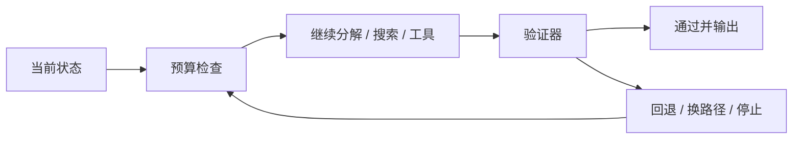

## reasoning 系统一旦进入工程环境，最重要的就不再是“能不能展开思路”，而是“什么时候该停、怎么证明自己没走歪”
很多实验里的 reasoning 技巧，在真实系统里一上线就会暴露成本和控制问题：它会不会越想越远，会不会不断调用工具，会不会把错误路径越做越完整，会不会为了多探索几条思路把延迟翻倍。真正能落地的 reasoning 方案，不是最长的思维链，而是最受控的思维链。

## 解决什么问题
这一页关注 reasoning 工程的控制面：

1. 为什么任务分解不是越细越好，而要服务于验证和执行。
2. 为什么搜索预算和停止条件是 reasoning 系统的第一约束。
3. 为什么验证器设计往往比生成器设计更决定可靠性。
4. 为什么 reasoning 方案一旦进入工具和搜索，就必须被纳入成本与安全治理。
5. 为什么很多“推理很强”的演示，一上线就会因为缺少停止机制而变成风险源。

## 核心对象
| 对象 | 负责什么 | 风险 |
| --- | --- | --- |
| Planner | 给问题拆阶段、拆子目标 | 过度分解导致链路膨胀 |
| Search Budget | 限制步数、分支数、时间和 token 消耗 | 没预算就没有上线边界 |
| Verifier | 检查中间状态和最终结果 | 验证太弱导致错误放大 |
| Escalation Rule | 定义何时停止自动推理并转人工 | 高风险任务越做越错 |
| Failure Memory | 记录常见错误路径 | 同一类失败反复重现 |

### 为什么停止条件本质上是安全对象
因为 reasoning 一旦与工具、检索或代码执行结合，过度展开不仅意味着多花 token，还可能意味着更多副作用、更多权限暴露和更复杂的失败现场。

## 执行链路
一个可控 reasoning 系统通常会在每轮都做三件事：

1. 判断当前是否还值得继续展开。
2. 判断下一步是继续想、去搜索、去调用工具还是直接验证。
3. 判断如果验证失败，是回退、换路径还是停止并上报。



### 为什么“继续思考一下”不是中性动作
因为每多一步都在消耗 token、延迟和外部系统调用额度。对开放式任务来说，多一步可能帮助更大；但对高风险任务来说，多一步也可能意味着更多错误动作。因此 reasoning 系统必须显式知道“什么时候不值得继续”。

## 一致性与容错
控制面设计不当时，reasoning 系统会出现几类典型问题：

1. 多轮思考越来越长，但正确率没有提升。
2. 工具观察已经足够，系统却还在继续生成解释文本。
3. 验证失败后没有回退策略，只能在错误状态上继续推理。
4. 高风险任务没有人工升级规则，系统独自做出不可逆动作。

### 为什么验证失败后的处理比验证本身还重要
因为真实系统很少一次就全对。问题在于，失败后到底是重新检索、换一条路径、降低权限重试，还是直接停止并人工接管。如果没有这层设计，验证器只是把“错了”告诉你，却没有改变系统行为。

## 性能模型
reasoning 工程的成本要按预算对象拆开看：

1. token 预算决定可展开的思考深度。
2. 搜索分支决定组合爆炸速度。
3. 工具调用次数决定外部系统耗时。
4. 验证层的复杂度决定每轮迭代额外成本。

### 为什么预算要细分而不是只看总延迟
因为总延迟只告诉你“慢了”，但不告诉你慢在思考文本、慢在搜索、慢在工具调用，还是慢在验证器。拆开后，才能知道到底该压缩 reasoning token、减少分支、优化工具还是调整验证方式。

## 生产排障
当 reasoning 系统出现“又慢又不稳”时，建议优先检查：

1. 平均展开步数是否失控。
2. 某类问题是否总会触发过多分支。
3. 验证器是否经常在太后的位置才发现错误。
4. 是否存在应升级人工却被继续自动执行的场景。

### 适合固化的证据
1. 每类任务的平均推理步数。
2. 每轮 search / tool / verify 的耗时占比。
3. 常见失败路径和回退原因。
4. 人工接管触发率与触发原因。

## 样例
下面这份停止策略比“让模型自己决定什么时候停”更可控：

```yaml
stop_policy:
  max_reasoning_steps: 6
  max_search_branches: 4
  max_tool_calls: 3
  max_total_tokens: 3200
  escalate_if_verifier_fails: true
```

而这个失败记忆片段，可以帮助系统和团队快速识别重复性问题：

```json
{
  "pattern": "calculator_tool_called_without_unit_normalization",
  "task_type": "math_word_problem",
  "recommended_fix": "normalize_units_before_tool_call"
}
```

## 相邻技术边界
这一页讨论的是 reasoning 系统的控制面，不等于 CoT 提示技巧本身，也不等于单纯的工具工程。它关心的是：一套会思考、会搜索、会行动的系统，如何在成本、正确性和风险之间被稳定管理。

## 本页结论
reasoning 工程真正难的地方，不是让模型多说几步，而是让它在正确的地方展开、在错误的地方回退、在高风险处停止。只有任务分解、预算、验证器和停止条件一起设计，推理能力才不会失控。
