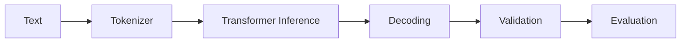

## 一句话定位

大模型基础知识库要把模型结构、训练目标、tokenization、上下文窗口、推理成本、对齐、评估和应用边界连成一条工程链路。

## 核心对象

- Token 是模型处理文本的基本单位，影响上下文长度、成本和截断。
- Embedding 表示语义向量，可用于检索和相似度。
- Transformer 通过注意力和前馈网络建模上下文依赖。
- Context Window 限制一次调用可见信息。
- Sampling 参数影响生成多样性和稳定性。
- Eval 数据集和评分器用于判断模型或应用是否退化。

## 执行链路

1. 输入文本先被 tokenizer 切成 token。
2. 模型在上下文窗口内计算条件概率分布。
3. 解码策略根据概率和采样参数生成后续 token。
4. 应用层用系统指令、工具、RAG 或结构化输出约束结果。
5. 上线后通过 eval、trace 和人工抽检监控质量。

## 保证项与边界

- 模型能力由训练数据、架构、上下文和推理策略共同决定。
- 上下文只影响本次可见信息，不等于长期记忆。
- Prompt 约束任务表达和输出格式，但不能保证事实正确。
- Eval 用于发现回归和风险，不是一次主观体验。

边界是知识库质量的分水岭。一个组件通常只保证自己负责的语义，端到端正确性还依赖调用方、存储层、计算层、权限系统、重试策略和运维流程共同成立。

## 性能模型

- 延迟受模型规模、输入输出 token、批处理、缓存、网络和工具链路影响。
- 成本受 token 数、模型选择、重试、检索和多轮上下文膨胀影响。
- 长上下文不等于高质量，检索、压缩和分层摘要仍然重要。

性能分析不要从“调大参数”开始，而要先判断瓶颈位于输入、调度、网络、存储、状态、计算、序列化还是下游系统。任何调优动作都应该先有基线指标，再做单变量变更。

## 状态变化与容量判断

分析 大模型基础 时，要把状态变化拆成四层：控制面状态、数据面状态、元数据状态和外部依赖状态。控制面状态决定谁来调度、谁来提交、谁来恢复；数据面状态决定数据是否已经写入、可见、可重放或可清理；元数据状态决定查询和治理能否正确找到对象；外部依赖状态决定端到端链路是否真的完成。

容量判断不能只看平均值。平均值决定长期资源成本，峰值决定限流和扩容，长尾决定用户体验和故障放大概率。任何组件一旦进入生产，都应该有容量基线、增长趋势、保留策略、失败重试上限和降级方案。

## 治理、安全与变更控制

治理不是上线后的附加项，而是架构的一部分。权限、审计、隔离、保留期、变更记录、回滚策略和人工审批应该在设计阶段就明确。否则系统规模扩大后，会出现无法追踪、无法恢复或无法解释的问题。

对于协议、API、表格式、事务、权限和状态恢复这类内容，必须区分官方保证、实现细节和工程经验。官方保证可以写成明确结论；实现细节要标明版本范围；工程经验只能写成适用条件下的建议。

## 发布前验证路径

发布级知识不能只停留在“讲得通”。每个关键结论都要能被验证：第一，用官方文档或已登记来源确认概念边界；第二，用执行计划、日志、指标或 trace 找到运行证据；第三，用一个失败场景检验恢复路径；第四，用一个容量增长场景检验性能模型；第五，用一个相邻技术对比检验职责边界。

如果某个结论无法被这些方式验证，就不要把它写成绝对判断。更稳妥的写法是说明“在什么配置、什么版本、什么数据规模、什么失败条件下成立”。这能避免知识库变成口号，也能让题库答案具备可追溯性。

## 学习时的核对清单

学习 大模型基础 时至少核对五件事：对象是否讲清、状态是否讲清、链路是否讲清、边界是否讲清、排障证据是否讲清。只要其中一项缺失，回答就容易停在术语层。真正的掌握应该能把一个现象还原成对象状态变化，再把状态变化还原成可观测证据，最后给出有代价说明的处理动作。

还要避免两个极端：一个极端是只背官方定义，无法解释生产问题；另一个极端是只讲经验参数，无法说明为什么有效。发布级知识应该把定义、机制、证据和操作连起来，让读者既知道“是什么”，也知道“为什么这样设计”“什么时候不成立”“出了问题先看哪里”。

因此，每次补充 大模型基础 内容时，都要同时补三类材料：机制图、排障证据和边界说明。机制图帮助理解对象如何协作，排障证据帮助定位真实问题，边界说明帮助避免把组件能力夸大成端到端保证。

## 工程样例

```text
一次 LLM 应用调用 = instruction + context + optional tools/RAG + model inference + validation + trace/eval
```



## 相邻技术边界

- Prompt Engineering 解决表达和约束，不替代知识来源。
- RAG 解决动态外部知识，不改变模型参数。
- Fine-tuning 调整模型行为或领域模式，但不适合频繁更新事实库。

## 知识库到题库的派生方式

下面这些题目应该从本篇知识点派生，而不是脱离知识库单独理解：

1. Token 为什么影响成本和上下文？
2. 长上下文为什么不等于长期记忆？
3. Prompt、RAG、Fine-tuning 如何分工？
4. 如何拆分 LLM 应用延迟？

复盘时如果答不出对象、链路、状态、边界和排障证据，就说明知识库还没有真正掌握，需要回到对应章节补齐。
