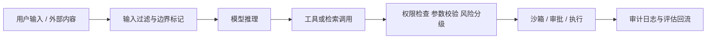

---
kb_id: llm-foundations/llm-safety-prompt-injection-permission-and-red-team
title: LLM 安全：为什么 Prompt Injection、权限、沙箱、审批和红队必须被设计成同一条防线
domain: llm-foundations
component: llm-safety
topic: prompt-injection-permission-sandbox-human-approval-red-team
difficulty: advanced
status: reviewed
sidebar_position: 13
version_scope: OWASP LLM Top 10, OpenAI prompt injection article, and OpenAI safety best practices as verified on 2026-04-27
last_verified_at: '2026-04-27'
source_ids:
  - owasp-llm-top10-2025
  - openai-prompt-injection-blog
  - openai-safety-best-practices
claim_ids:
  - llm-foundation-claim-0025
  - llm-foundation-claim-0026
tags:
  - llm-safety
  - prompt-injection
  - permission
  - sandbox
  - red-team
---
## LLM 安全最容易被误解的地方，是把它当成“写好 system prompt”
只要系统开始接外部内容、开始调用工具、开始读知识库、开始执行代码，安全问题就不再是模型输出风格问题，而是完整的系统边界问题。Prompt 只是其中一层，而且通常是最脆弱的一层。真正可靠的安全设计，必须把输入来源、权限、工具参数、执行环境、审计和人工审批一起考虑。

## 解决什么问题
这一页主要回答五个问题：

1. Prompt Injection 为什么会成为 LLM 系统的核心风险。
2. 为什么 system prompt 不是可靠安全边界。
3. 工具、RAG、代码执行和外部集成为什么会放大风险。
4. 最小权限、沙箱、审批、审计和红队各自解决什么问题。
5. 为什么安全策略必须进入评估和回归，而不是只靠上线前检查一次。

## 核心对象
| 对象 | 作用 | 失控后会发生什么 |
| --- | --- | --- |
| Trusted Instruction | 系统和开发侧给出的控制目标 | 被外部内容覆盖或稀释 |
| Untrusted Content | 用户输入、网页、文档、邮件、工具输出 | 携带恶意指令和越权诱导 |
| Tool Surface | 模型可调用的动作入口 | 从错误文本升级成真实副作用 |
| Permission Policy | 定义谁能调用什么能力 | 越权读写、敏感数据外流 |
| Sandbox | 限制代码、文件、网络的破坏半径 | 攻击面扩散到系统环境 |
| Approval Gate | 在高风险动作前插入人工确认 | 错误动作直接落地 |
| Audit Trail | 记录输入、决策、动作和结果 | 事后无法复盘和追责 |
| Red-Team / Eval Suite | 主动发现和回归攻击路径 | 修过一次的问题反复出现 |

### 为什么安全对象必须拆得这么细
因为不同对象承担的职责不一样：Prompt Injection 是输入污染问题，权限是授权问题，沙箱是执行环境问题，审批是高风险决策问题，审计和红队是可复盘和持续改进问题。把它们混成一句“模型安全”没有任何工程价值。

## 执行链路
真实系统里，攻击和防护都发生在链路中：

1. 用户输入或外部内容进入系统。
2. 系统决定哪些内容进入模型上下文。
3. 模型基于上下文选择回答、检索或工具调用。
4. 工具调用参数经过校验、权限检查和风险分级。
5. 高风险动作进入审批或沙箱。
6. 结果经过审计与输出过滤，失败样本进入红队和评估闭环。



## 一致性与容错
Prompt Injection 之所以危险，是因为模型把系统提示、用户内容、检索片段和工具输出都作为上下文的一部分理解。如果其中任何一段恶意内容在语义上比系统提示“更像当前任务需要遵循的指令”，模型就可能被诱导偏航。

### 为什么 prompt 不是安全边界
因为 prompt 无法天然提供：

1. 权限隔离。
2. 参数白名单。
3. 文件系统和网络隔离。
4. 真实动作的审批。
5. 事后可追责的审计证据。

它可以降低风险，但无法在系统层形成硬边界。

## 性能模型
安全控制会增加一部分额外开销，但这个开销的目标是缩小破坏半径，而不是追求零成本：

1. 输入过滤和输出过滤增加少量延迟。
2. 参数校验和权限检查增加同步逻辑。
3. 沙箱和审批会降低自动化吞吐。
4. 红队和评估会增加发布成本。

### 为什么这些成本通常值得付
因为 LLM 系统一旦能够执行动作，错误就不再只是“答错一句话”，而可能变成删除文件、外发敏感信息、越权访问知识库或误触高风险业务动作。此时安全成本本质上是风险保费。

## 生产排障
安全故障发生后，第一反应不应该是“模型怎么这么笨”，而应该沿着防线看哪一层缺失：

1. 恶意内容是否被标记成不可信来源。
2. 检索阶段是否已经越权返回内容。
3. 工具参数是否未经校验直接执行。
4. 高风险动作是否绕过审批。
5. 输出是否缺少审计和告警。

### 常见故障模式
1. 间接注入来自 RAG 文档或网页内容。
2. 模型能调用工具，但没有最小权限边界。
3. 沙箱存在，但网络或文件系统隔离过松。
4. 有审批，但没有风险分级，导致所有动作都自动通过。

## 样例
一个更接近生产的动作策略，不是“信任模型自己判断”，而是显式的风险配置：

```yaml
tool_policy:
  search_docs:
    risk: low
    approval_required: false
  send_email:
    risk: medium
    approval_required: true
  delete_record:
    risk: high
    approval_required: true
    sandbox_only: true
```

```json
{
  "tool": "update_customer_profile",
  "input_schema_valid": true,
  "permission_check": "denied",
  "reason": "caller missing write_customer scope"
}
```

这两个样例说明：真正的控制点在系统层，而不是让模型靠一句“请谨慎操作”来自觉约束。

## 相邻技术边界
LLM 安全不是只等于内容审核。内容审核主要处理输出违规，Prompt Injection 处理的是上下文污染，权限系统处理的是授权边界，沙箱处理的是执行边界，红队和评估处理的是长期韧性。它也不等于普通 Web 安全的简单复制，因为模型会把不可信内容重新组织成“貌似合理的行动建议”，这是传统规则引擎很少面对的风险形态。

## 本页结论
LLM 安全的核心不是更强的 prompt，而是把不可信输入、权限、工具、沙箱、审批、审计和评估串成一条完整防线。只有当这些对象一起工作时，系统才不至于把一次上下文污染升级成真实业务事故。
