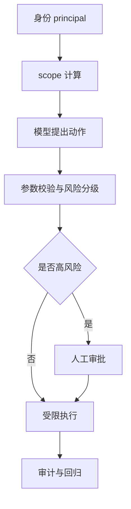

---
kb_id: llm-foundations/llm-safety-tool-permission-sandbox-approval-and-audit-chain
title: LLM 动作安全链：工具权限、沙箱、审批、审计为什么是四个不同控制面
domain: llm-foundations
component: llm-safety
topic: llm-safety-tool-permission-sandbox-approval-audit
difficulty: advanced
status: reviewed
sidebar_position: 14
version_scope: OWASP LLM Top 10, OpenAI safety best practices, Azure document access docs, and Azure query-time ACL docs as verified on 2026-04-25 to 2026-04-27
last_verified_at: '2026-04-27'
source_ids:
  - owasp-llm-top10-2025
  - openai-safety-best-practices
  - azure-document-level-access
  - azure-query-time-acl-rbac
claim_ids:
  - llm-foundation-claim-0026
  - pattern-claim-0074
  - pattern-claim-0075
tags:
  - llm-safety
  - tool-security
  - approval
  - sandbox
  - audit
---
## 当 LLM 可以“采取行动”之后，安全问题就从回答正确性升级成了控制面设计问题
很多安全讨论会把重点放在模型有没有说错话，但对工具型系统来说，更关键的问题是：模型能不能访问不该访问的内容，能不能触发不该触发的动作，错误动作发生后能不能被拦下，出了问题后能不能解释。也就是说，真正高价值的安全能力不是“模型说自己会很谨慎”，而是动作前后是否存在独立控制面。

## 解决什么问题
这一页专门讨论动作型系统里的四个控制面：

1. 权限：模型代表谁、能看到什么、能操作什么。
2. 沙箱：即使动作失控，也把破坏限制在最小边界内。
3. 审批：高风险动作在真正执行前是否有人工兜底。
4. 审计：动作发生后，是否能追溯输入、决策和结果。

### 为什么这四个控制面不能互相替代
权限只能决定“可不可以做”，不能决定“做错后破坏多大”；沙箱能限制破坏半径，但不能决定“这个动作本来该不该做”；审批能拦截高风险动作，但不能代替完整日志；审计能复盘，但不能阻止实时事故。所以它们是并列控制面，而不是单个开关。

## 核心对象
| 对象 | 作用 | 关键问题 |
| --- | --- | --- |
| Principal | 当前请求代表的用户或租户身份 | 模型到底在替谁行动 |
| Scope / Role | 允许访问的资源和能力集合 | 最小权限是否成立 |
| Action Classifier | 判断动作风险等级 | 哪些动作必须人工确认 |
| Sandbox Runtime | 限制执行环境 | 文件、网络、资源是否隔离 |
| Approval Record | 保存审批决策和理由 | 人工确认是否留痕 |
| Audit Event | 记录动作前后证据 | 事后能否复盘和回放 |

## 执行链路
动作安全链应该在模型真正执行前后都插入控制：

1. 先根据用户身份和租户信息计算 principal 与 scope。
2. 模型提出动作意图后，系统先做参数校验和风险分类。
3. 低风险动作进入受限执行环境，高风险动作先进入审批。
4. 执行结果和关键证据进入审计日志。
5. 失败样本回流到安全评估和红队集。



## 一致性与容错
权限和检索系统结合时，一个常被忽视的点是：权限必须在索引或查询过滤阶段就生效，而不是让模型拿到文档后再“自觉不说”。如果越权内容已经进入上下文，模型层再怎么克制都不是可靠边界。

### 为什么审计不仅仅是日志更多
动作型系统里的审计至少要回答：

1. 是谁发起了请求。
2. 模型基于哪些输入做出动作意图。
3. 参数在校验前后发生了什么变化。
4. 审批是否发生、由谁批准。
5. 动作最终是否成功、是否回滚。

没有这些信息，就很难区分是模型判断错、权限配置错，还是沙箱隔离错。

## 性能模型
动作安全链会增加额外延迟，但延迟来源本身也是架构设计点：

1. scope 计算通常是轻量同步逻辑。
2. 审批引入的是人类延迟，不应滥用到低风险动作。
3. 沙箱启动与资源隔离可能带来显著冷启动成本。
4. 审计写入需要在可靠性和吞吐之间平衡。

### 什么场景最容易过度设计
如果所有动作都走审批，系统会完全失去自动化价值；如果所有动作都进沙箱但沙箱权限仍很大，也只是增加成本没有增加安全。真正有效的策略是按动作类别和风险等级分层。

## 生产排障
动作安全链的排障顺序通常是：

1. 先看 principal 和 scope 是否计算正确。
2. 再看参数校验是否真的覆盖危险字段。
3. 再看审批是否被错误绕过或错误放行。
4. 最后看沙箱和审计是否把问题留在可恢复范围内。

### 适合长期复用的审计事件
```json
{
  "principal": "tenant-a:user-17",
  "action": "send_email",
  "risk": "medium",
  "approval_required": true,
  "approved_by": "manager-03",
  "sandbox": "mail-outbound-restricted",
  "result": "blocked_by_policy"
}
```

这个事件的价值在于，它把动作安全链的四个控制面都串到了同一条证据里。

## 相邻技术边界
这一页讲的是动作安全链，不是通用内容安全。内容安全可以只拦文本，动作安全必须控制真实副作用。它也不等于零信任网络安全的直接翻版，因为 LLM 会把不可信内容转译成动作意图，系统必须在“意图生成”和“动作执行”之间插入独立控制面。

## 本页结论
当 LLM 具备动作能力后，安全设计就必须从权限、沙箱、审批和审计四个控制面同时下手。它们不是重复功能，而是分别解决授权、破坏半径、人工兜底和事后复盘四类不同问题。
